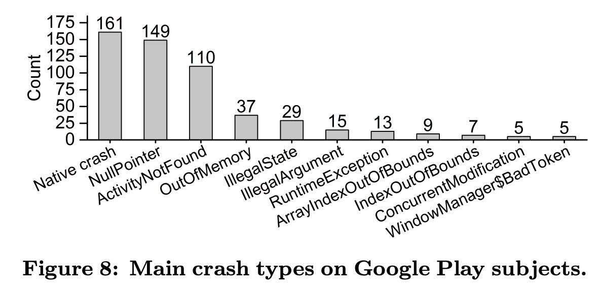

:hardbreaks:
= 자바에서 null을 안전하게 다루는 방법

* https://www.slideshare.net/gyumee/null-142590829[자바에서 null을 안전하게 다루는 방법]

== Part 0: null에 대해서
* 2000년 대 중반
** 동적 타이핑/스크립팅
** RoR과 스타트업 붐으로 생산성이 강조
** 다언어 프로그래밍(Polyglot) 인기
** 그루비(Groovy), jRuby, Jython

* 2010년 전후
** 함수형 프로그래밍
*** 멀티코어와 대용량 분산 처리가 인기를 끌면서 함수형 프로그래밍이 주목 받음. 스칼라(Scala), 클로저(Clojure)

* 2010년대 중반
** 널 안정성
*** 차기 자바의 자리를 두고 실용 언어들 간 경쟁
**** 실론(Ceylon), 코틀린(Kotlin)

> "I call it my billion-dollar mistake. It was the invention of the null reference in 1965." - Tony Hoare

* null 참조
** '레코드 핸들링': 객체지향의 시초가 된 논문
** *특별한 값이 없음을 나타내려고* null을 도입했고 이 값을 사용하려고 할 때 오류를 내도록 설계
** 두 참조값이 null일 때 두 참조는 동일하다고 판단

* 자바의 null 참조
** 의미가 모호함: 초기화되지 않음, 정의되지 않음, 값이 없음, null 값
** 모든 참조의 기본 상태(값?)
** 모든 참조는 null 가능

* 소프트웨어 결함 통계

** Google Play 주요 crush 2위가 NullPointer

http://www0.cs.ucl.ac.uk/staff/K.Mao/archive/p_issta16_sapienz.pdf[Sapienz: Multi-objective Automated Testing for Android Applications]

== Part 1: null을 안전하게 다루는 방법

자바 기본 장치
* 단정문(assertion)
* java.util.Objects
* java.util.Optional

=== 자바 기본 장치: 단정문(assertion)
----
assert 식1;
assert 식1 : 식2;
----
* 부울식인 식1의 거짓이면 AssertionError 발생
* 식2는 AssertionError에 포함될 상세 정보를 만드는 생성식
* 공개 메서드에는 사용하지 말아야 함
* -enableassertions 또는 -ea 옵션으로 활성화
----
private void setRefreshInterval(int interval) {
  assert interval > 0 && interval <= 1000/MAX_REFRESH_RATE : interval;
  ....
}
----

=== 자바 기본 장치: java.util.Objects
자바8
* isNull(Object obj)
* nonNull(Object obj)
* requireNonNull(T obj)
* requireNonNull(T obj, String message)
* requireNonNull(T obj, Supplier<String> messageSupplier)

자바9
* requireNonNullElse(T obj, T defaultObj)
* requireNonNullElseGet(T obj, Supplier<? extends T> supplier)

=== 자바 기본 장치: java.util.Optional
Optional - The Mother of All Bikesheds: Stuart Marks
https://www.youtube.com/watch?v=Ej0sss6cq14

1. 절대로 Optional 변수와 *반환값에 null을 사용하지 말라*
2. Optional에 값이 들어 있다는 걸 확신하지 않는한 Optionsl.get()을 쓰지 말라
3. Optional.isPresent()이나 Optional.get() 외 API를 가능한 사용하라
4. Optional에서 여러 메서드를 연속해서 호출하고 값을 얻기 위해 Optional을 생성하는 건 권장할만하지 않다
5. Optional로 값을 처리하는 중에 그 안에 중간값을 처리하기 위해 또 다른 Optional이 사용되면 너무 복잡해진다
6. Optional을 필드, 메서드 매개변수, 집한 자료형에 쓰지 말라
7. 집합 자료형(List, Set, Map)을 감싸는 데 Optional을 쓰지 말고 빈 집합을 사용해라.

=== null 잘 쓰는 법
1. API(매개변수, 반환값)에 null을 최대한 쓰지 말아라
2. 사전 조건과 사후 조건을 확인하라: 계약에 의한 설계(design by contract)
3. (상태와 같이) null의 범위를 지역(클래스, 메서드)에 제한하라.
4. 초기화를 명확히 하라

==== null 잘 쓰는 법1: API(매개변수, 반환값)에 null을 최대한 쓰지 말아라
* null로 지나치게 유연한 메서드를 만들지 말고 명시적인 메서드를 만들어라
* null을 반환하지 말라
** 반환 값이 꼭 있어야 한다면 null을 반환하지 말고 예외를 던져라.
** 빈 반환 값은 빈 컬렉션이나 'Null 객체'를 활용하라
** 반환 값이 없을 수도 있다면 Optional을 반환하라
* 선택적 매개변수는 null 대신 다형성(메서드 추가 정의; overload)를 사용해라 표현하라

Null 객체 (특수 사례 패턴; Special Case Pattern)
* 타입 안전하면서 의미를 표현할 수 있는 동일한 타입의 특수 상황용 객체를 만들어 반환
* 다형성 활용
* 아무 일도 하지 않는 객체; 일종의 더미 객체
* 리스코프 치환 원칙 주의

==== null 잘 쓰는 법2: 계약에 의한 설계(Design by Contract)

> When quality is pursued, productivity follows - K. Fujino

* API 규약을 소비자와 제공자 사이에 지켜야 할 엄격한 계약으로 여기는 설계 방법
* 형식적 규약 외에 사전 조건과 사후 조건과 유지 조건을 포함
* 베르트랑 마이어(Bertrand Meyer) - 에펠(Eiffel) 프로그래밍 언어 제작
* 개방-폐쇄 원칙의 상위 개념

...

==== null 잘 쓰는 법3: null의 범위를 지역에 제한하라

> OOP to me means only messaging, local retention and protection and hiding of state-process, and extreme late-binding of all things. - Alan Kay

* 기본 문제 해결 원칙: 큰 문제는 제어 가능한 작은 문제로 나누어 정복하고 다시 통합한다.
* 상태와 비슷하게 null도 지역적으로 제한할 경우 큰 문제가 안된다.
* 클래스와 메서드를 작게 만들어라
* 설계가 잘 된 코드에서는 널의 위험도 약해진다.

==== null 잘 쓰는 법4: 초기화를 명확히 하라

* 초기화 시점과 실행 시점이 겹치지 않아야 한다
* 실행 시점엔 초기화되지 않은 필드가 없어야 한다
* 실행 시점에 null인 필드는 초기화되지 않았다는 의미가 아닌, 값이 없다는 의미여야 한다.
* 객체 필드의 생명주기는 모두 객체의 생명주기와 같아야 한다.
* 지연 초기화(lazy initialization)필드의 경우 팩토리 메서드로 null 처리를 캡슐화 하라

=== null을 안전하게 다루는 방법 - 요약
* API에 null을 최대한 쓰지 말아라
** 반환값은 Optional, Null 객체, 빈값, 예외로 처리
** 매개변수는 명확한 메서드 추가 정의
* 사전 조건과 사후 조건을 확인하라: 계약에 의한 설계(design by contract)
** 보호절을 통한 사전 조건 확인, 다양한 편의 객체 활용
* (상태와 같이) null의 범위를 지역(클래스, 메서드)에 재한하라.
* 초기화를 명확히 하라

== Part 2: null이 안전하다고 보장해주는 도구

> `This led me to suggest that the null value is a member of every type, and a null check is required on every use of that reference variable, and it may be perhaps a billion dollar mistake.' - Tony Hoare

=== null 안전한 언어들
null을 안전하고 쉽게 다루게 해주는 엘비스 연산자
* C#: null 조건 연산자(?.과 ?[])
* 그루비(Groovy): def name = person?.name
* 코틀린: ?. 과 ?:
* 스위프트: Optional Chaining & 가드(Guard) 문

null이 예외인 언어
* 코틀린: null 가능 타입과 non-null 타입
* 스위프트: Optional
* C# 8.0 (출시 예정)

=== 자바의 엘비스 연산자(?:) 논의
* 자바 문법 개선 프로젝트인 코인(coin)에서 최종 탈락
** ?:는 삼항 연산자의 축약형으로 자바와 맞지 않다: a != null ? a : b -> a ?: c
** null 안전한 참조(?.)는 null 사용을 부추긴다: 디미터 법칙(Law of Demeter)
** 진행 중인 타입 어노테이션(JSR 308) 추천
* ?. 대신 Optional 사용 권유

----
house?.getFloor()?.getWall(WEST)?.getDoor();
----

----
Optional.ofNullable(house)
  .map(house -> house.getFloor(0))
  .map(floorZero -> floorZero.getWall(WEST))
  .map(wallWest -> wallWest.getDoor())
----

https://jcp.org/en/jsr/detail?id=308[JSR 308: Annotations on Java Types]

=== null 안전성을 도와주는 자바 도구
* JSR 305
** 중단된 미완성 표준 (JSR 리뷰 2006/8/29~2006/9/11)
** 정적 분석 (findbug 등)
** IDE 지원 (IntelliJ, Eclipse, Spring Framework, Android Studio)
** Nullaway
* JSR 308
** CheckerFramework

=== JSR-308 타입 어노테이션
* 선언부가 아닌 타입 지정 위치에 어노테이션 추가 가능
* 어노테이션 프로세싱을 통한 빈약한 자바 타입 시스템을 강화
* 초안 제출 2006/10/17, 최종안 승인 2014/2/18, 자바 8에 추가
* 워싱턴대 마이클 에른스트(Michael Ernst) 교수 주도
* CheckerFramework와 동시에 진행 (버전 0.1.1 2007/6/7 첫 출시)

=== Checker Framework
* null 안정성 확인 @Nullable, @NonNull, @PolyNull
* Map 키, 잠금, 순차 자료형(배열, List 등) 색인값, 정규식, 문자열 형식, 단위 등 다수 확인 기능 제공
* 자작 확인 기능 추가 가능
* 특정 환경이나 IDE 독립적

=== @NonNull과 @Nullable
----
public class Address {
  public final @NonNull String address1;
  public final @Nullable String address2;
  public final @NonNull String zipcode;
  public final @NonNull String city;
  public final @NonNull String country;

  private Address(@NonNull String address, @Nullable String address2, @NonNull String zipcode, @NonNull String city, @NonNull String country) {
    ...
  }

  public static Address of(@NonNull String address1, @NonNull String zipcode, @NonNull String city, @NonNull String country) {
    return new Address(address1, null, zipcode, city, country);
  }
----

=== 기본 null 정책
* 과도한 어노테이션 사용 예방
* 기본 @NonNull 필드, 매개변수, 반환값 등
* 예외적 @Nullable 지역 변수, 타입 캐스트 등
* 패키지, 클래스 수준 정책 설정 @DefaultQualifier

----
public class Address {
  public final String address1;
  public final @Nullable String address2;
  public final String zipcode;
  public final String city;
  public final String country;

  private Address(String address, @Nullable String address2, String zipcode, String city, String country) {
    ...
  }

  public static Address of(String address1, String zipcode, String city, String country) {
    return new Address(address1, null, zipcode, city, country);
  }
----

=== 패키지. 클래스 수준 기본 정책 설정
* @DefaultQualifier
* 패키지(package-info.java)나 클래스 전체의 기본 정책 설정

----
@DefaultQualifier(value = NonNull.class, locations = TypeUseLocation.LOCAL_VARIABLE)
package dev.fupfin.null_safety.strict;
----

----
@DefaultQualifier(value = Nullable.class, locations = TypeUseLocation.FIELD)
class MyClass {
  Object nullableField = null
  @NonNull Object nonNullField = new Object();
}
----

=== 어노테이션 달린 자바 표준 API 제공
* 자바 8 표준 API
* 자바 11 출시 준비 중
* 임의의 API에 어노테이션 설정 가능

----
private static void password() {
  Console console = System.console();
  char[] password = console.readPassword();
  ...
}
----

Error:(30, 27) java: [dereference.of.nullable] dereference of possibly-null reference console

=== 자동 타입 개선(Automatic type refinement)
* 단순한 정적 타입 확인이 아닌 코드 흐름과 실행 결과를 반영
* 코드로 null 확인을 한 경우 @nonNull로 취급
* 메서드 내부로 제한

----
private static void password() {
  Console console = System.console();
  char[] password = nonNull(console) ? console.readPassword() : new char[0];
  ...
}
----

=== 집한 타입 요소의 null 안정성 지원
* List, Set, Map, 배열 등 집합 자료형의 요소도 null 확인
* 기본 @NonNull
* 타입 매개변수에 @Nullable 지정

----
private static void printList() {
  List<String> names = Arrays.asList("kim", "choi", null, "park", "hwang");
  for (String name: names)
    out.println(name);
}
----

Error:(42, 43) java: [assignment.type.incompatible]
incompatible types in assignment.
  found   : @Initialized @NonNull List<@Initialized @Nullable String>....

=== 정리
null은 왜 문제인가?
* 모든 참조 타입에 지정 가능한 값(상태?), 언어가 지원할 문제
null을 안전하게 다루는 방법
* API에 null을 최대한 쓰지 말아라 - 반환값은 Optional, Null 객체, 빈값, 예외로 처리
* 사전 조건과 사후 조건을 확인하라: 계약에 의한 설계(design by contract)
* (상태와 같이) null의 범위를 지역(클래스, 메서드)에 재한하라.
* 초기활르 명확히 하라
null에 안전하다고 보장해주는 도구
* JSR 305 계열과 JSR 308 계열
* 가장 성숙한 자바 타입 확인 확장 기술: Checker Framework
* '(원래) 부족한 자바, 고쳐쓰자'
