# servlet project - IntelliJ - maven
IntelliJ 에서 File -> New -> Project 로 가서 maven 프로젝트를 생성합니다.


project name과 groupId 등은 적절히 입력합니다.

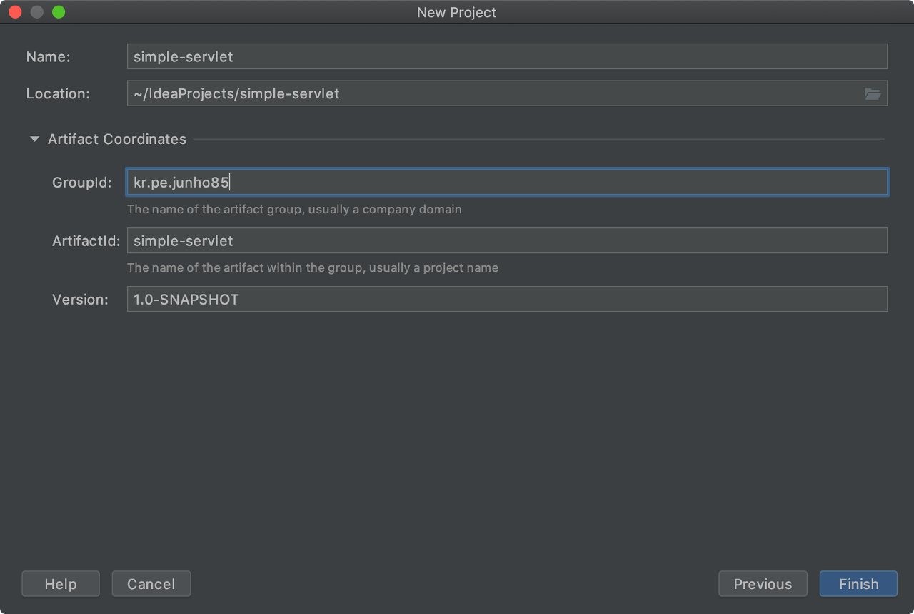

pom.xml 파일에 servlet api dependency를 추가해 줍니다. https://mvnrepository.com/artifact/javax.servlet/javax.servlet-api에서 maven 공개 저장소에 있는 버전과 xml 설정을 확인 할 수 있습니다. 현재 4.0.1이 최신버전이네요.


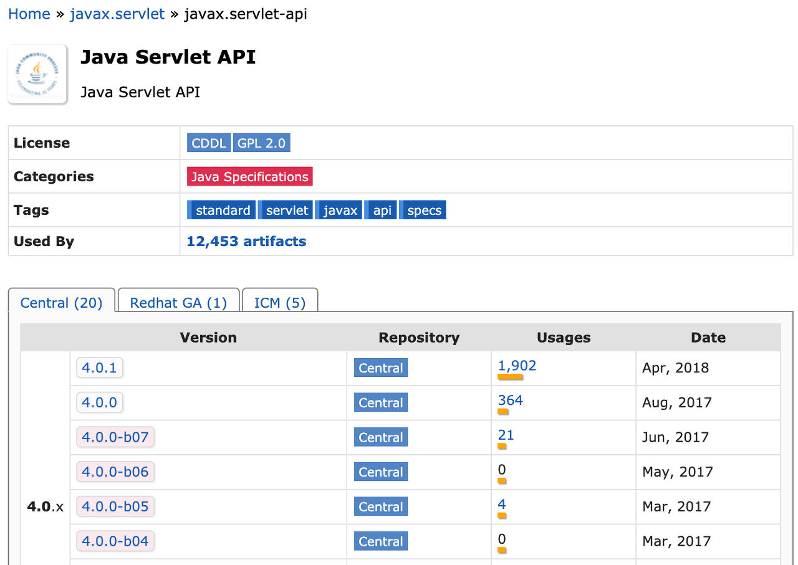

4.0.1을 선택하면 maven 설정을 확인 할 수 있습니다. 마우스로 클릭하면 자동으로 복사해줍니다.


프로젝트의 pom.xml 파일에 붙여 넣기 합니다.


우측의 Maven탭을 열고 Reimport를 눌러주면 servlet api 4.0.1을 가져온 것을 확인 할 수 있습니다.

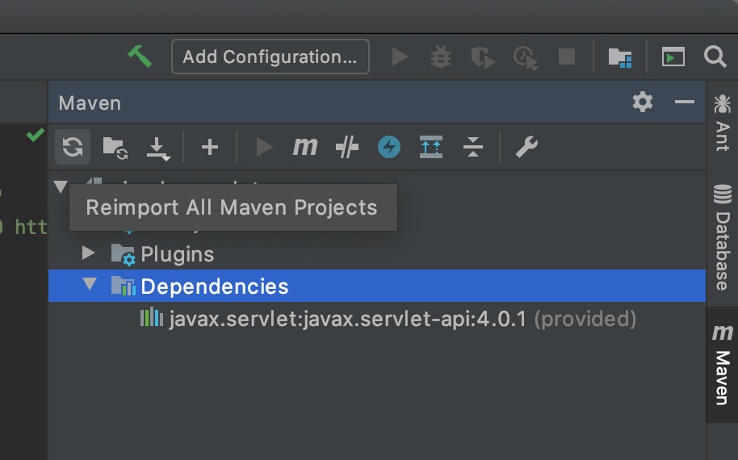

프로젝트를 웹프로젝트로 만들어 줍니다. File -> Project Structure -> Modules 에서 Web을 추가합니다.


우측 하단에 Create Artifact 를 선택합니다.

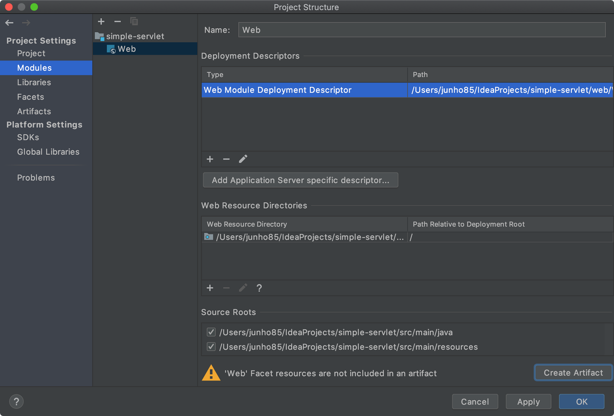

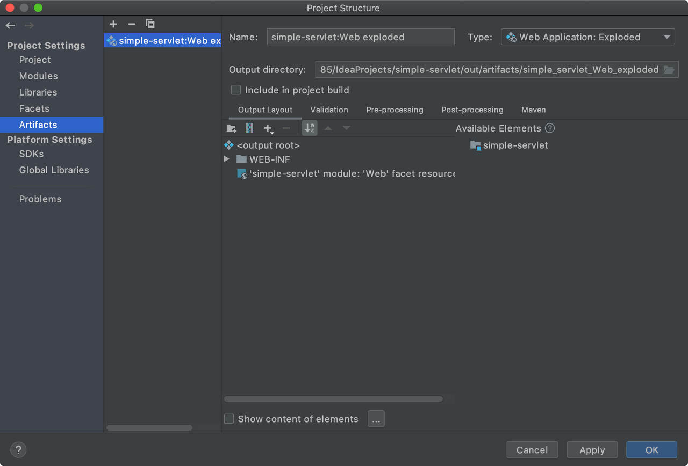

src/main/java 에 New -> Create New Servlet을 선택합니다.

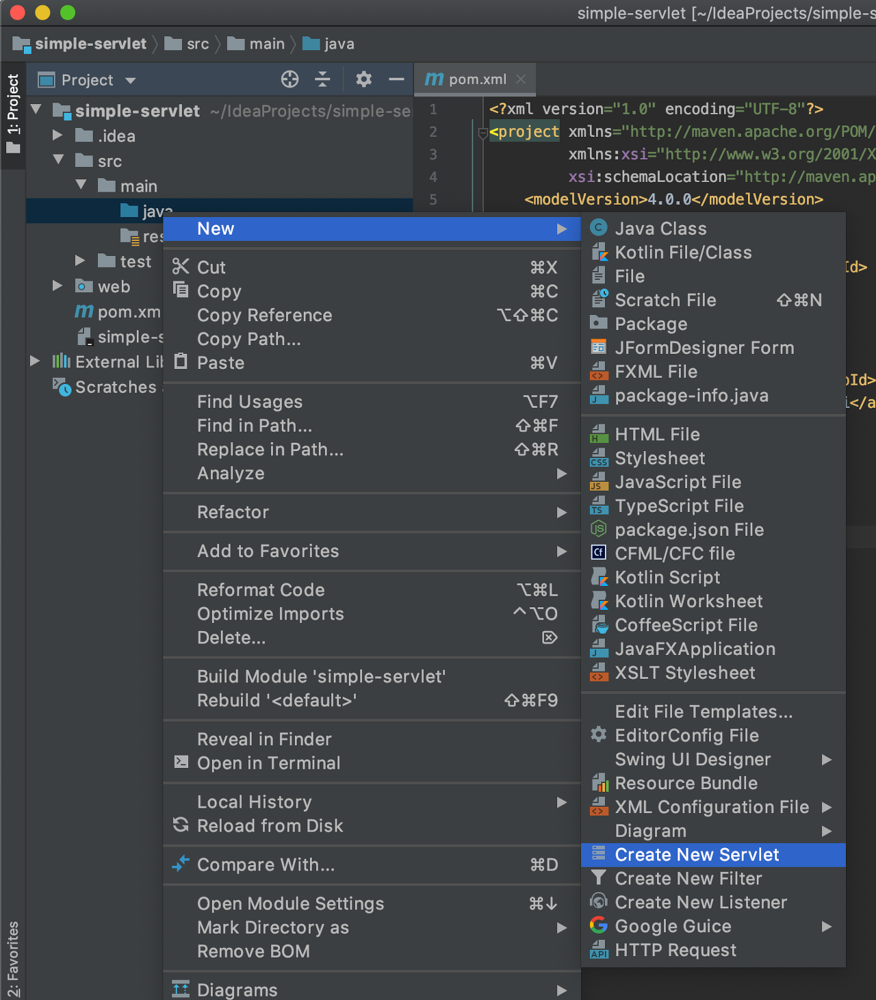

적당히 MyServlet이라고 만들었습니다. package는 kr.pe.junho85 로 했습니다.
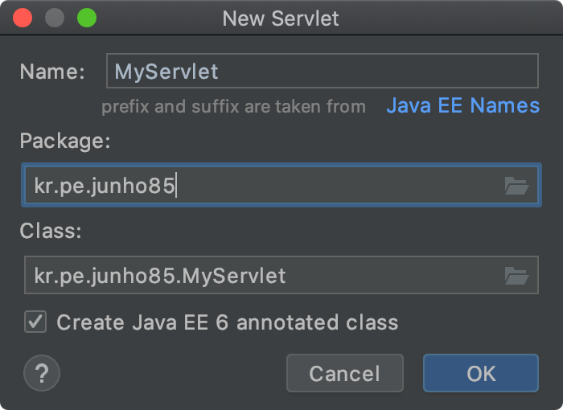

MyServler 파일이 생성되었습니다.
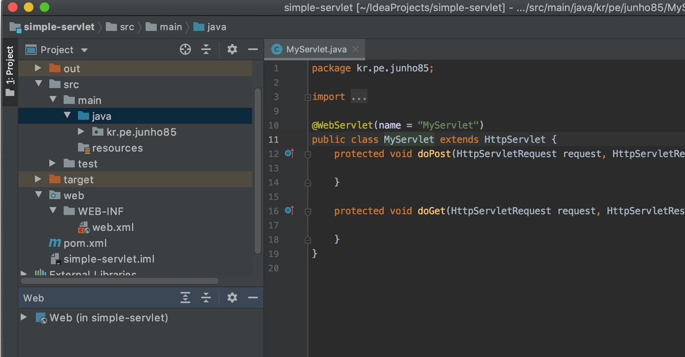

doGet에 아래 코드를 추가합니다.
```
        response.setContentType("text/html");
        PrintWriter out = response.getWriter();
        out.println("<h1>Hello World!</h1>");
```
그리고 @WebServlet(name = "MyServlet")을 @WebServlet("/MyServlet")으로 수정합니다.

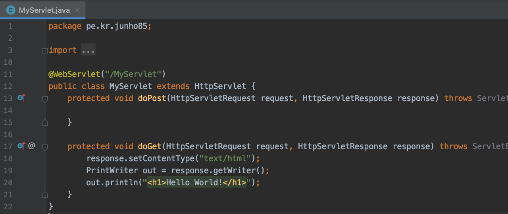

프로젝트를 구동해서 확인해 봅시다. 오른쪽 위에 Add Configuration을 선택합니다.

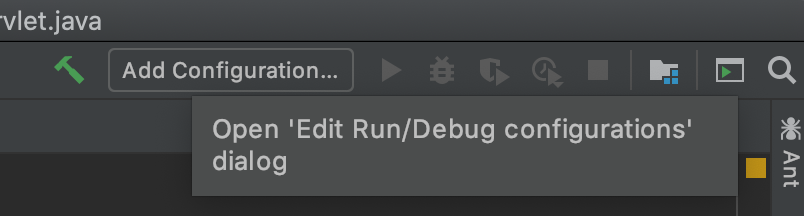

+ 버튼을 누르거나 Cmd + n을 누르고 Tomcat Server -> Local을 선택합니다.

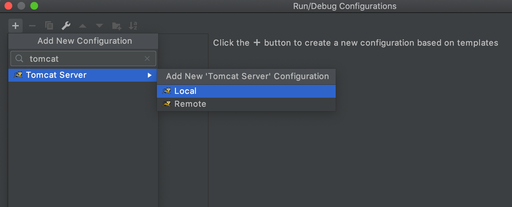

Name에 적당히 이름을 넣어 줍니다. Tomcat 9를 선택합니다. 포트가 충돌한다면 다른 포트로 바꾸어 줍니다.

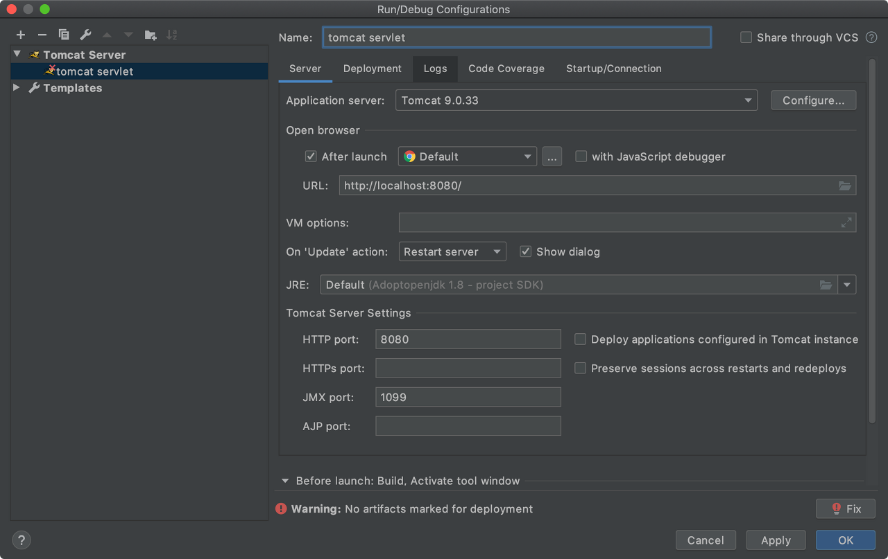

저는 8080을 쓰려니 충돌해서 28080으로 바꿨습니다. JMX포트도 21099로 바꿨습니다.

Tomcat 9 가 없을 수 있는데 그런 경우 Configure를 눌러서 Tomcat 9를 추가해 줍니다. 설치했던 경로로 추가해 줍니다.

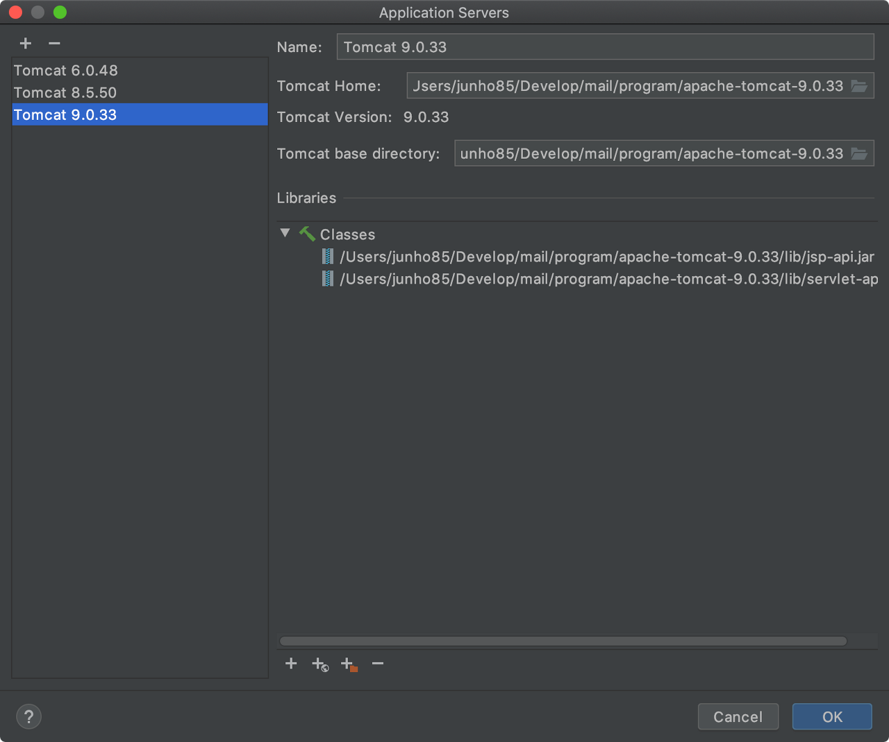

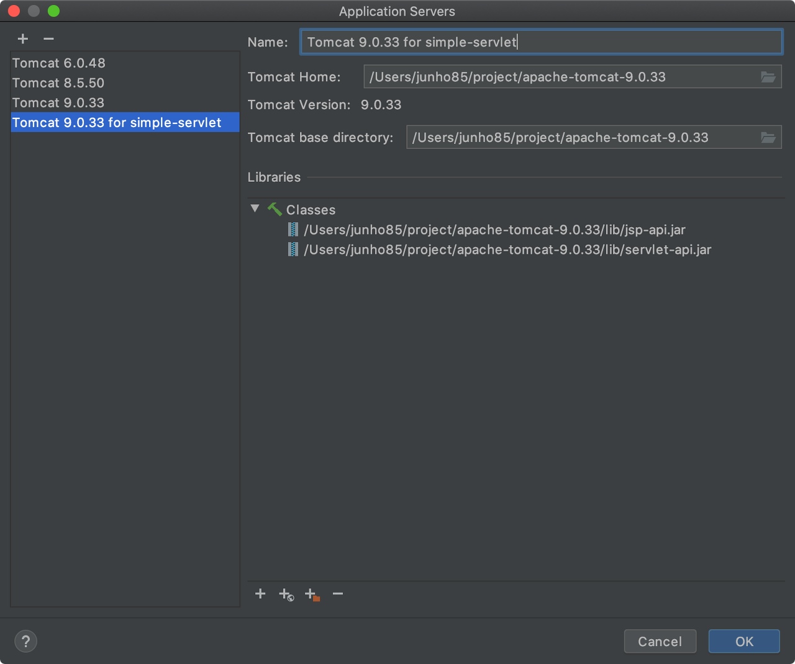

이미 있어서 하나 더 추가했습니다.

아까 Run/Debug Configuration에서 우측 하단에
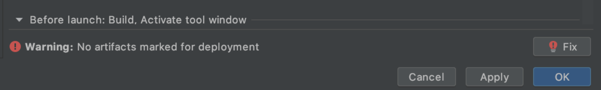

이런 게 있었는데 Fix 버튼을 눌러 줍니다.

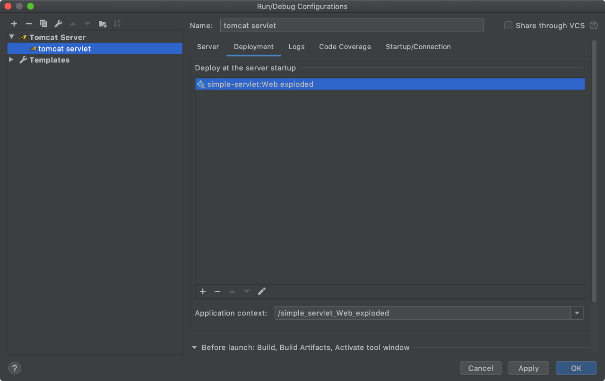
Deployment탭에 simple-servlet:Web exploded 가 추가된 것을 볼 수 있습니다. Application context는 나중에 브라우저에서 확인할 때 기본 경로에 되는데요. 마음에 들지 않는다면 다른 것으로 수정해 줍니다.

 

자 이제 Tomcat을 구동해 봅시다. Run을 눌러줍니다.

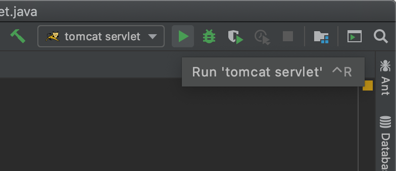

브라우저가 뜨면서 "404 - 찾을 수 없음" (404 Not Found)가 뜨는 걸 볼 수 있는데요.

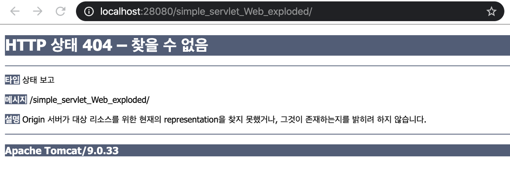

url이 완성되지 않았기 때문입니다. 뒤에 MyServlet을 추가합니다.

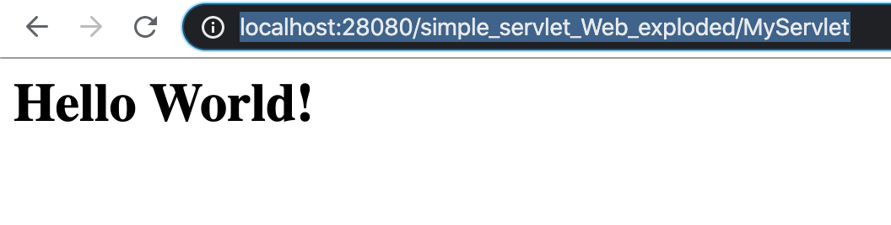

휴~ 프로젝트 세팅이 완료되었습니다. 이제 servlet을 추가해 주면서 작업하면 됩니다.

## 정리
* [간단한 servlet 프로젝트 만들기. tomcat9, servlet4. maven, IntelliJ 2020.03.29](https://junho85.pe.kr/1488)
