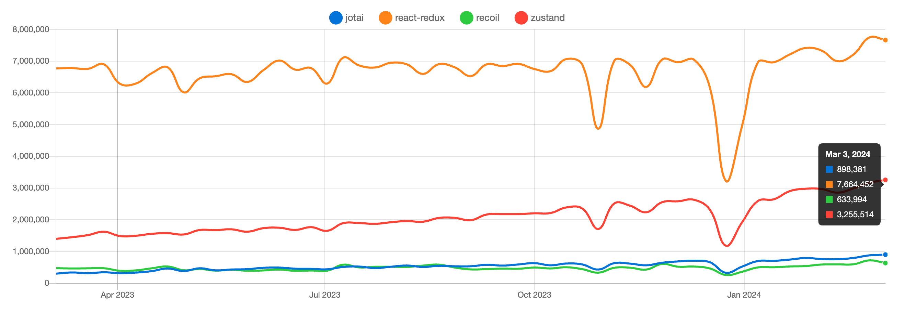

:hardbreaks:
= Recoil

https://recoiljs.org/

https://github.com/facebookexperimental/Recoil

A state management library for React

== Trends

https://npmtrends.com/jotai-vs-react-redux-vs-recoil-vs-zustand

2024.03.11 기준

== References
* Recoil, 이제는 떠나 보낼시간이다 2023.12.28[https://medium.com/@clockclcok/recoil-%EC%9D%B4%EC%A0%9C%EB%8A%94-%EB%96%A0%EB%82%98-%EB%B3%B4%EB%82%BC-%EC%8B%9C%EA%B0%84%EC%9D%B4%EB%8B%A4-ff2c8674cdd5]
업데이트 주기
메모리 누수
SSR(Server Side Rendering)에서의 미비한 지원
Recoil 개발자의 퇴직

* https://techblog.yogiyo.co.kr/recoil%EC%9D%84-%EC%9D%B4%EC%9A%A9%ED%95%9C-%EC%86%90%EC%89%AC%EC%9A%B4-%EC%83%81%ED%83%9C%EA%B4%80%EB%A6%AC-b70b32650582[Recoil을 이용한 손쉬운 상태관리 2022.12.23]

Recoil은 2020년에 Facebook에서 발표, React의 Concurrent Renderere를 공식 지원하는 유일한 상태 관리 라이브러리

상태관리에서 상태는 일반적인 데이터가 아닌 UI를 업데이트 하는 데이터. 예를 들면 Reac의 useState hook이 반환하는 데이터가 있음.

React만으로는 복잡한 상태관리가 어려우므로 보통은 별도의 라이브러리를 사용함

대표적으로 Flux 패턴의 구현체인 Redux,k Mobx 등이 있음.

상태관리 라이브러리들은 컴포넌트 트리에서 거리가 먼 컴포넌트 간에 공유하는 상태(전역 상태)를 비교적 손쉽고 안정적으로 관리하게 해줌.

