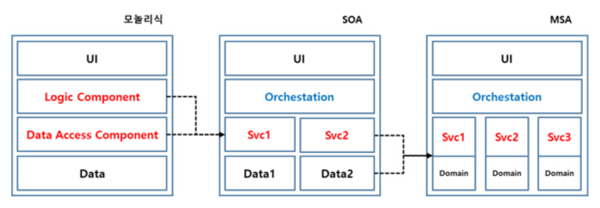

= Microservice Architecture

== References

https://www.samsungsds.com/kr/insights/msa.html[Do Not Use MSA - 마이크로서비스 아키텍처가 꼭 필요한가요? 2020.03.13]

오버 아키텍처링 또는 불필요할 수 있다

모놀리식(Monolithic) 아키텍처와 비교

SOA (Service Oriented Architecture, SOA) 하나의 구성으로 동작하던 서비스를 단순히 몇 개의 서비스로 나눈 것

https://www.popit.kr/%EB%A7%88%EC%9D%B4%ED%81%AC%EB%A1%9C-%EC%84%9C%EB%B9%84%EC%8A%A4msa%EB%A5%BC-%EC%96%B4%EB%96%BB%EA%B2%8C-%EB%82%98%EB%88%8C%EA%B9%8C-ii/[마이크로 서비스(MSA)를 어떻게 나눌까? II 2018.04.24 안영회]
