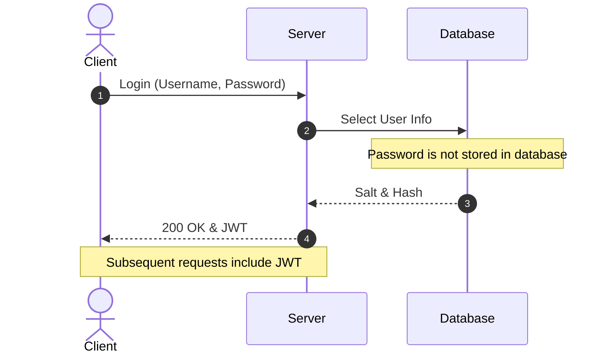
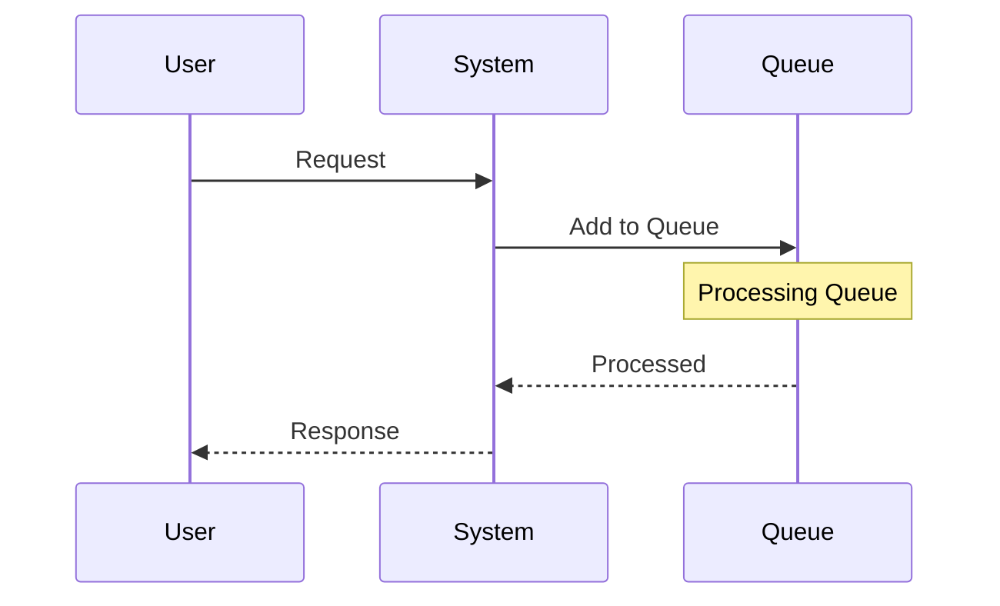
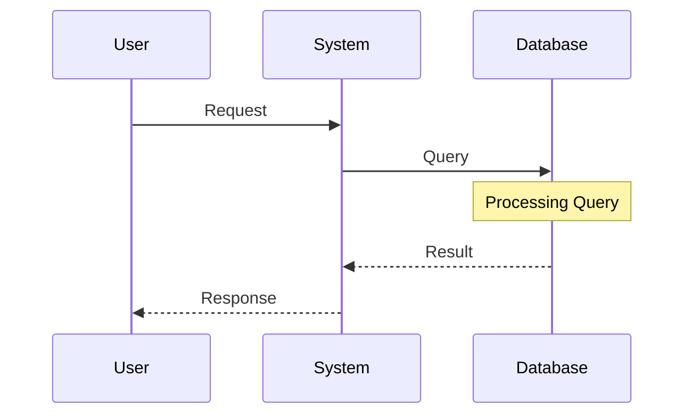
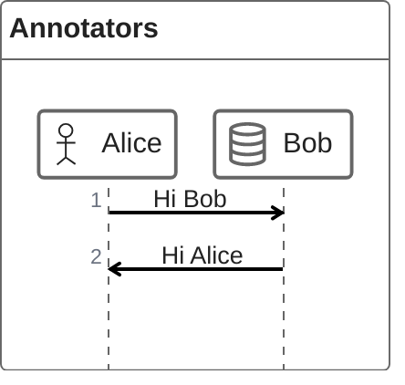
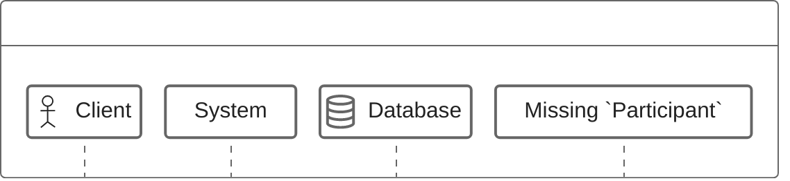
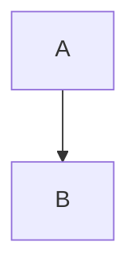

# Mermaid

## examples

### sequenceDiagram

```mermaid
sequenceDiagram
    autonumber
    actor C as Client
    participant S as Server
    participant DB as Database
    C->>S: Login (Username, Password)
    S->>DB: Select User Info
    note over DB: Password is not stored in database
    DB-->>S: Salt & Hash
    S-->>C: 200 OK & JWT
    note over C, S: Subsequent requests include JWT
```

```mermaid
sequenceDiagram
  participant User
  participant System
  participant Queue

  User ->> System: Request
  System ->> Queue: Add to Queue
  Note over Queue: Processing Queue

  Queue -->> System: Processed
  System -->> User: Response
```

```mermaid
sequenceDiagram
  participant User
  participant System
  participant Database

  User ->> System: Request
  System ->> Database: Query
  Note over Database: Processing Query

  Database -->> System: Result
  System -->> User: Response
```

#### SequenceDiagram with zenuml

```mermaid
zenuml
    title Annotators
    @Actor Alice
    @Database Bob
    Alice->Bob: Hi Bob
    Bob->Alice: Hi Alice
```

```mermaid
zenuml
    @Actor Client
    @Participant System
    @Database Database
    @
```

### Mermaid with custom title/desc

```mermaid
graph
   accTitle: My title here
   accDescr: My description here
   A-->B
```

```mermaid
zenuml
    title Annotators
    @Actor Alice
    @Database Bob
    Alice->Bob: Hi Bob
    Bob->Alice: Hi Alice
```