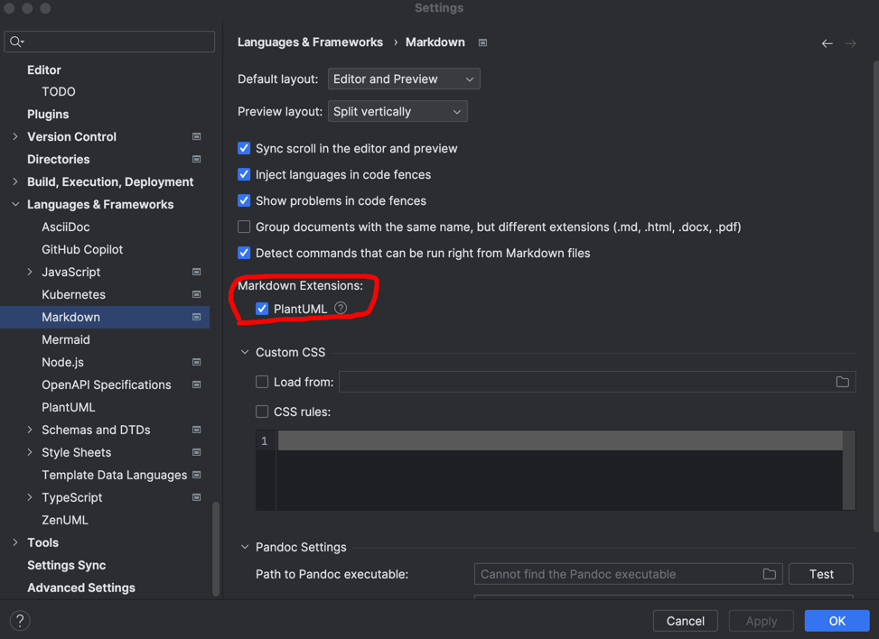
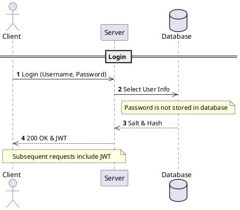

# PlantUML

IntelliJ Markdown 에서 바로 렌더링 하려면 Markdown Extensions 에서 PlantUML 을 체크해야 한다.

```plantuml
@startuml
autonumber
actor Client
participant Server
database Database

== Login ==

Client->>Server: Login (Username, Password)
Server->>Database: Select User Info
note over Database: Password is not stored in database
Database-->>Server: Salt & Hash
Server-->>Client: 200 OK & JWT
note over Client, Server: Subsequent requests include JWT
@enduml
```