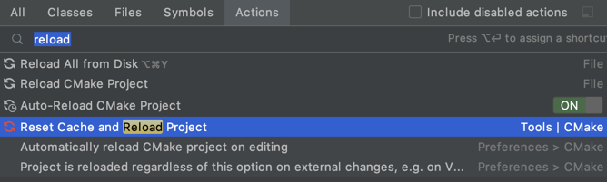

# clion

## fatal error: 'wchar.h' file not found
```
/Applications/Xcode.app/Contents/Developer/Toolchains/XcodeDefault.xctoolchain/usr/bin/../include/c++/v1/wchar.h:119:15: fatal error: 'wchar.h' file not found
#include_next <wchar.h>
              ^~~~~~~~~
```

XCode 나 OSX 를 업그레이드 하고 나면 이런 저런 문제들이 발생하는데 그 중 하나이다.



XCode 실행해서 필요한 파일 설치후 "Reset Cache and Reload Project" 해주면 정상으로 바뀌기도 한다.