= JPA Java Persistent API

* https://blog.woniper.net/255[[JPA\] JPA란 무엇인가? 2015.05.01]

== Naming Strategy 이름 매핑 전략

* https://www.popit.kr/intellij%EC%97%90%EC%84%9C-%EC%BD%94%EB%93%9C-%ED%95%9C-%EC%A4%84-%EC%95%88-%EC%A7%9C%EA%B3%A0-jpql-%EC%8B%A4%ED%96%89%ED%95%98%EA%B8%B0/[IntelliJ에서 코드 한 줄 안 짜고 JPQL 실행하기 2017.12.26]
* https://www.baeldung.com/hibernate-naming-strategy[Hibernate 5 Naming Strategy Configuration 2018.10.28]
* https://mycup.tistory.com/237[Springboot jpa & Hibernate Naming Strategy(네이밍 전략) 2018.08.31]

== References

* https://ramees.tistory.com/48[@Convert 사용해서 Object를 Json 형식으로 저장하기 2019.12.11]

https://www.youtube.com/watch?v=Ppqc3qN75EE[[10분 테코톡] 🙆‍♂️올레의 JPA와 JDBC 2019.07.19]

체스 과제 (1) 테이블 생성

----
create table chess_board(
id int auto_increment primary key...
...
----

체스 과제 (2) connection 설정

----
public class DBConnection {
  public static Connection getConnection() throws SQLException {
    Connection con = null;
...
----

체스 과제 (3) 데이터 삽입

----
public class ChessBoardDAO {
  private Connection connection;
  public ChessBoardDAO(Connection connection) { this.connection = connection; }
...
----

체스 과제로 알아본 jdbc의 특징
1. sql문
2. connection 관리
3. preparedstatement, resultset 객체

connection 객체가 db와 app의 연결을 관리하고, preparedstatement가 sql을 전달하며...

jdbc 개념

jpa 장점
1. sql 문을 직접 java applicatino 내에서 적을..

jpa 장점: 1. sql문을 적을 경우가 적어짐

----
public class ChessBoardDAO {
...
----

jpa 장점 2. sql 구조를 java application 내에서 적용하지 않아도 된다.

(1) Order table이 foreign key로 Member table의 member id를 참조하는 경우
----
@Entity
@Table(name = "ORDERS")
public class Order {

  @Id @GeneratedValue
  @Column(name = "ORDER_ID")
  private Long id;

  @ManyToOne
  @JoinColumn(name = "MEMBER_ID")
...

----

Why jpa hibernate is awful?

https://www.youtube.com/watch?v=mezbxKGu68Y[[10분 테코톡] 🧘‍♂️코즈의 JDBC, SQLMAPPER, ORM 2020.06.24]

JDBC SQLMAPPER ORM

공통점?

PERSISTENCE 영속성

데이터를 생성한 프로그램의 실행이 종료되더라도 사라지지 않는 데이터의 특성

영구히 저장되는 그 어떤 것

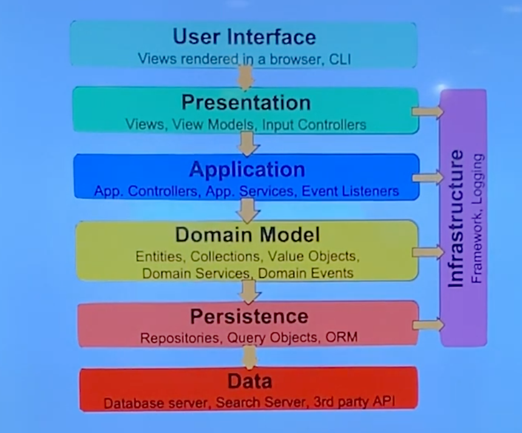

역사

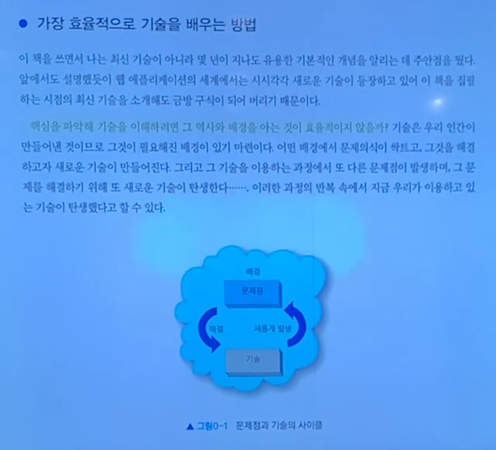

가장 효율적으로 기술을 배우는 방법

...

"역사를 잊은 기술에겐 미래란 없다" - 익명 크루 -

JDBC     SQLMAPPER     ORM
JDBC API MyBatic       JPA
         Spring JDBC   HIBERNATE
                       Spring JDBC/JPA

1997년

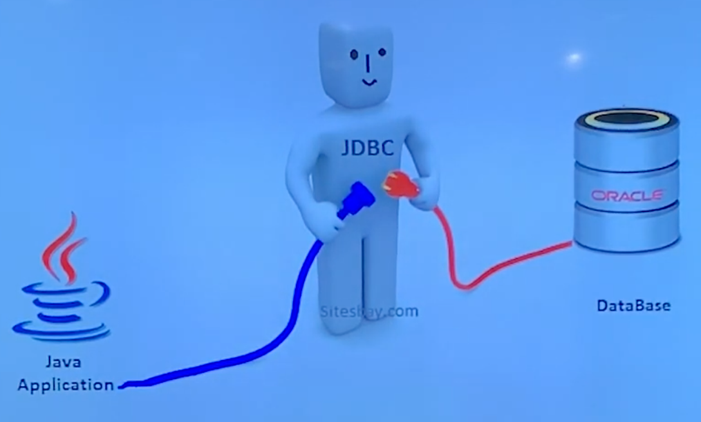

JDBC API
JAVA DATABASE CONNECTIVITY

1990년대 중반.

- 인터넷 보급. DB 산업 성장
- 온라인 비지니스의 투자 증가. DB Connector에 대한 니즈
...

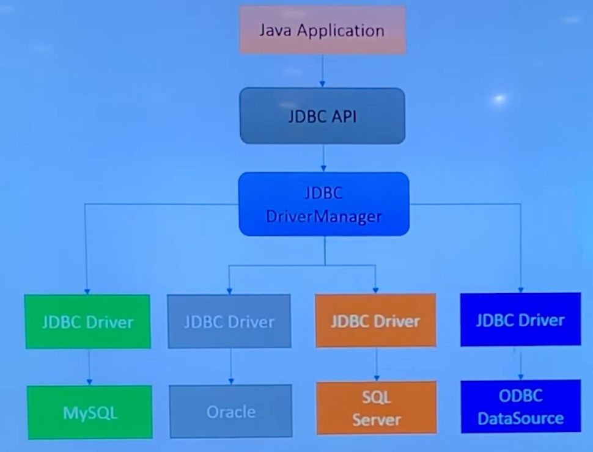

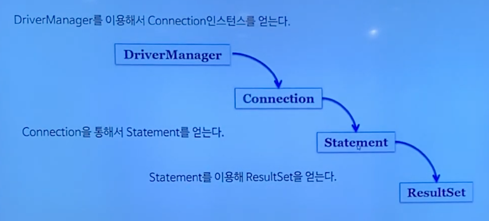

불편한 점?

중복 코드, 쿼리 작성, 커넥션 관리...

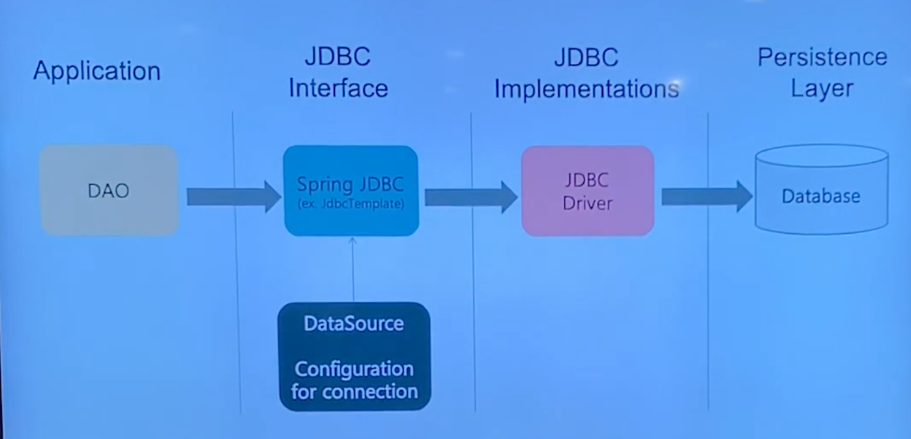

----
public class CrewDAO {
  private JdbcTemplate jdbcTemplate;
  @Autowired
  public void setDataSource(DataSource dataSource) {
    this.jdbcTemplate = new JdbcTemplate(dataSource);
  }
  public List<Crew> getCrews() {
    return jdbcTemplate.query("select * from crews", new...
}
----

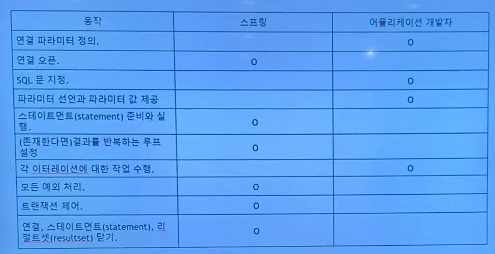

불편한 것들을 추상화

MyBatis 주 관심사는 SQL 분리!

MYBATIS

Query를 Java에서 XML로
- 복잡한 JDBC코드 X
- ResultSet과 같이 결과값을 맵핑하는 객체 X

- 간단한 설정!
...

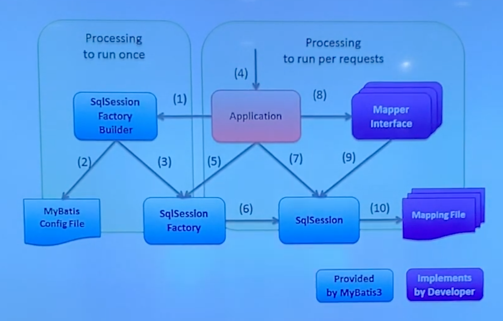

SqlSession이 핵심.

Crew

CrewDAO

xml 설정

ORM
OBJECT-RELATIONAL MAPPING

바라보는 시각이 다름.

객체지향으로 구현하는데 관계형DB에 연결하기 어렵다.

SQL에 의존적인 개발

----
public class Crew {
  private int id;
  private String name;
  private String nickname; // 추가
----

----
String sql...
----

select 추가 했는데 update추가 안했음

----
public class Crew {
  private int id;
  private String name;
  private String nickname;
  private Team team; // 추가
----

"물리적으로 SQL과 JDBC API를 데이터 접근 계층에 숨기는 데 성공했을지는 몰라도, 논리적으로는 엔티티와 아주 강한..."

패러다임의 불일치 - 연관 관계 (객체 참조), 상속

객체 지향 안해!

ORM 등장

Java에서 JPA인터페이스

Hibernate라는 대표적인 구현체

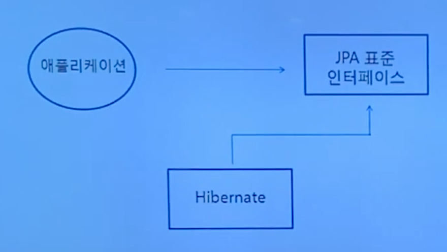

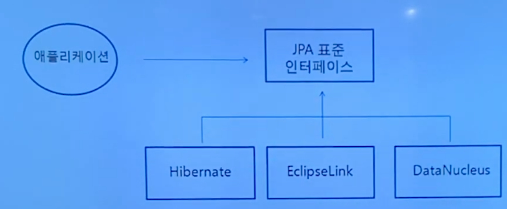

ENTITYMANGER - 영속성 컨텍스트

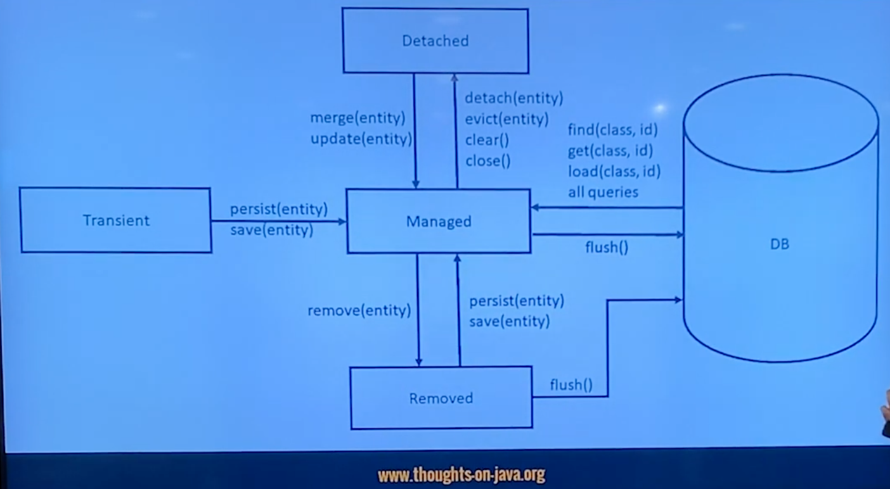

flush() 할 때 쿼리를 동적으로 생성

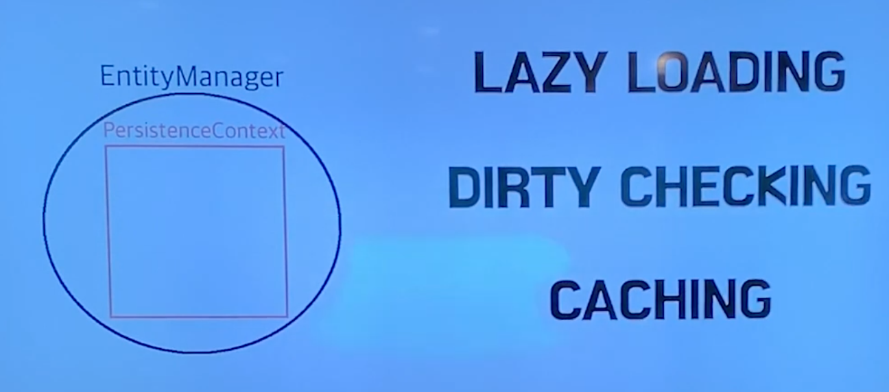

LAZY LOADING. Team조회 안하면 안가져 와도 된다.
DIRTY CHECKING. 바뀐거 검사
CACHING. 캐시에 있으면 조회안하고 캐시에 있는 거 준다

이동욱님 보라색 책.

Spring Data진영의 JPA

REPOSITORY

한단계 더 추상화

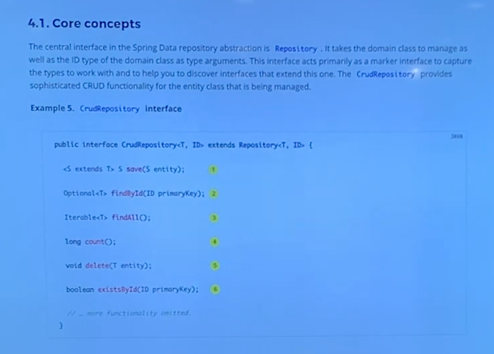

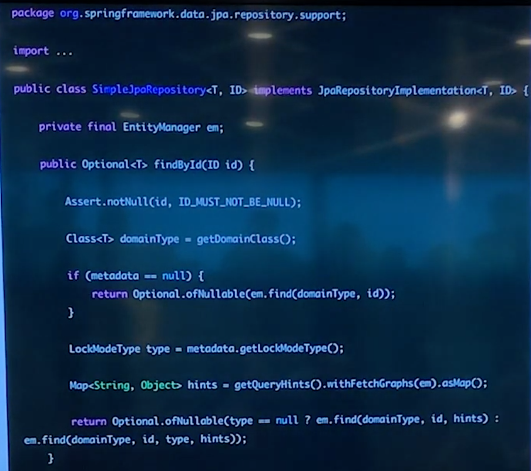

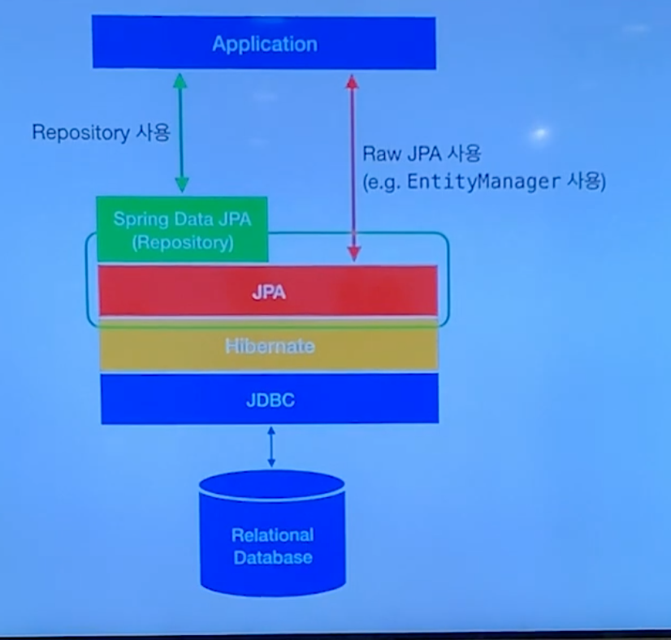

SIMPLE

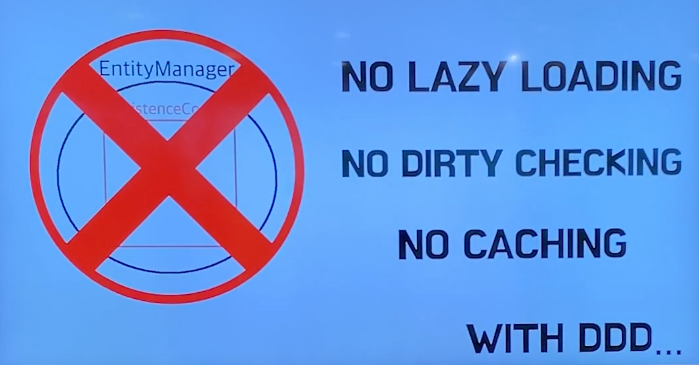

ORM이라고 하기에 살짝 애매함

"SPRING DATA JDBC A SIMPLE. LIMITED. OPINIONATED ORM."

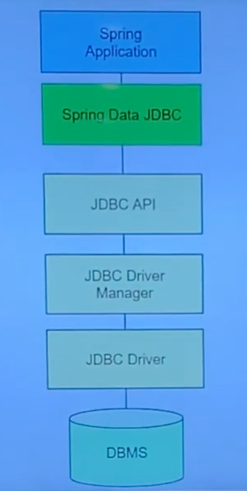

hibernate 안 쓰는 구조.
-> 안쓰는 건 아니지 않나?

