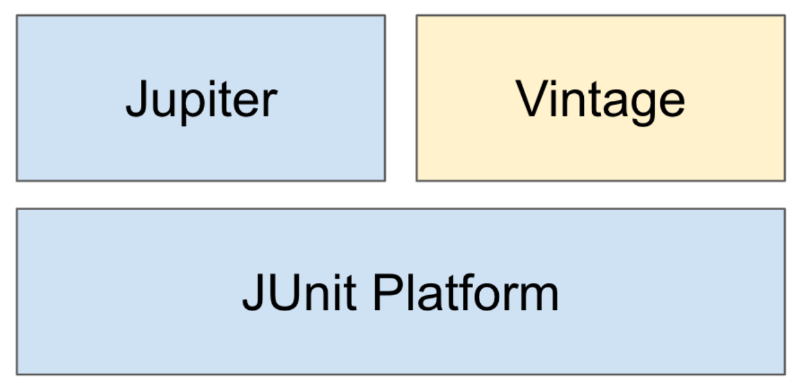

= 섹션 0. 1부 JUnit 5
:hardbreaks:

== 강의 자료

https://www.inflearn.com/course/the-java-application-test/lecture/28700?tab=curriculum

* 강의 노트: https://docs.google.com/document/d/1j6mU7Q5gng1mAJZUKUVya4Rs0Jvn5wn_bCUp3rq41nQ/edit
* Github 저장소: https://github.com/keesun/inflearn-the-java-test

== JUnit 5 소개

https://www.inflearn.com/course/the-java-application-test/lecture/28588?tab=note&speed=1.5

* 자바 개발자가 가장 많이 사용하는 테스팅 프레임워크
** https://www.jetbrains.com/lp/devecosystem-2019/java/
** "단위 테스트를 작성하는 자바 개발자 93% JUnit을 사용함."
* 자바 8 이상을 필요로 함.
* 대체제: TestNG, Spock, ...

Platform: 테스트를 실행해주는 런처 제공. TestEngine API 제공.
Jupiter: TestEngine API 구현체로 JUnit 5를 제공.
Vintage: JUnit 4와 3을 지원하는 TestEngine 구현체.

참고: https://junit.org/junit5/docs/current/user-guide/

== JUnit 5 시작하기

== JUnit 5 테스트 이름 표시하기
== JUnit 5 Assertion
== JUnit 5 조건에 따라 테스트 실행하기
== JUnit 5 태깅과 필터링
== JUnit 5 커스텀 태그
== JUnit 5 테스트 반복하기 1부
== JUnit 5 테스트 반복하기 2부
== JUnit 5 테스트 인스턴스
== JUnit 5 테스트 순서
== JUnit 5 junit-platform.properties
== JUnit 5 확장 모델
== JUnit 5 마이그레이션
== JUnit 5 연습 문제
