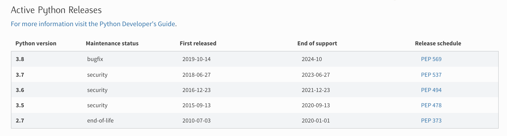
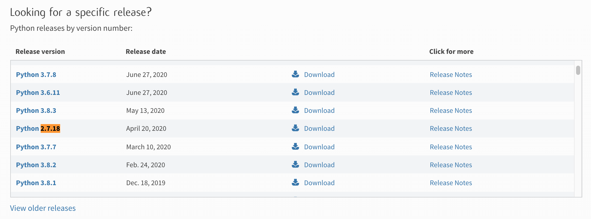

= Python 2 Installation - Build source code

Python2 는 2.7.18 버전을 마지막으로 더 이상의 지원은 없습니다.

== Download
https://www.python.org/downloads/ 에서 다운로드 받습니다.

는 아니고 아래쪽에 있습니다.

터미널에서 wget 명령어를 이용해서 다운로드 받을 수 있습니다.
----
wget https://www.python.org/ftp/python/2.7.18/Python-2.7.18.tgz
----

== 압축 해제
----
tar xvfz Python-2.7.18.tgz
----

----
cd Python-2.7.18/
./configure && make && sudo make install
----

기본적으로 설치 경로는 /usr/local/에 설치 되며 python 실행 파일은 /usr/local/bin/python 에 설치 됩니다.

만약 설치 경로를 바꾸고 싶다면 configure 에서 prefix를 지정해 주면 됩니다.

----
./configure --prefix=/program/Python-2.7.18
----

----
./configure --prefix=/Users/junho85/Python-2.7.18 && make && make install
----

== python 버전 확인

----
$ /Users/junho85/Python-2.7.18/bin/python --version
Python 2.7.18
----

== pip 설치

빌드해서 설치 하고 나면 pip가 없는 상태 입니다.
----
$ ./python -m pip
/Users/junho85/Python-2.7.18/bin/python: No module named pip
----

ensurepip로 pip를 설치합니다.
----
$ ./python -m ensurepip
DEPRECATION: Python 2.7 will reach the end of its life on January 1st, 2020. Please upgrade your Python as Python 2.7 won't be maintained after that date. A future version of pip will drop support for Python 2.7. More details about Python 2 support in pip, can be found at https://pip.pypa.io/en/latest/development/release-process/#python-2-support
Looking in links: /var/folders/f7/qrs7vm1n5pddvxcmxkl850ch0000gn/T/tmpU5u9to
Collecting setuptools
Collecting pip
Installing collected packages: setuptools, pip
Successfully installed pip-19.2.3 setuptools-41.2.0
----

이제 pip가 잘 동작 합니다.
----
$ ./python -m pip install requests
----

간단히 테스트 해 봅니다.

test.py
----
import requests
response = requests.get("https://httpbin.org/get")
print(response.text)
----

----
$ ./python test.py
{
  "args": {},
  "headers": {
    "Accept": "*/*",
    "Accept-Encoding": "gzip, deflate",
    "Host": "httpbin.org",
    "User-Agent": "python-requests/2.24.0",
    "X-Amzn-Trace-Id": "Root=1-5f60bd63-f24f6f78c7ade3d01bd666ea"
  },
  "origin": "14.47.185.136",
  "url": "https://httpbin.org/get"
}
----

== 정리
https://junho85.pe.kr/1677[python2 설치. 소스코드 빌드 해서 설치 하기 2020.09.16]

