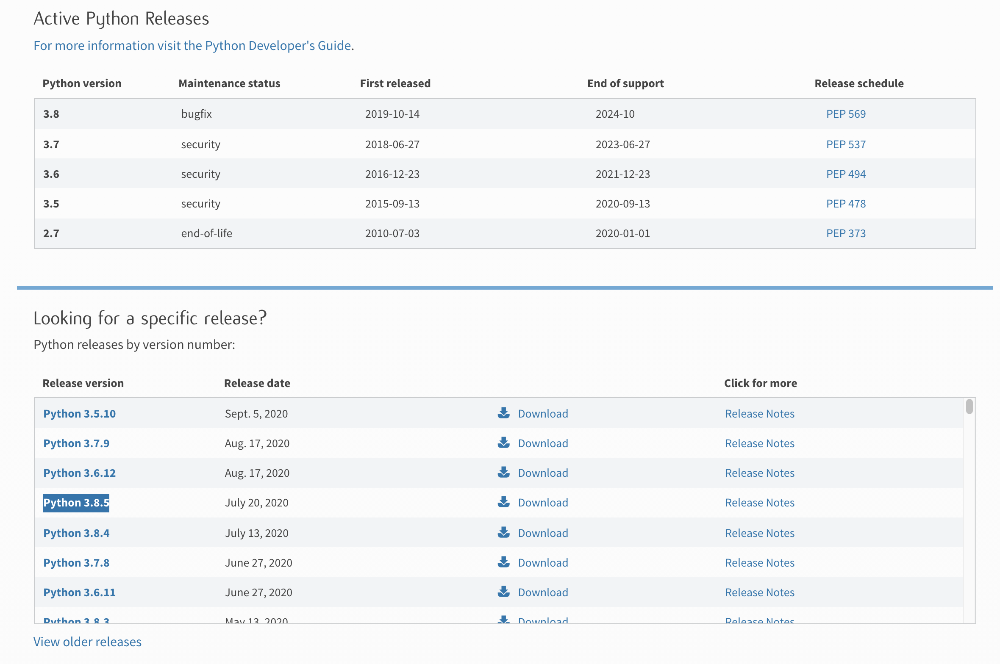

= Python 3 Installation - Build source code

== Download
https://www.python.org/downloads/ 에서 다운로드 받습니다.

터미널에서 wget 명령어를 이용해서 다운로드 받을 수 있습니다.
----
$ wget https://www.python.org/ftp/python/3.8.5/Python-3.8.5.tgz
----

== 압축 해제
----
$ tar xvfz Python-3.8.5.tgz
----

----
cd Python-3.8.5/
./configure && make && sudo make install
----

기본적으로 설치 경로는 /usr/local/에 설치 되며 python 실행 파일은 /usr/local/bin/python 에 설치 됩니다.

만약 설치 경로를 바꾸고 싶다면 configure 에서 prefix를 지정해 주면 됩니다.

----
./configure --prefix=/program/Python-3.8.5 && make && make install
----

----
./configure --prefix=/Users/junho85/Python-3.8.5 && make && make install
----

== python 버전 확인

----
$ /Users/junho85/Python-3.8.5/bin/python3 --version
Python 3.8.5
----

== pip
python2 와는 달리 pip가 기본적으로 설치 되어 있습니다.
----
$ ./python3 -m pip

Usage:
  /Users/junho85/Python-3.8.5/bin/python3 -m pip <command> [options]
...
----

pip로 requests모듈을 설치해 봅니다.
----
$ ./python3 -m pip install requests
----

간단히 테스트 해 봅니다.

test.py
----
import requests
response = requests.get("https://httpbin.org/get")
print(response.text)
----

----
$ ./python3 test.py
{
  "args": {},
  "headers": {
    "Accept": "*/*",
    "Accept-Encoding": "gzip, deflate",
    "Host": "httpbin.org",
    "User-Agent": "python-requests/2.24.0",
    "X-Amzn-Trace-Id": "Root=1-5f60c3c1-09e41900a92b15505e520c40"
  },
  "origin": "14.47.185.136",
  "url": "https://httpbin.org/get"
}
----

== 정리
https://junho85.pe.kr/1677[python2 설치. 소스코드 빌드 해서 설치 하기 2020.09.16]

