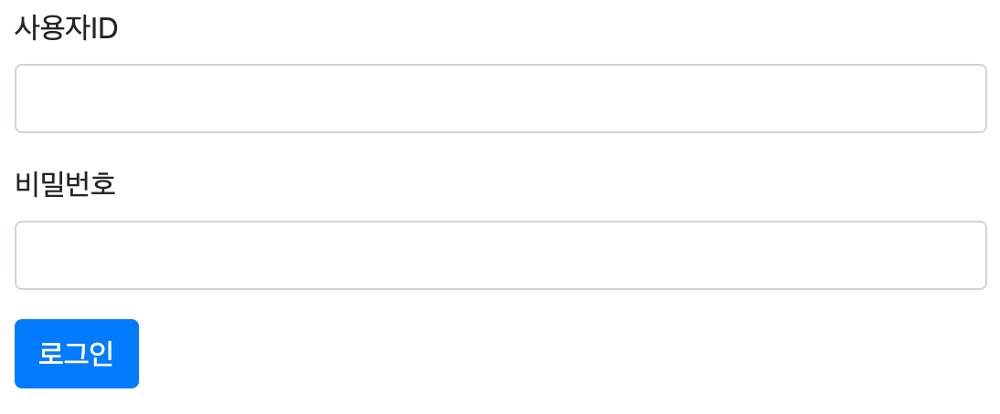
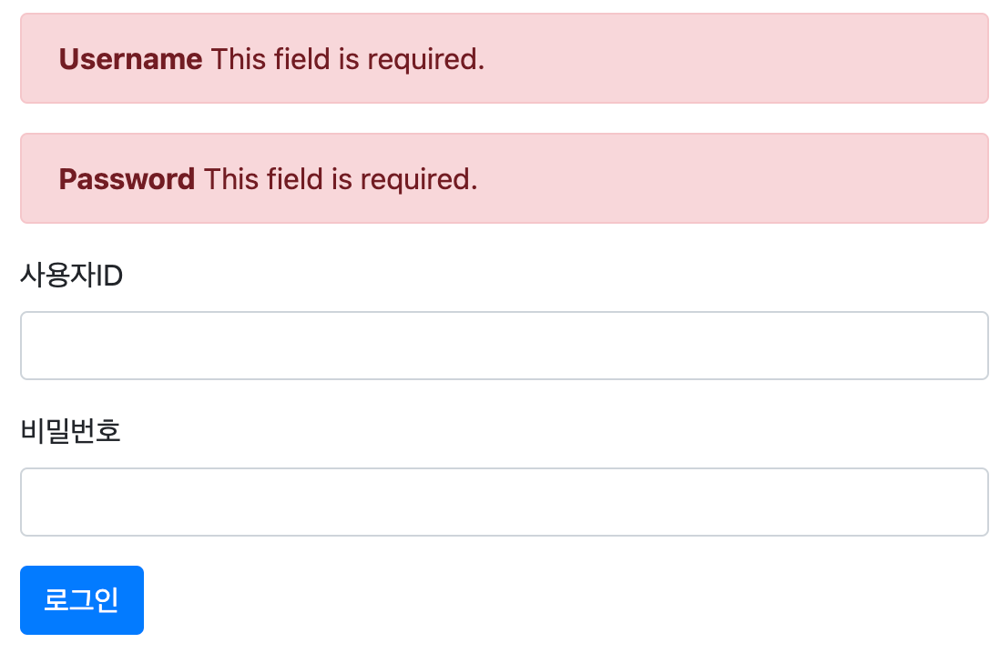
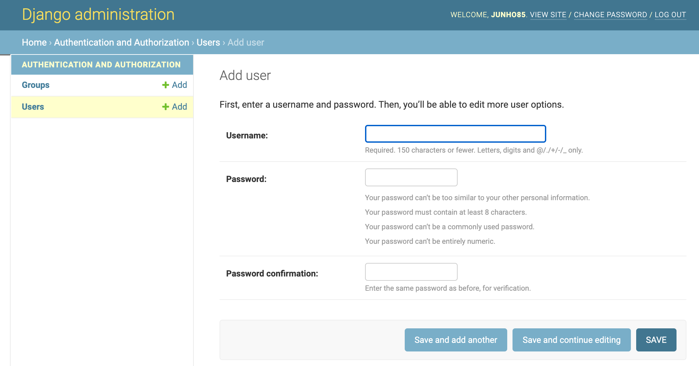

= 로그인/로그아웃 기능 추가

https://github.com/junho85/garden6/commit/5cee3d48ed4f1fe4c3c2a627c382c69f74aaabc6

https://github.com/junho85/garden6/commit/6deea53b899eab979526fc99e67697d87df8bdf8

== common/urls.py에 login/logout url 추가
common/urls.py에 login, logout url을 설정합니다.
[source,python]
----
    path('login/', auth_views.LoginView.as_view(template_name='login.html'), name='login'),
    path('logout/', auth_views.LogoutView.as_view(), name='logout'),
----

== garden6/settings.py 설정 - login, logout후 이동할 경로
garden6/settings.py에 login, logout후 이동할 경로를 설정합니다.
----
LOGIN_REDIRECT_URL = '/'
LOGOUT_REDIRECT_URL = '/'
----

== templates/login.html 작성
templates/login.html을 작성합니다.

[source,python]
----



    <form method="post" class="post-form" action="">
        
        
        

            <label for="username">사용자ID</label>
            <input type="text" class="form-control" name="username" id="username"
                   value="{{ form.username.value|default_if_none:'' }}">
        

        

            <label for="password">비밀번호</label>
            <input type="password" class="form-control" name="password" id="password"
                   value="{{ form.password.value|default_if_none:'' }}">
        

        <button type="submit" class="btn btn-primary">로그인</button>
    </form>


----

모양의 폼이 생성됩니다.

== templates/form_errors.html 작성
templates/form_errors.html을 작성합니다.
----

    
        
            

                <strong>{{ field.label }}</strong>
                {{ error }}
            

        
    
    
        

            <strong>{{ error }}</strong>
        

    

----

앞서 login.html에서 include하고 있던 form_errors.html 입니다. 없어도 특별히 문제 될 건 없지만 작성해주면 아래 처럼 오류가 발생하면 오류에 대해서 설명해 주는 화면이 나타납니다.

== templates/header.html에 로그인/로그아웃 버튼 추가

templates/header.html에 로그인/로그아웃 버튼을 추가합니다.
----
                
                    <a class="nav-link" href="">{{ user.username }} (로그아웃)</a>
                
                    <a class="nav-link" href="">로그인</a>
                
----

== DB설정과 유저 추가
dmin 기능을 사용하고 싶지 않다면 진행할 필요 없습니다.

admin기능을 사용하고 싶다면 다음 명령어를 실행합니다.
----
$ python manage.py migrate
Operations to perform:
  Apply all migrations: admin, auth, contenttypes, sessions
Running migrations:
  Applying contenttypes.0001_initial... OK
  Applying auth.0001_initial... OK
  Applying admin.0001_initial... OK
  ...
----
admin, auth, contenttypes, sessions 정보가 생성됩니다.

기본 슈퍼 유저를 생성합니다.

----
$ python manage.py createsuperuser
Username (leave blank to use 'junho85'): junho85
Email address: junho85@gmail.com
Password:
Password (again):
Superuser created successfully.
----

이후에는 django의 admin기능을 이용해서 유저를 추가해 줄 수 있습니다.

== 정리
* https://junho85.pe.kr/1809[정원사들 출석부. 로그인 기능 추가 2021.01.24]

== References
* https://wikidocs.net/71259[점프 투 장고 / 3-05 로그인·로그아웃 구현하기]
