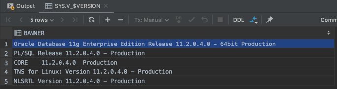
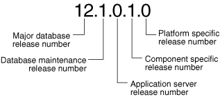

# oracle - version

## version 확인 방법
```
select * from v$version;
```

```
Oracle Database 11g Enterprise Edition Release 11.2.0.4.0 - 64bit Production
PL/SQL Release 11.2.0.4.0 - Production
CORE	11.2.0.4.0	Production
TNS for Linux: Version 11.2.0.4.0 - Production
NLSRTL Version 11.2.0.4.0 - Production
```


## version 5자리 의미
출처: https://docs.oracle.com/en/database/oracle/oracle-database/12.2/upgrd/about-oracle-database-release-numbers.html#GUID-1E2F3945-C0EE-4EB2-A933-8D1862D8ECE2

* 첫번째. Major database release number
* 두번째. Database maintenance release number
* 세번째. Application server release number
* 네번째. Component specific release number
* 다섯번째. Platform specific release number

## 정리
* [Oracle - 버전 확인 방법. 버전 5자리 의미. 2020.03.21](https://junho85.pe.kr/1480)

## References
* [About Oracle Database Release Numbers](https://docs.oracle.com/en/database/oracle/oracle-database/12.2/upgrd/about-oracle-database-release-numbers.html#GUID-1E2F3945-C0EE-4EB2-A933-8D1862D8ECE2)
* [Meaning of ‘i’,‘g’ and ‘c’ in Oracle Database Version](https://www.linkedin.com/pulse/meaning-ig-c-oracle-database-version-piyush-prakash)
* [What is the main difference between Oracle 8i, 9i, 10g, 11g, 12c?](https://www.quora.com/What-is-the-main-difference-between-Oracle-8i-9i-10g-11g-12c)
* [What is the meaning of database version in Oracle 2013.08.24](http://markstutpnt.blogspot.com/2013/08/what-is-meaning-of-database-version-in.html)
* [Oracle PL/SQL Articles](https://oracle-base.com/articles/plsql/articles-plsql)
  * 버전별 기능들에 대해 나열되어 있다.
