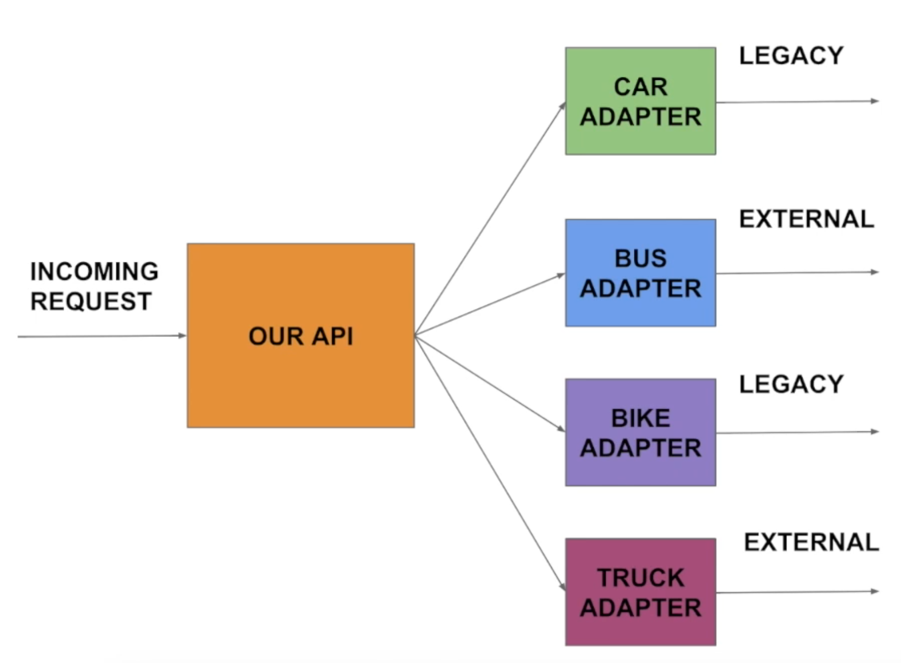

= Spring - ServiceLocatorFactoryBean

== References
* https://docs.spring.io/spring-framework/docs/current/javadoc-api/org/springframework/beans/factory/config/ServiceLocatorFactoryBean.html[Class ServiceLocatorFactoryBean]

=== https://namocom.tistory.com/819[ServiceLocatorFactoryBean 2020.01.31]
* 결제 수단이 추가되면 계속 PaymentService를 추가해야 함
* prepare, approve, cancel 같은 다른 메서드들도 모두 분기하는 로직이 등장
* 단일책임의 원칙 위반 및 중복되는 코드의 냄새

* 전략 패턴. 서비스를 추상화 하여 인터페이스로 분리하는 것도 좋은 전략
** 스프링에서는 ServiceLocatorFactoryBean을 통해 의존성을 끊을 수 있게 도와줌

공통 인터페이스 만든다. PaymentHandlerLocator. serviceLocatorInterface를 통해 설정 하면 스프링은 알아서 그 인터페이스 타입의 프록시 객체를 만들어 줌.

public enum PaymentType
  KAKAOPAY, NAVERPAY

PaymentService에 PaymentHandlerLocator 주입
prepare
...

@Service("KAKAOPAY")
public class KakaopayService {
  @Autowired KakaopayExternalAPI ...

  prepare

@Service("NAVERPAY")
public class NaverpayService {
  @AUtowired NaverpayExternalAPI ...

  prepare

PaymentType.KAKAOPAY의 경우 내부적으로 toString이 호출되어 "KAKAOPAY"라는 이름의 빈을 찾게 됨.

어떤 서비스를 결정해야 하는지 PaymentHandlerLocator가 결정을 하기 때문에 PaymentService는 바뀔 이유가 없음.

ServiceLocatorFactoryBean의 동작 원리

초기화

BeanFactory 주입

=== https://www.youtube.com/watch?v=rHk5pijFymo[Spring Boot - ServiceLocatorFactoryBean | Example | Simple Programming]

=== https://www.youtube.com/watch?v=dO3jN9CkwWI[Spring ServiceLocatorFactoryBean Example | Java Techie]

