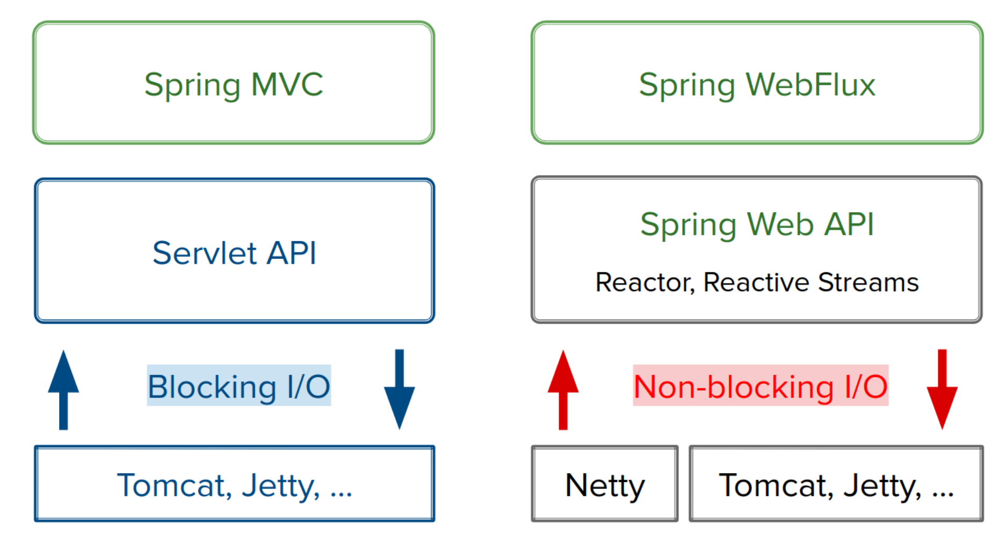

= History of Spring Framework

== GOTO 2018 • 15 Years of Spring: Evolving a Java Application Framework • Juergen Hoeller

https://www.youtube.com/watch?v=Tx6hBQQH3eI[GOTO 2018 • 15 Years of Spring: Evolving a Java Application Framework • Juergen Hoeller 2019.02.21]

Juergen Hoeller - Co-founder of Spring Framework

https://gotober.com/2018/sessions/496/15-years-of-spring-evolving-a-java-application-framework[15 Years of Spring: Evolving a Java Application Framework]

https://gotober.com/2018/sessions/496/slides[15 Years of Spring Evolving a Java Application Framework (2003 to 2018)]

https://books.google.co.kr/books?id=N6vEfdJws3IC&pg=PA716&lpg=PA716&dq=com.interface21&source=bl&ots=ZaUkxXkRLK&sig=ACfU3U2G2jDH1EhGRoYECdWqXE62lSAMrQ&hl=en&sa=X&ved=2ahUKEwiqg-_Bk5LqAhWJv5QKHa9mBRkQ6AEwAXoECAoQAQ#v=onepage&q=com.interface21&f=false

expert one-on-one J2EE Design and Development

== Spring Framework 0.9 -> 1.2
* Spring Framework 0.9 in June 2003
* Spring Framework 1.0 GA in march 2004

* XML bean definitions & bean lifecycle management at runtime
** manually declaring every sing bean (as a singleton or prototype)
** programmatic metadata underneath, allowing for other definition formats

* Early annotation support in Spring Framework 1.2 (on JDK 5)
** @Transactional annotation (with manual container setup)

* Spring MVC based on controller interface and class hierarchy

== Key Open Source Projects in the Struts Era
* jetty
* Hibernate
* Apache Tomcat
* eclipse

== The Third Book (2005, covering Spring Framework 1.2)
Professional Java Development with the Spring Framework

== Spring Framework 2.0 -> 2.5
* Spring Framework 2.0 in October 2006
* Spring Framework 2.5 in November 2007
* XMl bean definitions with scopes and convenient XML schemas
** declaring a runtime 'feature': <aop:config>, <tx:annotation-driven>
* Introducing annotation-driven injection and component scanning
** @Autowired, @Qualifier; <context:component-scan>
* Introducing @MVC as alternative to controller class hierarchy
** @Controller components with @RequestMapping methods

== Groovy & Grails
Groovy
Grails

== Weapons for the War on Java Complexity

== The Wider Spring Portfolio in 2009

== Spring Framework 3.0 -> 3.2
* Spring Framework 3.0 launched in December 2009
* JDK 5+ baseline, rich JDK 6 and Java EE 6 support

* Configuration classes & SpEL (Spring Expression Language)
** @Configuration, @Bean, @Enable annotations
** @Value: injecting configuration values via placeholder or expression
** container keeps using programmatic definition metadata underneath

* Comprehensive REST suport in Spring MVC
** @PathVariable resolution, Bean Validation integration, etc
** effectively reinventing Spring MVC as a REST endpoint model

== The State of the Art: Component Classes
[source,java]
----
@Service
@Lazy
public class MyBookAdminService implements BookAdminService {
  @Autowired
  public MyBookAdminService(AccountRepository repo) {
    ...
  }
  @Transactional
  public BookUpdate updateBook(Addendum addendum) {
    ...
  }
}
----

== The State of the Art: Configuration Classes
[source,java]
----
@Configuration
@EnableTransactionManagement
public class MyBookAdminConfig {
  @Bean
  @Scope("session")
  public BookAdminService myBookAdminService() {
    MyBookAdminService service = new MyBookAdminService();
    service.setDataSource(bookAdminDataSource());
    return service;
  }
  ...
}
----

== Cloud Foundry at Pivotal

== Spring Framework 4.0 -> 4.3
* 4.0 GA in December 2013 (three months before JDK 8 GA)
* JDK 6+ baseline, early but comprehensive JDK 8 support
* Early Java EE 7 support (including Servlet 3.1 & WebSockets)

* Programming model refinements
** generics-based injection matching, composable annotations
** conditional configuration with a lot of extensibility

* The foundation for Spring Boot 1.0 -> 1.5
** auto-configuration and dependency management
** self-contained cloud deployment, microservice architectures

== Composable Annotations
[source,java]
----
@Service
@Scope("session")
@Primary
@Transactional(rollbackFor=Exception.calss)
@Retention(RetentionPolicy.RUNTIME)
public @interface MyService {}

@MyService
public class MyBookAdminService {
  ...
}
----

== Common Annotations for MVC Controllers
[source,java]
----
@RestController
@CrossOrigin
public class MyRestController {
  @GetMapping("/books/{id}")
  public Book findBook(@PathVariable long id) {
    return this.bookAdminService.findBook(id);
  }
  @PostMapping("/books/new")
  public void newBook(@Valid Book book) {
    this.bookAdminService.storeBook(book);
  }
}
----

== The Importance of Reactive Architectures

== Spring Framework 5.0 -> 5.1
* 5.0 GA launched in September 2017 with a JDK 8+ baseline
* Coming with full JDK 9 support - one week after JDK 9 GA!

* Comprehensive integration with Java EE 8 API level
** Servlet 4.0, Bean Validation 2.0, JSON Binding API

* Functional API design & reactive web architectures
** on Java 8 as well as Kotlin
** Spring WebFlux: embracing Reactor and Reactive Streams

* The foundation for Spring Boot 2.0 -> 2.1

== Programmatic Bean Registration with Java 8
[source,java]
----
// Starting point may also be AnnotationConfigApplicationContext
GenericApplicationContext ctx = new GenericApplicationContext();
ctx.registerBean(Foo.class);
ctx.registerBean(Bar.class, () -> new Bar(ctx.getBean(Foo.class)));

// Or alternatively with some bean definition customzing
GenericApplicationContext ctx = new GenericApplicationContext();
ctx.registerBean(Foo.class, Foo::new);
ctx.registerBean(Bar.class, () -> new Bar(ctx.getBean(Foo.calss)),
                            bd -> bd.setLazyInit(true));
----

== Programmatic Bean Registration with Kotlin
[source,kotlin]
----
// Java-style usage of Spring's Kotlin extensions
val ctx = GenericApplicationContext()
ctx.registerBean(Foo::class)
ctx.registerBean { Bar(it.getBean(Foo::class)) }

// Gradle-style usage of Spring's Kotlin extensions
val ctx = GenericApplicationContext {
    registerBean<Foo>()
    registerBean { Bar(it.getBean<Foo>()) }
}
----

== Spring MVC on Servlets <-> Spring WebFlux on Reactor

== Reactive Web Controller with Repository Interop
[source,java]
----
@Controller
public class MyReactiveWebController {
  private final UserRepository repository;
  public MyReactiveWebController(UserRepository repository) {
    this.repository = repository;
  }
  @GetMapping("/users/{id}")
  public Mono<User> getUser(@PathVariable Long id) {
    return this.repository.findById(id);
  }
  @GetMapping("/users")
  public Flux<User> getUsers() {
    return this.repository.findAll();
  }
}
----

== Functional Web Endpoints in Lambda Style
[source,java]
----
UserReposityr reposityr = ...;

RouterFunction<?> router =
  route(GET("/users/{id}"),
    request -> {
      Mono<User> user = Mono.justOrEmpty(request.pathVariable("id"))
        .map(Long::valueOf).then(repository::findById);
      return ServerResponse.ok().body(user, User.class);
    })
  andRoute(GET("/users"),
    request -> {
      Flux<User> users = repository.findAll();
      return ServerResponse.ok().body(users, User.class);
    });
----

== Spring Framework 5.0
Sep 2017

support for JDK 8, 9, 10
functional style with Java & Kotlin
reactive web stack on Reactor

Spring Framework 5.1
Sep 2018
JDK 11, Reactor 3.2, etc
