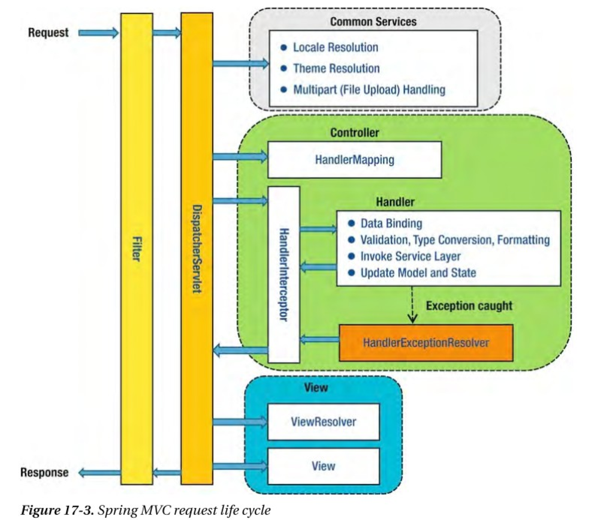

= Spring Boot - HTTP Request logging

== References
https://medium.com/@slothink/spring-boot-%EB%A1%9C-%EC%9A%94%EC%B2%AD%EC%97%90-%EB%8C%80%ED%95%B4%EC%84%9C-%EB%A1%9C%EA%B9%85%ED%95%98%EA%B8%B0-127a381be1d[Spring Boot 로 요청에 대해서 로깅하기]

https://www.baeldung.com/spring-http-logging[Spring – Log Incoming Requests]

https://taetaetae.github.io/2019/06/30/controller-common-logging/[Spring에서 Request를 우아하게 로깅하기]

https://justforchangesake.wordpress.com/2014/05/07/spring-mvc-request-life-cycle/[SPRING MVC REQUEST LIFE CYCLE]

