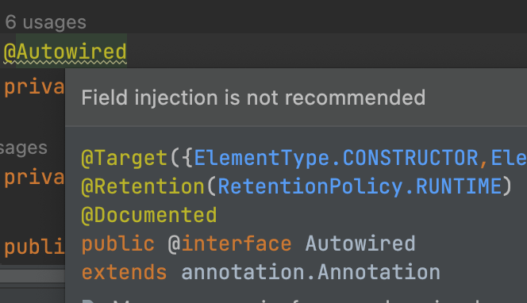

= 8.의존성 주입 (Dependency Injection)

https://www.youtube.com/watch?v=IVzYerodIyg[예제로 배우는 스프링 입문 8. 의존성 주입 (Dependency Injection)]

필요한 의존성을 어떻게 받아올 것인가...

@Autowired / @Inject를 어디에 붙일까?
* 생성자
* 필드
* Setter

`@Autowired`로 의존성 주입을 할 수 있음.

생성자에도 `@Autowired`로 주입할 수 있음.

스프링 4.3 이상 부터는 `@Autowired` 생략하고 사용할 수 있음. 레퍼런스 변수들이 빈으로 등록되어 있으면 됨.

[source,java]
----
private final OwnerRepository owners;

// @Autowired 생략 가능
public OwnerController(OwnerRepository owners) {
  this.owners = owners;
}
----

`@Autowired` 생성자로 의존성 주입 받는게 아니고 필드로 주입 받는거

[source,java]
----
@Autowired
private OwnerRepository owners;
----

Field injection is not recommended

요즘 IntelliJ에서는 자동으로 생성자로 바꾸도록 가이드 해주고 있는거로 보아 `@Autowired` 사용을 권장하지 않는 걸까?

setter에 `@Autowired` 붙이는 방법도 있음.

[source,java]
----
private OwnerRepository owners;

@Autowired
public void setOwners(OwnerRepository owners) {
  this.owners = owners;
}
----

field injection, setter injection, 생성자 injection

스프링프레임워크 레퍼런스에서 권장하는 방법은 생성자를 사용한 주입방식.

둘 다 생성자 injection을 사용하면 순환참조(circular dependency)가 발생할 수 있음. 그런 경우는 setter나 field injection 사용.

가급적이면 circular dependency가 발생하지 않도록 하는 것이 좋음.

== 과제
* OwnerController에 PetRepository 주입하기

field injection 할 떄는 final 쓰면 안됨.
----
@Autowired
private PetRepository petRepository;
----

생성자
----
private final PetRepository petRepository;
public OwnerController(OwnerRepository owners, PetRepository petRepository) {
  this.owners = owners;
  this.petRepository = petRepository;
}
----

setter
----
@Autowired
public void setPetRepository(PetRepository petRepository) {
  this.petRepository = petRepository;
}
----

== 기타
CSS 꺠지면 package
