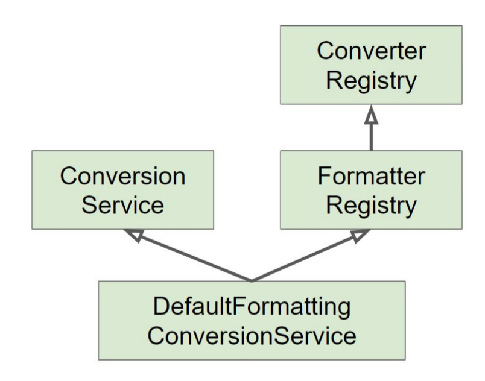

= 16. 데이터 바인딩 추상화: Converter와 Formatter.adoc

.https://docs.spring.io/spring-framework/docs/current/javadoc-api/org/springframework/core/convert/converter/Converter.html[Converter]
* S타입을 T타입으로 변환할 수 있는 매우 일반적인 변환기.
* 상태 정보 없음 == Stateless == 쓰레드세이프
* https://docs.spring.io/spring-framework/docs/current/javadoc-api/org/springframework/core/convert/converter/ConverterRegistry.html[ConverterRegistry]에 등록해서 사용
[source,java]
----
public class StringToEventConverter implements Converter<String, Event> {
  @Override
  public Event convert(String source) {
    Event event = new Event();
    event.setId(Integer.parseInt(source));
    return event;
  }
}
----

.https://docs.spring.io/spring-framework/docs/current/javadoc-api/org/springframework/format/Formatter.html[Formatter]
* PropertyEditor 대체제
* Object와 String간의 변화를 담당한다.
* 문자열을 Locale에 따라 다국화하는 기능도 제공한다. (optional)
* https://docs.spring.io/spring-framework/docs/current/javadoc-api/org/springframework/format/FormatterRegistry.html[FormatterRegistry]에 등록해서 사용

[source,java]
----
public class EventFormatter implements Formatter<Event> {
  @Override
  public Event parse(String text, Locale locale) throws ParseException {
    Event event = new Event();
    int id = Integer.parseInt(text);
    event.setId(id);
    return event;
  }

  @Override
  public String print(Event object, Locale locale) {
    return object.getId().toString();
  }
}
----

.https://docs.spring.io/spring-framework/docs/current/javadoc-api/org/springframework/core/convert/ConversionService.html[ConversionService]
* 실제 변환 작업은 이 인터페이스를 통해서 쓰레드-세이프하게 사용할 수 있음.
* 스프링 MVC, 빈(value)설정, SePL에서 사용한다.
* DefaultFormattingConversionService
** FormatterRegistry
** ConversionService
** 여러 기본 컨버터와 포매터 등록 해 줌.

.스프링 부트
* 웹 애플리케이션인 경우에 DefaultFormattingConversionService를 상속하여 만든 WebConversionService를 빈으로 등록해 준다.
* Formatter와 Converter 빈을 찾아 자동으로 등록해 준다.

== 정리

getAsText는 스트링으로 변환

setAsText 문자열을 받아서 다른 객체로 변환

문자와 오브젝트관의 관계

그런데 데이터 바인딩은 다른 타입도 가능. 좀 더 제너럴한 것. 일반적인 바인딩이 가능.

PropertyEditor가 가진 상태 정보를 없앤 Converter.

PropertyEditor대신 사용할 수 있는 기능.

EventEditor 삭제하고 Converter생성

상태 정보가 없어서 빈으로 등록해서 사용할 수 있음.
----
public class EventConverter {
    public static class StringToEventConverter implements Converter<String, Event> {

        @Override
        public Event convert(String source) {
            return new Event(Integer.parseInt(source));
        }
    }

    public static class EventToStringConverter implements Converter<Event, String> {

        @Override
        public String convert(Event source) {
            return source.getId().toString();
        }
    }
}
----

Integer같은건 스프링이 기본적으로 해 주는거고 Event처럼 직접 만든거는 만들어 쓰는거

----
    @GetMapping("/event/{event}")
    public String getEvent(@PathVariable Event event) {
----

Formatter 좀 더 웹쪽에 특화해서 만든거

Formatter도 쓰레드세이프함.

빈으로 등록하고 messageSource같은거 주입해서 locale처리 할 수 있다.

WebConversionService는 부트에서 제공해주는 서비스

ConversionService을 상속받아 구현함.

웹과 관련된 빈만 등록해준다. 컨트롤러만 등록.

포매터나 컨퍼터가 등록되지 않을 수 있음.

기존
----
@WebMvcTest
----

포메터 사용하려면 아래 처럼 추가
----
@WebMvcTest({EventFormatter.class, EventController.class})
----

컨퍼터 사용하려면 아래 처럼 추가
----
@WebMvcTest({EventConverter.StringToEventConverter.class, EventController.class})
----

추천드리고 싶은 방법은 Formatter사용하는 방법

보통 웹과 관련된거 사용하기 때문.

컨버터 사용해도 상관 없음.

JPA관련해서 사용하면 @Entity 컨버터가 이미 등록되어 있음.

등록되어 있는 컨버터 전부 보는 방법\

----
System.out.println(conversionService);
----

여러 컨버터들이 기본적으로 등록 되어 있음.
----
ConversionService converters =
	@org.springframework.format.annotation.DateTimeFormat java.lang.Long -> java.lang.String: org.springframework.format.datetime.DateTimeFormatAnnotationFormatterFactory@2938127d,@org.springframework.format.annotation.NumberFormat java.lang.Long -> java.lang.String: org.springframework.format.number.NumberFormatAnnotationFormatterFactory@56637cff
	@org.springframework.format.annotation.DateTimeFormat java.time.LocalDate -> java.lang.String: org.springframework.format.datetime.standard.Jsr310DateTimeFormatAnnotationFormatterFactory@3c3c4a71,java.time.LocalDate -> java.lang.String : org.springframework.format.datetime.standard.TemporalAccessorPrinter@1352434e
	@org.springframework.format.annotation.DateTimeFormat java.time.LocalDateTime -> java.lang.String: org.springframework.format.datetime.standard.Jsr310DateTimeFormatAnnotationFormatterFactory@3c3c4a71,java.time.LocalDateTime -> java.lang.String : org.springframework.format.datetime.standard.TemporalAccessorPrinter@74170687
	@org.springframework.format.annotation.DateTimeFormat java.time.LocalTime -> java.lang.String: org.springframework.format.datetime.standard.Jsr310DateTimeFormatAnnotationFormatterFactory@3c3c4a71,java.time.LocalTime -> java.lang.String : org.springframework.format.datetime.standard.TemporalAccessorPrinter@2b6fcb9f
	@org.springframework.format.annotation.DateTimeFormat java.time.OffsetDateTime -> java.lang.String: org.springframework.format.datetime.standard.Jsr310DateTimeFormatAnnotationFormatterFactory@3c3c4a71,java.time.OffsetDateTime -> java.lang.String : org.springframework.format.datetime.standard.TemporalAccessorPrinter@77bb48d5
	@org.springframework.format.annotation.DateTimeFormat java.time.OffsetTime -> java.lang.String: org.springframework.format.datetime.standard.Jsr310DateTimeFormatAnnotationFormatterFactory@3c3c4a71,java.time.OffsetTime -> java.lang.String : org.springframework.format.datetime.standard.TemporalAccessorPrinter@12d5c30e
	@org.springframework.format.annotation.DateTimeFormat java.time.ZonedDateTime -> java.lang.String: org.springframework.format.datetime.standard.Jsr310DateTimeFormatAnnotationFormatterFactory@3c3c4a71,java.time.ZonedDateTime -> java.lang.String : org.springframework.format.datetime.standard.TemporalAccessorPrinter@3d96fa9e
	@org.springframework.format.annotation.DateTimeFormat java.util.Calendar -> java.lang.String: org.springframework.format.datetime.DateTimeFormatAnnotationFormatterFactory@2938127d
	@org.springframework.format.annotation.DateTimeFormat java.util.Date -> java.lang.String: org.springframework.format.datetime.DateTimeFormatAnnotationFormatterFactory@2938127d
	@org.springframework.format.annotation.NumberFormat java.lang.Byte -> java.lang.String: org.springframework.format.number.NumberFormatAnnotationFormatterFactory@56637cff
	@org.springframework.format.annotation.NumberFormat java.lang.Double -> java.lang.String: org.springframework.format.number.NumberFormatAnnotationFormatterFactory@56637cff
... // 직접 등록한거도 있음.
	java.lang.String -> kr.pe.junho85.demo.Event: kr.pe.junho85.demo.EventFormatter@33d53216,java.lang.String -> kr.pe.junho85.demo.Event : kr.pe.junho85.demo.EventConverter$StringToEventConverter@ffaaaf0
...
----

DateTimeFormat 많이 쓸건데 이건 mvc에서
