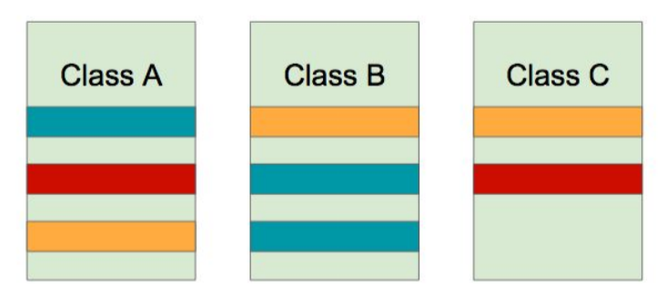
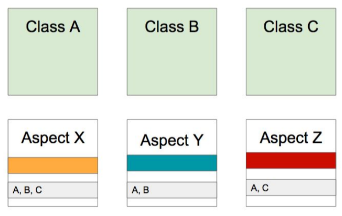

= 18.스프링 AOP: 개념 소개.adoc

https://www.inflearn.com/course/spring-framework_core/lecture/15525

Aspect-oriented Programming (AOP)은 OOP를 보완하는 수단으로, 흩어진 Aspect를 모듈화 할 수 있는 프포그래밍 기법.

흩어진 관심사 (Crosscutting Concerns)

AOP를 적용하면?

.AOP 주요 개념
* Aspect와 Target
* Advice
* Join point와 Pointcut

.AOP 구현체
* https://en.wikipedia.org/wiki/Aspect-oriented_programming
* 자바
** AspectJ
** 스프링 AOP

.AOP 적용 방법
* 컴파일
* 로드 타임
* 런타임

== 정리
스프링 AOP 개념

스프링 AOP는 AOP의 구현체를 제공

AspectJ를 연동해서 사용할 수 있는 기능도 제공

스프링 트랜잭션 등 여러 기능이 적용 되고 있음

Cached도 마찬가지

흩어진 Aspect를 모듈화 할 수 있는 기능

Aspect를 모듈화 하는 프로그래밍 기법

OOP와 보완관계

그림1. 동일한 색깔이 동일한 concern

:hardbreaks:
트랜잭션
setAutoCommit을 false 하고...
기존에 있던 서비스 코드를 감싸야 함

로깅

.AOP 주요 개념
* Aspect와 Target
* Advice
* Join point(합류점. 끼어들 수 있는 지점. 생상자 호출 했을 때. 필드에 접근하기 전.)와 Pointcut

AOP구현체는 많음

https://en.wikipedia.org/wiki/Aspect-oriented_programming#Implementations

https://en.wikipedia.org/wiki/AspectJ[AspectJ]

.AOP 적용 방법
* 컴파일
** 바이트코드 생성시
** 장점: 성능적으로 부하가 적다
** 단점: 별도의 컴파일 과정을 거쳐야 한다.
* 로드 타임
** 위빙. 낑겨 넣기.
** 단점: 클래스 로딩 할 때 약간의 부하. 로드 타임 위버를 설정 해 주어야 한다.
** 장점: 다양한 문법을 사용할 수 있다. aspectj
* 런타임
** 빈을 만들 때 proxy빈을 만든다. 감싼거. 뒤에서 좀 더 다룸.
** 단점: 최초 빈을 만들 때 약간의 성능 저하.
** 장점: 아무런 설정 필요 없음. 문법이 쉽다. AOP공부 많이 할 필요 없음.
** 이 방법이 가장 현실적이고 널리 쓰이는 방법

관심사를 모은다.

스프링AOP만 다룬다. 현실적이고 대부분 커버.
AspectJ는 다루지 않음.
