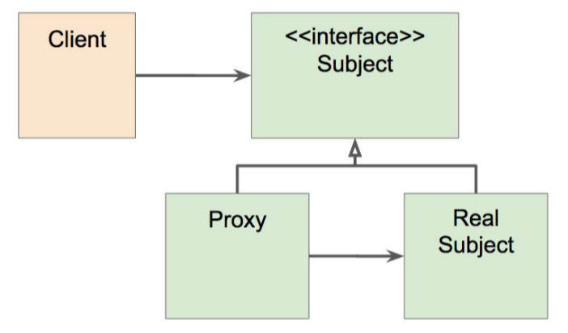

= 19.스프링 AOP: 프록시 기반 AOP

https://www.inflearn.com/course/spring-framework_core/lecture/15526

.스프링 AOP 특징
* 프록시 기반의 AOP 구현체
* 스프링 빈에만 AOP를 적용할 수 있다.
* 모든 AOP 기능을 제공하는 것이 목적이 아니라, 스프링 IoC와 연동하여 ㅇ네터프라이즈 애플리케이션에서 가장 흔한 문제에 대한 해결책을 제공하는 것이 목적.

.프록시 패턴
* 왜? (기존 코드 변경 없이) 접근 제어 또는 부가 긴으 추가

* 기존 코드를 건드리지 않고 성능을 측정해 보자. (프록시 패턴으로)

.문제점
* 매번 프록시 클래스를 작성해야 하는가?
* 여러 클래스 여러 메소드에 적용하려면?
* 객체들 관계도 복잡하고...

.그래서 등장한 것이 스플이 AOP
* 스프링 IoC 컨테이너가 제공하는 기반 시설과 Dynamic 프록시를 사용하여 여러 복잡한 문제 해결.
* 동적 프록시: 동적으로 프록시 객체 생성하는 방법
** 자바가 제공하는 방법은 인터페이스 기반 프록시 생성.
** CGlib은 클래스 기반 프록시도 지원.
* 스프링 IoC: 기존 빈을 대체하는 동적 프록시 빈을 만들어 등록 시켜준다.
** 클라이언트 코드 변경 없음.
** https://docs.spring.io/spring/docs/current/javadoc-api/org/springframework/aop/framework/autoproxy/AbstractAutoProxyCreator.html[AbstractAutoProxyCreator] implements https://docs.spring.io/spring/docs/current/javadoc-api/org/springframework/beans/factory/config/BeanPostProcessor.html[BeanPostProcessor]

== 정리

본격적으로 스프링 AOP. 프록시 기반의 AOP에 대해 살펴 봄.

starter-web 에 aop가 없어서 따로 가져와야 한다.

모든 AOP 기능을 제공하는 것이 목적 아님. 스프링 IoC와 연동하여 엔터프라이즈 애플리케이션에서 가장 흔한 문제에 대한 해결책을 제공하는 것이 목적.

원래 해야 할 일은 Real Subject에 있음.

Proxy가 감싸서 실제 클라이언트의 요청을 처리하게 됨.

목적은 접근 제어 또는 부가 기능 추가

인터페이스가 있으면 인터페이스 타입으로 주입 받는게 좋다.

----
    @Autowired
    EventService eventService;
----

----
long begin = System.currentTimeMillis();
...
System.out.println(System.currentTimeMillis() - begin);
----
createEvent, publishEvent에 넣었는데 매번 작성안하려면

스프링부트 팁

서버로 도는게 아니고 바로 종료 되도록. 테스트도 더 빠르게 할 수 있음.

----
@SpringBootApplication
public class DemoApplication {

    public static void main(String[] args) {
        SpringApplication app = new SpringApplication(DemoApplication.class);
        app.setWebApplicationType(WebApplicationType.NONE);
        app.run(args);
    }
}
----

ProxySimpleEventService 만들어서 원래 코드 안 건드리고 했음.

그래도 코드 중복은 발생함.

동적으로 프록시 객체를 만드는 방법

서비스라는 빈을 감싸는 프록시

그런일을 해 주는 클래스가 AbstractAutoProxyCreator

https://docs.spring.io/spring/docs/current/javadoc-api/org/springframework/aop/framework/autoproxy/AbstractAutoProxyCreator.html[AbstractAutoProxyCreator] implements https://docs.spring.io/spring/docs/current/javadoc-api/org/springframework/beans/factory/config/BeanPostProcessor.html[BeanPostProcessor]

토비의 스프링 3 에 아주 자세히 나와 있음.

다음에는 스프링 AOP로 해 보겠음.
