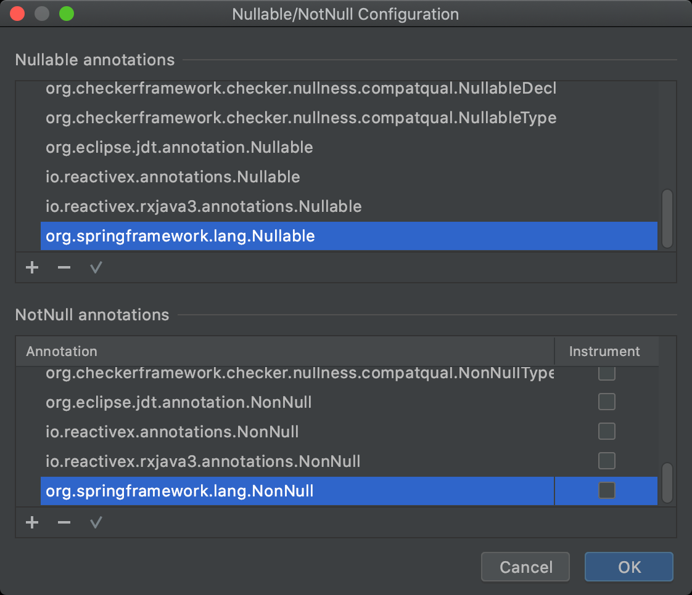
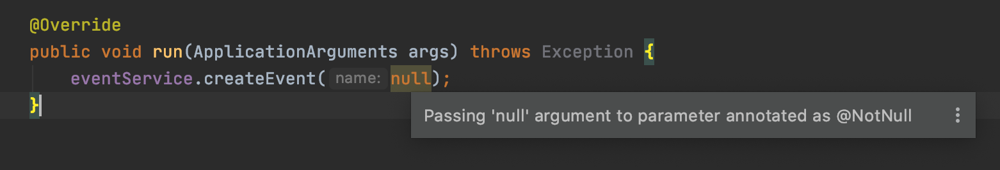
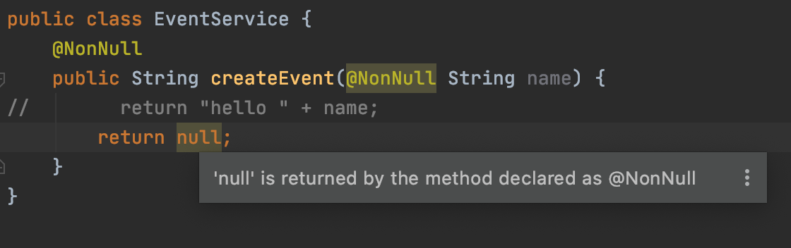

= 21.Null-safety

https://www.inflearn.com/course/spring-framework_core/lecture/15529

스프링 프레임워크 5에 추가된 Null 관련 애노테이션
* @NonNull
* @Nullable
* @NonNullApi (패키지 레벨 설정)
* @NonNullFields (패키지 레벨 설정)

.목적
* (툴의 지원을 받아) 컴파일 시점에 최대한 NullPointerException을 방지하는 것

== 정리

Preferences -> Build, Execution, Deployment -> Compiler

Configure annotations...

Nullable annotations 에 org.springframework.lang.Nullable

NotNull annotations 에 org.springframework.lang.NonNull

추가해 준다.

intellij는 재시작한다.

경고가 보이기 시작한다.

