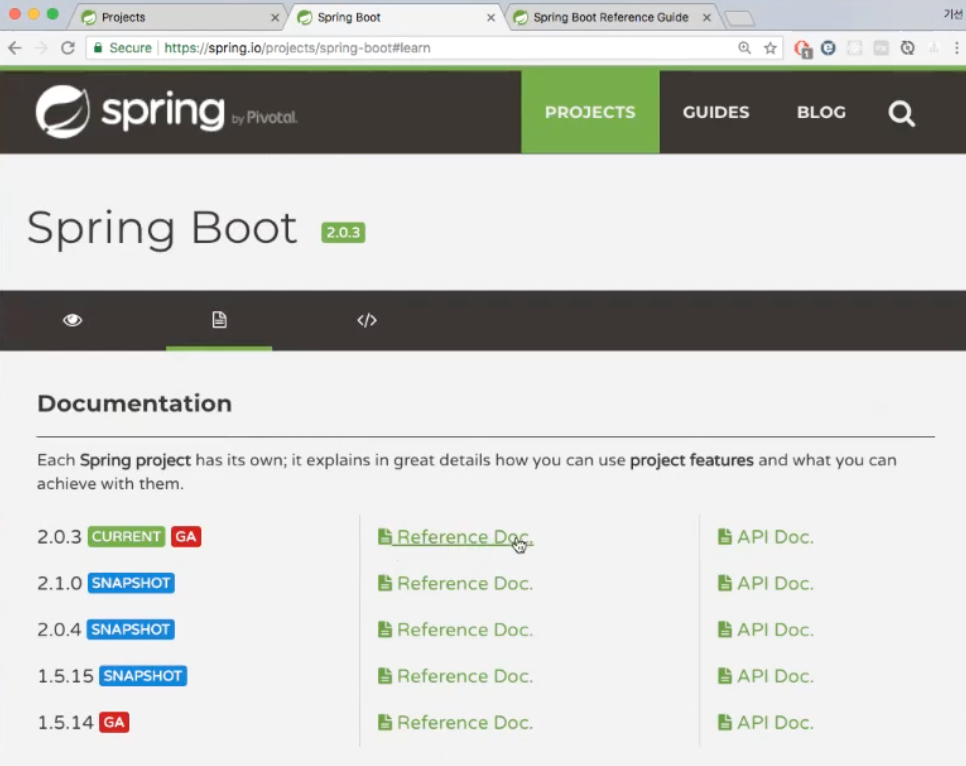
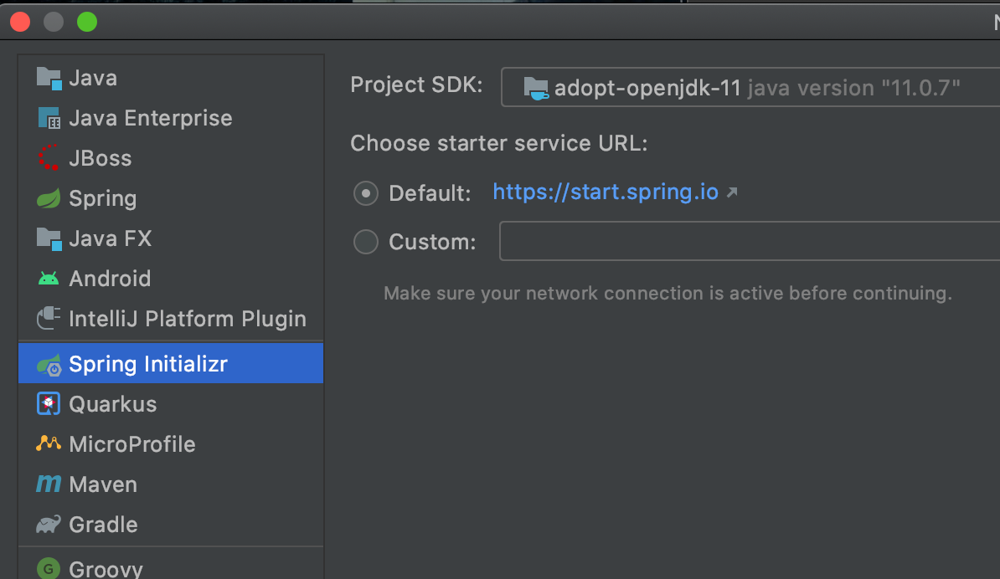

= 02.스프링 부트 시작하기

https://www.inflearn.com/course/%EC%8A%A4%ED%94%84%EB%A7%81%EB%B6%80%ED%8A%B8/lecture/13516

https://docs.spring.io/spring-boot/docs/2.0.3.RELEASE/reference/htmlsingle/#getting-started-maven-installation

스프링 부트 애플리케이션을 만들어 볼 것임

https://spring.io -> Projects -> Spring Boot

두번째 탭에 문서 모양. Reference Doc

지금은 좀 달라짐

https://docs.spring.io/spring-boot/docs/current/reference/htmlsingle/

https://docs.spring.io/spring-boot/docs/2.0.3.RELEASE/reference/htmlsingle/#getting-started-maven-installation

IDE이용하면 Create New Project

IntelliJ Ultimate에서는 Spring Initializr로 생성.

커뮤니티 버전에는 없을거고 maven이나 gradle 등을 이용해서 생성. 익숙한거로.

maven 프로젝트 생성

parent를 먼저 추가해 줍니다.
----
    <parent>
        <groupId>org.springframework.boot</groupId>
        <artifactId>spring-boot-starter-parent</artifactId>
        <version>2.3.1.RELEASE</version>
        <relativePath/>
    </parent>
----

spring-boot-starter-web
----
        <dependency>
            <groupId>org.springframework.boot</groupId>
            <artifactId>spring-boot-starter-web</artifactId>
        </dependency>
----

spring-boot-maven-plugin
----
    <build>
        <plugins>
            <plugin>
                <groupId>org.springframework.boot</groupId>
                <artifactId>spring-boot-maven-plugin</artifactId>
            </plugin>
        </plugins>
    </build>
----

Application

[source,java]
----
@SpringBootApplication
public class DemoApplication {

    public static void main(String[] args) {
        SpringApplication.run(DemoApplication.class, args);
    }

}
----

실행

앞으로 이정도 만드는 과정은 스킵 하고 진행할 것임. 스프링 이니셜라이져로 프로젝트 만들면 자동으로 진행 되는 부분들임.

tomcat이 8080 포트에서 돌고 있음

----
2020-07-19 23:29:31.570  INFO 15429 --- [           main] o.s.b.w.embedded.tomcat.TomcatWebServer  : Tomcat started on port(s): 8080 (http) with context path ''
----

터미널을 열어서
----
mvn package
----
jar파일이 생김

jar파일 실행
----
java -jar target/demo-0.0.1-SNAPSHOT.jar
----

원리에 대해서 설명할 예정.

사용하는법 위주로 알고 싶으면 원리는 건너 뛰면 됨
