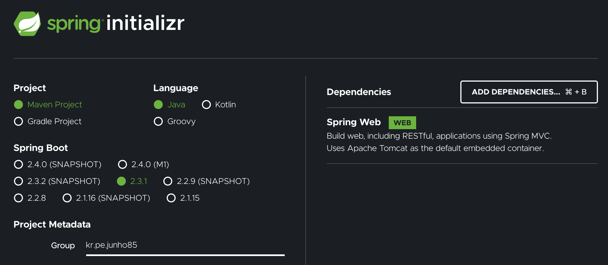

= 03.스프링 부트 프로젝트 생성기

https://www.inflearn.com/course/%EC%8A%A4%ED%94%84%EB%A7%81%EB%B6%80%ED%8A%B8/lecture/13517

https://start.spring.io/

group에 패키지 경로
artifact springinit

dependencies에 web 추가

generate

요즘은 좀 다름

generate하면 프로젝트 압축 파일이 다운로드 됨.

압축 풀기.

앞서 만들었던거에 테스트도 추가 되어 있음.

커맨드로 하는 방법은 따로 설명 하지 않음
