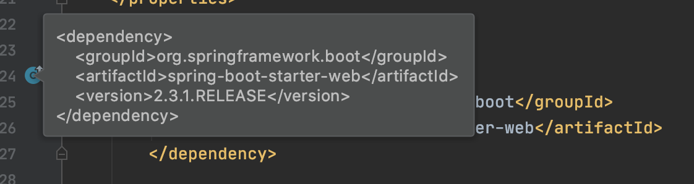
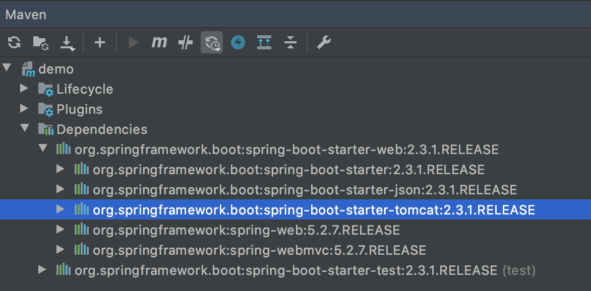

= 01. 의존성 관리 이해

https://www.inflearn.com/course/%EC%8A%A4%ED%94%84%EB%A7%81%EB%B6%80%ED%8A%B8/lecture/13520

https://docs.spring.io/spring-boot/docs/current/reference/htmlsingle/#using-boot-dependency-management

스프링 부트가 어떻게 수많은 의존성을 가져왔는지 설명.

이게 왜 좋은지 설명.

의존성 정의한게 별로 없음. 버전을 명시하지도 않았음. 적절한 버전으로 가져옴.

스프링부트의 의존성 관리 기능 때문.

parent pom에 보면 또 parent있음

spring-boot-dependencies에 보면 버전이 잔뜩 적혀 있음.

쉽게 계층구조로 볼 수 있음.

우리가 직접 관리해야할 의존성의 수가 줄어듬.

spring 버전을 올린다거나 3rd party 라이브러리 올리려면.

문제가 생기면 다른 버전 찾거나. 버전 내려서 맞추거나.

그런데 spring boot가 등장해서 의존성 관리 해 주고 나서는 할일이 별로 없음.

예전에 cglib에서 충돌 많이 났었음. 하이버네이트 같은거. 충돌 해결 방법 공유하고 그랬는데 요즘은 그럴일이 잘 없음.

특별히 원하는 버전이 있으면 직접 적어주면 됨. 오버라이딩이 됨.

parent 폼 쓰지 않고 하는 방법

13.2.2 Using Spring Boot without the Parent POM

기존의 부모가 있다면. 싸서 사용. 부모의 부모로 만들길.

dependencyManagement 사용. 단점. 의존성만 가져 오는게 아니고 그 밖에 다른 것들 설정이 있는데. (java가 1.8. 인코딩 UTF-8. ...). 플러그인. 스프링 부트에 최적화된 설정들이 있는데 이런 설정들이 안먹히게 됨.

parent로 쓰는걸 추천드림. parent로 받아서 사용해서 더 많은 기본세팅을 사용할 수 있음.

