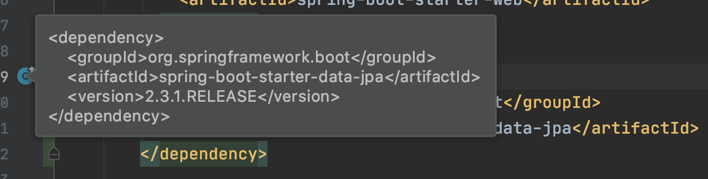

= 02.의존성 관리 응용

https://www.inflearn.com/course/%EC%8A%A4%ED%94%84%EB%A7%81%EB%B6%80%ED%8A%B8/lecture/13521

* 버전 관리 해주는 의존성 추가
* 버전 관리 안해주는 의존성 추가
* 기존 의존성 버전 변경하기
* https://mvnrepository.com/

스프링부트가 지원하는 의존성 관리를 활용하는 방법.

의존성을 추가하는 방법.

spring data jpa

----
        <dependency>
            <groupId>org.springframework.boot</groupId>
            <artifactId>spring-boot-starter-data-jpa</artifactId>
        </dependency>
----

이렇게 버전이 뜨면 버전 안적어 줘도 됨.

modelmapper 추가 해 보기

https://mvnrepository.com/

http://modelmapper.org/

DTO. 도메인객체. 코딩으로 일일이 복사해줘야 되는데 자동으로 해 줌. 코드 한줄로.

spring boot 가 관리 해주지 않기 때문에 버전을 명시해 줘야 됨.

----
<!-- https://mvnrepository.com/artifact/org.modelmapper/modelmapper -->
<dependency>
    <groupId>org.modelmapper</groupId>
    <artifactId>modelmapper</artifactId>
    <version>2.3.8</version>
</dependency>
----

버전 안적어도 버전 가져오긴 하는데 버전을 적어 주는게 best practice. 개발할때랑 배포할때랑 다른 버전이 되면 좋지 않음.

항상 버전을 명시하는게 좋음.

spring.version을 바꿔 보겠음.

spring-boot-dependencies에
<spring.version></spring.version>
