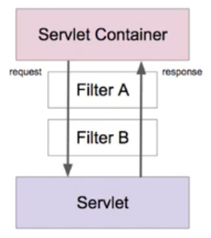

= 04. 서블릿 리스너와 필터

https://www.inflearn.com/course/%EC%9B%B9-mvc/lecture/17383?tab=curriculum&speed=1.5

서블릿 리스너와 서블릿 필터

서블릿 리스너
* 웹 애플리케이션에서 발생하는 주요 이벤트를 감지하고 각 이벤트에 특별한 작업이 필요한 경우에 사용할 수 있다.
** 서블릿 컨텍스트 수준의 이벤트
*** 컨텍스트 라이프사이클 이벤트
*** 컨텍스트 애트리뷰트 변경 이벤트
** 세션 수준의 이벤트
*** 세션 라이프사이클 이벤트
*** 세션 애트리뷰터 변경 이벤트

서블릿 필터
* 들어온 요청을 서블릿으로 보내고, 또 서블릿이 작성한 응답을 클라이언트로 보내기 전에 특별한 처리가 필요한 경우에 사용할 수 있다.
* 체인 형태의 구조

참고 oracle filters.html

조금 다른 url https://docs.oracle.com/cd/A97329_03/web.902/a95878/filters.htm

== Listener
----
public class MyListener implements implements ServletContext Listener {

contextInitialized

contextDestroyed
----

web.xml에 등록

<listener>
...
</listener>

getServletContext().getAttribute("name")

listener에는 공통적으로 쓰는 것들 넣어 두고 사용할 수 있음.

== Filter

public class MyFilter implements Filter

init
doFilter - chain

chian.doFilter(...)

destroy

web.xml

----
<filter>
  <filter-name>myFilter</filter-name>
  <filter-class>me.whiteship.MyFilter</filter-class>
</filter>

<filter-mapping>
  <filter-name>myFilter</filter-name>
  <servlet-name>hello</servlet-name>
</filter-mapping>
----

== References
https://leejongchan.tistory.com/45?category=955821[서블릿 리스너와 필터 2020.07.30]
