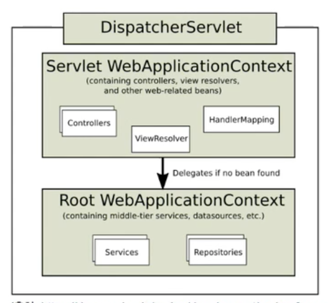

= 05. 스프링 IoC 컨테이너 연동.adoc

https://www.inflearn.com/course/%EC%9B%B9-mvc/lecture/17384?tab=note&speed=1.5

서블릿 애플리케이션에 스프링 연동하기
* 서블릿에서 스프링이 제공하는 IoC 컨테이너 활용하는 방법
* 스프링이 제공하는 서블릿 구현체 DispatcherServlet 사용하기

DispatcherServlet
* 스프링 MVC의 핵심
* Front Controller 역할을 한다.

spring-webmvc 5.1.3.RELEASE

web.xml
----

<listener>
  <listener-class>org.springframework.web.context.ContextLoaderListener
</listener>

<context-param>
  <param-name>contextConfigLocation</param-name>
  <param-value>me.whiteship.AppConfig</param-value>
</context-param>

----

context-param이 filter보다 앞에 있어야 한다.

AppConfig
----
@Configuration
@Component

AppConfig

----

----
@Service
pbulic class HelloService {

----

ApplicationContext context = getServletContext().getAttribute..

HelloService helloService = context.getBean(HelloService.class);

분배 하는게 Dispatch

DispatcherServlet

Servlet WebApplicationContext
Controllers, ViewResolver, HandlerMapping

Root WebApplicationContext
Services, Repositories

== References
* https://leejongchan.tistory.com/74?category=955821[서블릿과 스프링 IoC 연동 2021.01.01]
