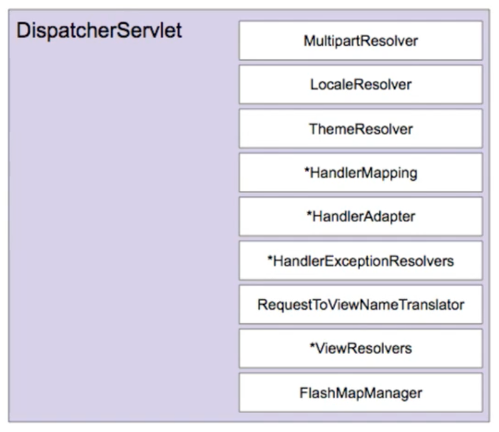

= 10. 스프링 MVC 구성 요소

:hardbreaks:

https://www.inflearn.com/course/%EC%9B%B9-mvc/lecture/17389?tab=curriculum&speed=1.5

.DispatcherServlet
* MultipartResolver
* LocaleResolver
* ThemeResolver
* *HandlerMapping
* *HandlerAdapter
* *HandlerExceptionResolvers
* RequestToViewNameTranslator
* *ViewResolvers
* FlashMapManager

DispatcherServlet의 기본 전략
* DispatcherServlet.properties

MultipartResolver
* 파일 업로드 요청 처리에 필요한 인터페이스
* HttpServletRequest를 MultipartHttpServletRequest로 변환해주어 요청이 담고 있는 File을 꺼낼 수 있는 API 제공.

LocaleResolver
* 클라이언트의 위치(Locale) 정보를 파악하는 인터페이스
* 기본 전략은 요청의 accept-language를 보고 판단.

ThemeResolver
* 애플리케이션에 설정된 테마를 파악하고 변경할 수 있는 인터페이스
* 참고: https://memorynotfound.com/spring-mvc-theme-switcher-example

HandlerMapping
* 요청을 처리할 핸들러를 찾는 인터페이스

HandlerAdapter
* HandlerMapping이 찾아낸 "핸들러"를 처리하는 인터페이스
* 스프링 MVC 확장력의 핵심

HandlerExceptionResolver
* 요청 처리 중에 발생한 에러 처리하는 인터네피읏

RequestToViewNameTranslator
* 핸들러에서 뷰 이름을 명시적으로 리턴하지 않은 경우, 요청을 기반으로 뷰 이름을 판단하는 인터페이스

return 없어도 view이름으로 추측함
----
  @GetMapping("/sample")
  public void sample() {}
----

ViewResolver
* 뷰 이름(string)에 해당하는 뷰를 찾아내는 인터페이스

FlashMapManager
* FlashMap 인스턴스를 가져오고 저장하는 인터페이스
* FlashMap은 주로 리다이렉션을 사용할 떄 요청 매개변수를 사용하지 않고 데이터를 전달하고 정리할 때 사용한다.
* redirect:/events/id=123
* redirect:/events # 매개변수 사용하지 않고도 데이터 전달

== References
* https://leejongchan.tistory.com/87?category=955821[스프링 MVC 구성 요소 2021.01.05]
