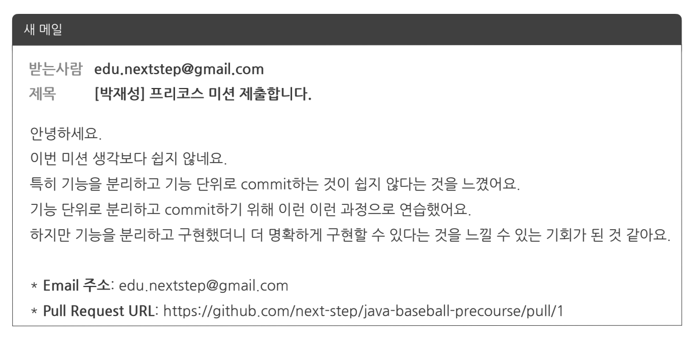

= 우아한테크캠프 Pro 2기
:hardbreaks:

== 프리코스 진행방식
=== 진행 방식
* 기능 요구사항, 프로그래밍 요구사항, 과제 진행 요구사항
* 세 개의 요구사항을 만족하기 위해 노력. 기능을 구현하기 전에 **기능 목록을 만들고, 기능 단위로 commit하는 방식**으로 진행

=== 미션 제출 방법
* 미션 구현을 완료한 후 GitHub을 통해 제출
** https://github.com/next-step/nextstep-docs/tree/master/precourse[프리코스 과제 제출] 문서 참고해 제출
* GitHub에 미션을 제출한 후 edu.nextstep@gmail.com 로 메일 발송

== email 템플릿
* 제목: [$이름] 프리코스 미션 제출합니다.
* 내용:
다음 두 개의 정보를 반드시 포함해 메일을 보낸다.
* 교육 과정 신청시 email 주소:
* Pull Request URL:

미션을 진행하면서 느끼고, 배운점, 많은 시간을 투자한 부분 등도 포함하면 더 좋음

email 예시

== 프리코스 1주차 숫자야구게임

=== 기능 요구사항
* ...

=== 프로그램 실행 결과
...

=== 프로그래밍 요구사항 - 메소드 분리
* 자바 코드 컨벤션
** https://naver.github.io/hackday-conventions-java/
* indent(인덴트, 들여쓰기) depth를 2가 넘지 않도록 구현. 1까지만 허용
** 예를 들어 while문 안에 if문이 있으면 들여쓰기는 2이다.
** 힌트: indent(인덴트, 들여쓰기) depth를 줄이는 좋은 방법은 함수(또는 메소드)를 분리하면 된다.
* 자바 8에 추가된 stream api를 사용하지 않고 구현. 단, 람다는 사용 가능.
* else 예약어를 쓰지 않는다.
** 힌트: if 조건절에서 값을 return하는 방식으로 구현하면 else를 사용하지 않아도 됨
** else를 쓰지 말라고 하니 switch/case로 구현하는 경우가 있는데 switch/case도 허용하지 않는다.
* 함수(또는 메소드)의 길이가 10라인을 넘어가지 않도록 구현
** 함수(또는 메소드)가 한 가지 일만 잘 하도록 구현

=== 프로그래밍 요구사항 - 단위 테스트
* 로직에 단위 테스트를 구현. 단, UI(System.out, System.in, Scanner)로직은 제외
** 핵심 로직을 구현하는 코드와 UI를 담당하는 로직을 구분
* JUnit5와 AssertJ 사용법에 익숙하지 않은 개발자는 첨부한 "학습테스트를 통해 JUnit 학습하기.pdf" 문서를 참고해 사용법을 익힌 후 JUnit5 기반 단위 테스트를 구현

=== 과제 진행 요구사항
* https://github.com/next-step/java-baseball-precourse 저장소 fork/clone해 시작
* 기능을 구현하기 전에 java-baseball/README.md 파일에 구현할 기능 목록을 정리해 추가
* git의 commit 단위는 앞 단계에서 README.md 파일에 정리한 기능 목록 단위로 추가
** https://gist.github.com/stephenparish/9941e89d80e2bc58a153 참고해 commit log를 남김
* 과제 진행 및 제출 방법은 https://github.com/next-step/nextstep-docs/tree/master/precourse[프리코스 과제 제출] 문서 참고

=== 미션 마간 및 기준
* 2021년 4월 27일(화) 23시 59부낚지 GitHub을 통한 미션 제출과 메일까지 완료해야 한다.
** 2021년 4월 27일(수) 00시 이후 추가 push도 허용하지 않는다.
* 2021년 4월 27일(수) 00시 이후 제출한 경우 미션을 제출하지 않은 것으로 한다.

