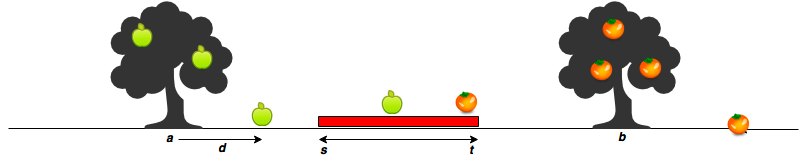

# Apple and Orange
문제: [Apple and Orange](https://www.hackerrank.com/challenges/apple-and-orange/problem)

Sam의 집에는 풍부한 과일을 생산하는 사과나무와 오렌지 나무가 있습니다. 아래의 다이어그램에서 빨간색 영역은 그의 집을 나타냅니다. s는 시작점이고 t는 끝점입니다. 사과나무는 집의 왼쪽에 있고 오렌지 나무는 오른쪽에 있습니다. 사과나무는 a지점에 있고 오렌지 나무는 b지점에 있다고 가정할 수 있습니다.


출처: https://www.hackerrank.com/challenges/apple-and-orange/problem

과일이 나무에서 떨어지면 x축에서 d 단위의 거리에 놓입니다. 음수는 왼쪽, 양수는 오른쪽으로 떨어짐을 의미합니다.

사과 m개와 오렌지 n개에 대해 d의 값이 주어지면 Sam의 집에 몇 개의 사과와 오렌지가 떨어질지 구하세요. (즉, [s, t] 범위 내에)

예를 들어 Sam의 집이 s=7과 t=10 사이에 있습니다. 사과나무는 a=4, 오렌지 나무는 b=12입니다. m=3 사과와 n=3 오렌지들이 있습니다. 사과는 a로부터 apples=[2,3,-4] 단위의 거리에 떨어집니다. 그리고 오렌지는 oranges=[3,-2,-4] 단위의 거리입니다. 각 사과의 위치를 계산하면 [4+2, 4+3, 4+-1]=[6,7,0]에 놓입니다. 오렌지는 [12+3, 12+-2, 12+-4]=[15,10,8] 위치에 놓입니다. 하나의 사과와 두 개의 오렌지들은 7-10 범위에 놓입니다. 그래서 아래를 출력합니다.
```
1
2
```

## Input Format
첫 줄은 s와 t (sam의 집 범위)
두 번째 줄은 a와 b (사과나무와 오렌지 나무의 위치)
세 번째 줄은 m과 n (사과 개수, 오렌지 개수)
네 번째 줄은 a 위치로부터의 사과 위치들. m개
다섯 번째 줄은 b 위치로부터의 오렌지 위치들. n개

각 라인의 값들은 스페이스로 구분됩니다.

## Output Format
서로 다른 두 줄에 정수를 출력합니다.

첫 줄은 Sam의 집에 떨어진 사과의 개수
둘째 줄은 Sam의 집에 떨어진 오렌지의 개수

## Sample Input 0
```
7 11
5 15
3 2
-2 2 1
5 -6
```

## Sample Output 0
``
1
1
``

## 설명 0
사과는 [5-2, 5+2, 5+1] = [3,7,6]
오렌지는 [15+5, 15-6] = [20,9]
Sam의 집 7-11 사이에 있는 사과는 1개, 오렌지는 1개입니다.

## 풀이
코드 템플릿
```
#!/bin/python3

import math
import os
import random
import re
import sys

# Complete the countApplesAndOranges function below.
def countApplesAndOranges(s, t, a, b, apples, oranges):

if __name__ == '__main__':
    st = input().split()

    s = int(st[0])

    t = int(st[1])

    ab = input().split()

    a = int(ab[0])

    b = int(ab[1])

    mn = input().split()

    m = int(mn[0])

    n = int(mn[1])

    apples = list(map(int, input().rstrip().split()))

    oranges = list(map(int, input().rstrip().split()))

    countApplesAndOranges(s, t, a, b, apples, oranges)
```
countApplesAndOranges 함수를 완성합니다. 입력값을 받아서 함수로 넘기는 부분은 모두 구현되어 있습니다. 출력은 하고 있지 않기 때문에 countApplesAndOranges 함수에서 출력을 해 주어야 됩니다.
문제가 길지만 이해하고 나면 쉽습니다. 실제 사과들의 위치와 오렌지들의 위치를 구한 다음 집의 범위에 들어와 있는지 확인합니다.

```def countApplesAndOranges(s, t, a, b, apples, oranges):
    for (i, x) in enumerate(apples):
        apples[i] = x + a

    for (i, x) in enumerate(oranges):
        oranges[i] = x + b

    a_in = 0
    for x in apples:
        if s <= x <= t:
            a_in += 1
    print(a_in)

    o_in = 0
    for x in oranges:
        if s <= x <= t:
            o_in += 1
    print(o_in)
```
python에서는 범위의 조건문을 아래와 같이 줄여서 작성할 수 있습니다.

```
        if s <= x <= t:
            a_in += 1
```
보통 다른 프로그래밍 언어들은 비교를 한 번에 하나씩 할 수 있기 때문에 아래처럼 and로 나눠서 두 개로 적어 주어야 합니다.
```
        if s <= x and x <= t:
            a_in += 1
```

사과들과 오렌지들의 위치를 구하는 부분은
```
    apples = [x + a for x in apples]
    oranges = [x + b for x in oranges]
```
로 줄일 수 있습니다.

집의 범위에 들어왔는지 확인하고 출력하는 부분은
```
    is_in = lambda x: s <= x <= t

    print(len(list(filter(is_in, apples))))
    print(len(list(filter(is_in, oranges))))
```
로 줄일 수 있습니다. filter를 이용하면 원하는 값들만 추릴 수 있습니다. 조건은 lambda로 간단한 함수를 구현하면 중복 코드를 방지하는데 도움이 됩니다. filter로 추려낸 결과를 list로 바꾼 다음 길이를 구합니다.


코드를 줄인 완성본입니다.
```
def countApplesAndOranges(s, t, a, b, apples, oranges):
    apples = [x + a for x in apples]
    oranges = [x + b for x in oranges]

    is_in = lambda x: s <= x <= t

    print(len(list(filter(is_in, apples))))
    print(len(list(filter(is_in, oranges))))
```

## 정리
* [hackerrank - Apple and Orange - Python3 2020.05.07](https://junho85.pe.kr/1531)
