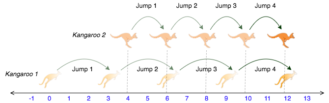

# hackerrank - Kangaroo - Python3
문제: [https://www.hackerrank.com/challenges/kangaroo/problem](https://www.hackerrank.com/challenges/kangaroo/problem)

당신은 다양한 동물들과 서커스 쇼 공연을 합니다. 한 번의 동작으로 양의 방향으로 점플 할 준비가 된 두 줄의 캥거루가 있습니다.

-   첫 번째 캥거루는 x1에서 시작해서 점프할 때마다 v1만큼 움직입니다.
-   두 번째 캥거루는 x2에서 시작해서 점프할 때마다 v2만큼 움직입니다.

쇼의 일환으로 같은 시간 같은 장소에서 두 마리의 캥거루를 동시에 얻을 수 있는 방법을 알아내야 합니다. 만약 가능하다면 YES를 반환하고 아니면 NO를 반환합니다.

예를 들어 캥거루 1은 x1=2에서 시작하고 점프 거리는 v1=1입니다. 캥거루 2는 x2=1에서 시작하고 점프 거리는 v2=2입니다. 한번 점프한 후 두 캥거루는 모두 x=3, (x1+v1=2+1, x2+v2+1+2), 이 되어서 답은 YES입니다.

## Input Format

x1, v1, x2, v2가 한 줄에 있고 스페이스로 구분됩니다.

## 제약조건 (Constraints)

-   0 <= x1 < x2 <= 10000
-   1 <= v1 <= 10000
-   1 <= v2 <= 10000

위의 조건으로 보아 x2 캥거루는 무조건 더 앞에 있습니다. 출발점이 같을 일은 없습니다.

## Output Format

같은 시작에 같은 위치에 착지할 수 있으면 YES, 아니면 NO를 출력합니다.

## Sample Input 0

```
0 3 4 2
```

## Sample Output 0

```
YES
```

## Explanation 0

두 캥거루들은 점프할 때마다 다음 순서에 위치합니다.


출처: https://www.hackerrank.com/challenges/kangaroo/problem

위의 그림에서 4번 점프했을 때 둘 다 12에 위치하게 됩니다.

## Sample Input 1

```
0 2 5 3
```

## Sample Output 2

```
NO
```

## Explanation 1

두 번째 캥거루는 첫 번째 캥거루보다 앞에 위치합니다. 두 번째 캥거루가 더 빠르고 이미 첫 번째 캥거루보다 앞에 있기 때문에 첫 번째 캥거루는 두 번째 캥거루를 절대 따라잡을 수 없습니다. 그러므로 NO를 출력합니다.

## 풀이

템플릿 코드

```python
#!/bin/python3

import math
import os
import random
import re
import sys

# Complete the kangaroo function below.
def kangaroo(x1, v1, x2, v2):

if __name__ == '__main__':
    fptr = open(os.environ['OUTPUT_PATH'], 'w')

    x1V1X2V2 = input().split()

    x1 = int(x1V1X2V2[0])

    v1 = int(x1V1X2V2[1])

    x2 = int(x1V1X2V2[2])

    v2 = int(x1V1X2V2[3])

    result = kangaroo(x1, v1, x2, v2)

    fptr.write(result + '\n')

    fptr.close()

```

kangaroo함수를 완성합니다. YES나 NO를 리턴하도록 구현합니다.

제약조건에서 x1 < x2 가 있기 때문에 문제 풀기가 좀 더 수월합니다. x2캥거루가 무조건 앞에서 시작하는데 만약 어떤 캥거루가 앞서 있는지 제약되어 있지 않다면 조금은 더 복잡해질 수 있습니다.

x2 캥거루가 앞에 있기 때문에 둘의 속도가 같거나 v2가 더 빠르면 둘은 절대 만날 수 없습니다.

```python
    if v1 <= v2:
        return "NO"

```

그러고 나서 레이스를 시작합니다. while True 반복문을 계속 돌려주면서 x1는 v1만큼, v2는 v2만큼 계속 더합니다. 그리고 x1과 x2가 같은 경우가 생기면 "YES"를 리턴합니다. 만약 x1가 x2를 앞질러 갔다면 "NO"를 리턴합니다.

```python
    while True:
        x1 += v1
        x2 += v2

        if x1 == x2:
            return "YES"

        if x1 > x2:
            return "NO"
```

함수를 완성하면 아래와 같습니다.

```python
def kangaroo(x1, v1, x2, v2):
    if v1 <= v2:
        return "NO"

    while True:
        x1 += v1
        x2 += v2

        if x1 == x2:
            return "YES"

        if x1 > x2:
            return "NO"
```

앞서 설명하였듯이 제약조건(Constraints)이 문제를 풀기 쉽게 도와주고 있어서 좀 더 풀기 쉽습니다. 만약 제약조건이 없었다면 누가 앞에 있는지 비교하는 조건 처리를 더 해주었어야 합니다.

## 정리
* [hackerrank - Kangaroo - Python3 2020.05.09](https://junho85.pe.kr/1533)
