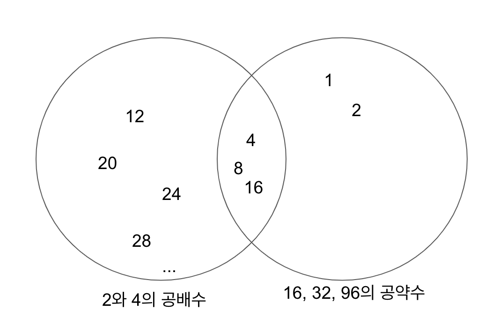

# hackerrank - Between Two Sets - Python3

문제: [https://www.hackerrank.com/challenges/between-two-sets](https://www.hackerrank.com/challenges/between-two-sets)

난이도: Easy

두 개의 정수 배열이 있습니다. 모든 정수들이 다음 두 조건에 만족하는지 확인하세요.

1.  첫 번째 배열의 요소들은 고려되는 정수의 모든 인수들(factors)
2.  고려되는 정수는 두 번째 배열의 모든 요소들의 인수(factor)

이 숫자들은 두 배열 사이에 있다고 합니다. 그러한 숫자가 몇 개인지 결정해야 합니다.

예를 들어, a=\[2,6\], b=\[24,36\] 배열이 있을 때, 6, 12 두 개의 숫자가 있습니다. 첫 번째 값으로 6%2=0, 6%6=0, 24%6=0, 36%6=0. 비슷하게 12%2=0, 12%6=0, 그리고 24%12, 36%12=0.

## Function Description

getTotalX함수를 완성하세요. set들의 정수 숫자를 반환합니다.

getTotalX는 다음의 인자를 받습니다.

-   a: 정수 배열
-   b: 정수 배열

## Input Format

첫 번째 줄은 스페이스로 구분된 정수 두 개 n, m입니다. 배열 a의 개수와 배열 b의 개수입니다.  
두 번째 줄은 스페이스로 구분된 정수 배열 a입니다.  
세 번째 줄은 스페이스로 구분된 정수 배열 b입니다.

## Output Format

a와 b사이에 고려되는 숫자들의 개수를 출력하시오

## Sample Input

```
2 3
2 4
16 32 96
```

## Sample Output

```
3
```

## Explanation

2와 4는 4,8,12,16으로 균등하게 나뉩니다.  
4, 8, 16은 16, 32, 96으로 균등하게 나뉩니다.  
4, 8, 16은 a의 각 요소가 하나의 인자이고 각각이 b의 모든 요소의 인자 인 유일한 3개의 숫자입니다.

## 풀이

문제가 좀 길고 직역을 하니 더 이해가 어려웠습니다. 문제를 고민해 보니 결국 첫 번째 배열의 공배수이면서 두 번째 배열의 공약수인 값을 찾는 문제입니다.

2와 4의 공배수는 4, 8, 12, 16, 20, 24, 28, 32, 36,... 순으로 늘어납니다.

16, 32, 96의 공약수는 1, 2, 4, 8, 16입니다.

2와 4의 공배수이면서 16, 32, 96의 공약수인 숫자는 4, 8, 16입니다. 



첫 번째 배열의 공배수를 구하려면 첫 번째 배열의 최소공배수를 구한 다음 1, 2, 3, 4,... 순서로 계속 곱해주면 됩니다. 공배수는 끝없이 나오지만 무한정으로 찾을 필요는 없습니다. 두 번째 배열의 최대공약수 이하 까지만 있으면 됩니다. 더 큰 공배수는 두 번째 배열의 공약수가 될 수 없기 때문입니다.

두 번째 배열의 공약수를 구하는 건 각 숫자의 약수를 구한 다음 공통된 약수를 추출하면 됩니다. 그런데 숫자가 많아지고 커지면 공약수 구하는 거도 쉬워 보이진 않습니다. 그리고 공약수를 구하지 않아도 됩니다. 첫 번째 배열의 공배수로 나누어서 나머지가 없는 걸 찾으면 되니까요.

템플릿 코드입니다.

```
#!/bin/python3

import math
import os
import random
import re
import sys

#
# Complete the 'getTotalX' function below.
#
# The function is expected to return an INTEGER.
# The function accepts following parameters:
#  1. INTEGER_ARRAY a
#  2. INTEGER_ARRAY b
#

def getTotalX(a, b):
    # Write your code here

if __name__ == '__main__':
    fptr = open(os.environ['OUTPUT_PATH'], 'w')

    first_multiple_input = input().rstrip().split()

    n = int(first_multiple_input[0])

    m = int(first_multiple_input[1])

    arr = list(map(int, input().rstrip().split()))

    brr = list(map(int, input().rstrip().split()))

    total = getTotalX(arr, brr)

    fptr.write(str(total) + '\n')

    fptr.close()

```

일단 배열의 공배수, 최소공배수, 최대공약수를 구할 수 있어야 됩니다. 수학 시간에 배웠긴 하지만 기억이 가물가물 합니다. python에서는 두 수의 최대공약수를 구하는 함수는 제공하고 있습니다.

```
from math import gcd

assert(gcd(4, 6) == 2)
```

최소공배수를 구하는 함수는 직접 작성해야 합니다. 두 수의 최소공배수는 두 수의 곱을 최대공약수로 나누어 주면 됩니다.

```
def lcm(a, b):
    return int(a * b / gcd(a, b))
```

일단 최대공약수와 최소공배수는 이렇게 구할 수 있다는 걸 외워두는 게 좋습니다. 최소공배수 구하는 함수도 python에서 내장에 주면 좋겠는데 없는 게 조금 아쉽네요. 최대공약수와 최소공배수에 대해서 좀 더 이해하고 싶으신 분들은 유클리드 호제법에 대해서 찾아보시기 바랍니다. 관련 내용은 나중에 따로 정리해 봐야겠습니다.

그런데 이 문제에서는 두 수의 최대공약수나 최소공배수가 아니라 리스트의 최대공약수와 최소공배수를 구해야 합니다. 리스트의 최대공약수와 최소공배수를 구하는 방법은 간단합니다. 리스트의 0, 1 번째 수의 최대공약수나 최소공배수를 구하고 구한 값과 2번째 수의 최대공약수나 최소공배수를 구하는 것을 반복하면 됩니다.

앞서 만든 lcm을 포함해서 아래의 형태가 됩니다.

```
from math import gcd


# Greatest Common Divisor of list
# 리스트의 최대공약수
def gcd_list(nums):
    gcd_nums = None
    for i in range(len(nums)):
        if i == 0:
            gcd_nums = nums[i]
        else:
            gcd_nums = gcd(gcd_nums, nums[i])
    return gcd_nums


# Least common multiple
# 최소공배수
def lcm(a, b):
    return int(a * b / gcd(a, b))


# least common multiple of list
# 리스트의 최소공배수
def lcm_list(nums):
    lcm_nums = None
    for i in range(len(nums)):
        if i == 0:
            lcm_nums = nums[i]
        else:
            lcm_nums = lcm(lcm_nums, nums[i])
    return lcm_nums
```

그냥 python에서 내장해 줬으면 좋겠네요.

자 이제 getTotalX함수를 완성해 봅시다. 첫 번째 리스트의 공배수들 중 두 번째 리스트의 최대 공배수 이하의 숫자들을 구합니다. 그 숫자들로 두 번째 리스트의 모든 숫자들을 나누었을 때 모두 나머지가 없다면 개수에 1을 더합니다.

```
def getTotalX(a, b):
    lcm_a = lcm_list(a)
    gcd_b = gcd_list(b)

    # a의 공배수들 중 min_b 이하
    a_cms = []
    i = 1
    while True:
        temp = lcm_a * i
        if temp > gcd_b:
            break

        a_cms.append(temp)
        i += 1

    answer = 0
    for temp in a_cms:
        is_factor = True
        for bb in b:
            if bb % temp != 0:
                is_factor = False
        if is_factor:
            answer += 1

    return answer
```
