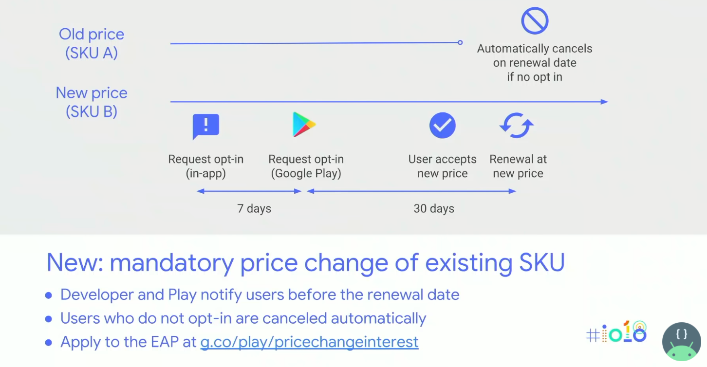
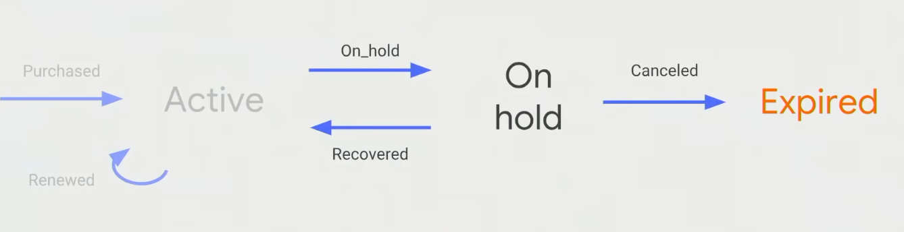

= Grow and optimize your subscriptions with new Google Play features (Google I/O '18) 2018.05.09

:hardbreaks:

https://www.youtube.com/watch?v=x1AYelepG6o[Grow and optimize your subscriptions with new Google Play features (Google I/O '18) 2018.05.09]

http://g.co/play/sellsubscriptions
-> https://developer.android.com/distribute/best-practices/earn/subscriptions.html

Real-time developer notifications

취소하면 다시 구독하도록 유도

Account hold + grace period
* 70% decrease in involuntary cancellation
* 13% increase in monthly subscription retention after 70 days

Play Console subscription reports

Building a greate subscription business today

Account Hold
Real-time developer notification
...

What's new
Angela Ying

I'm afraid I'll be trapped.
I don't want to spend more because ...

New subscriptions center
* Discover new
* Manage
* Backup FOP
* Deep-link
* Cancel survey

Demo A

Developer deeplinks to manage subscriptions

// Manage a subscription
https://play.google.com/store/acc...

Refund improvements

Server-side API supports order ID Partial refunds

My costs have gone up.
Help me roll out a mandatory price change.

New: mandatory price change of existing SKU
* Developer and Play notify users before the renewal date
* Users who do not opt-in are canceled automatically
* Apply to the EAP at g.co/play/pricechangeinterest

...

Subscriptions reporting

* Retention report
** Advanced cohort comparisons
** How well does my free trial perform?
** How many renewals do my users make?

Subscriptions reporting
* Cancellation report
** Insights to help you minimize churn
** Cancellation reasons and survey
** Advanced reporting...

Learn more about subscriptions reporting
"Analyze your audience and benchmark metrics to grow on Google Play" Wednesday 9:30a ...

And there's more...

Faster renewals for license test accounts
Intro price w/ different recurrence
Upgrade and keep renewal date

12 new features to help grow your business

Improved user experience
* New app discovery
* New management UI
* Backup payment method
* Deep links
* Cancel survey

More developer flexibility
* Refund API improvements
* Partial refunds
* Price change ...
...

What's next
How to get ready

What if your use could...
... subscribe from the Play store?
... pay with cash?
... ...

"Zero" integration
... on your client app
... on your sever

Play Billing Library

No ore copying/pasting sample client code

Abstraction layer on top of the AIDL file
Automatically pick up new features

Three easy steps
Add to build.gradle dependencies file
Create the billing client instance
Call the appropriate method during ...

----
dependencies ...
----

billingClient = BillingClient.new...

3.Call the appropriate method during ...

I recently had a chance to try out the new Play Billing Library ...

Remember...
Much simpler integration
Only way to get new features
Available today in Java

Real-time Developer Notifications
Know immediately when your user renews or cancels

Grant entitlement of an active subscription

Block entitlement of a subscription on hold

Win back a user before a cancelled subscription expires

Future: grant entitlement for ...

Real-time Developer Notifications

The notification itself is not give enough information!

Check the Pur...

Learn more at g.co/play/billing-rtdn

https://developer.android.com/google/play/billing/rtdn-reference

Future-proof your integration

Play Billing Library

Real-time Developer Notification

Today

Users love subscriptions
Developer successes

What's new
Subscriptions center
Twelve new developer ...

What's next
Billing Library
...

Other sessions
New and advanced Google Play tools for game developers
Today 6:00pm Stage 6
...

