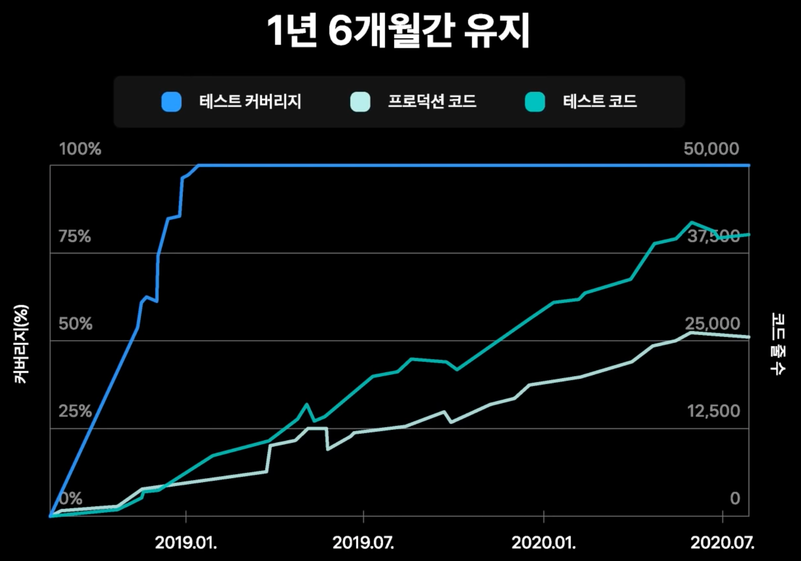

= 테스트 커버리지 100%

:hardbreaks:

https://toss.im/slash-21/sessions/1-6

* 발표영상: https://www.youtube.com/watch?v=jdlBu2vFv58p[토스ㅣSLASH 21 - 테스트 커버리지 100% 2021.04.28]
* 발표자료: https://static.toss.im/slash21/pdf/[%ED%86%A0%EC%8A%A4_SLASH%2021]%20%ED%85%8C%EC%8A%A4%ED%8A%B8%20%EC%BB%A4%EB%B2%84%EB%A6%AC%EC%A7%80%20100%ED%8D%BC%EC%84%BC%ED%8A%B8_%EC%9D%B4%EC%9D%91%EC%A4%80.pdf

----
얼마만큼의 코드를 자동화한 단위 테스트로 계산해야 할까?
대답할 필요조차 없다. 모조리 다 해야 한다. 모.조.리!

100% 테스트 커버리지를 권장하냐고? 권장이 아니라 강력히 요구한다.
작성한 코드는 한 줄도 빠짐없이 전부 테스트해야 한다.
군말은 필요 없다.
----
로버트 마틴 저, 정희종 역.
"클린 코더(2016)" 중에서

2018년 11월, 토스 홈 리뉴얼 프로젝트
서버 테스트 커버리지 100%에 도전

84% 부터는 커버리지가 낮아지면 배포가 안되게 했음.

계속 유지할 수 있을까?

높은 테스트 커버리지의 이점

거침없는 리팩토링

리팩토링에 문제가 있다면 테스트가 알려줄 것이다

점점 쉬워지는 테스트 작성

프로덕션 코드가 테스트를 작성하기 쉽도록 변해간다
이미 작성한 테스트를 참고해 새 테스트를 작성

JaCoCo

jacocoTest...

느려지는 테스트

테스트 케이스 400개
실행 시간 1분 초과

테스트가 느려지면 생산성이 떨어진다

느려지는 원인
스프링 애플리케이션 컨텍스트 로딩

스프링 애플리케이션 컨텍스트 로딩 제거

스프링 애플리케이션 컨텍스트 로딩에 몇 초가 걸린다.
WebTestClient는 컨텍스트 로딩 없이 테스트 가능

제거가 어려운 경우

Static Mocking

실제로 스프링 애플리케이션을 기동하지는 않고 run이 호출되는지만

다시 느려지는 테스트

테스트 케이스 1,600개
다시 실행 시간 1분 초과

다시 느려진 원인
* SLF4J 초기화
* Jackson ObjectMapper() 생성
* Handlebars 컴파일
* Byte Buddy 초기화
* 코틀린 리플렉션 모듈 초기화
* MockK
* 테스트 순차적 실행

Async Profiling

== References
* https://blog.npcode.com/2020/02/28/%ED%85%8C%EC%8A%A4%ED%8A%B8-%EC%BB%A4%EB%B2%84%EB%A6%AC%EC%A7%80-100/[테스트 커버리지 100% – eungjun 2020.02.28]
** 2021.04.30 접속 안되는 상태
* https://blog.npcode.com/2020/02/28/%ED%85%8C%EC%8A%A4%ED%8A%B8-%EC%BB%A4%EB%B2%84%EB%A6%AC%EC%A7%80-100/[]
