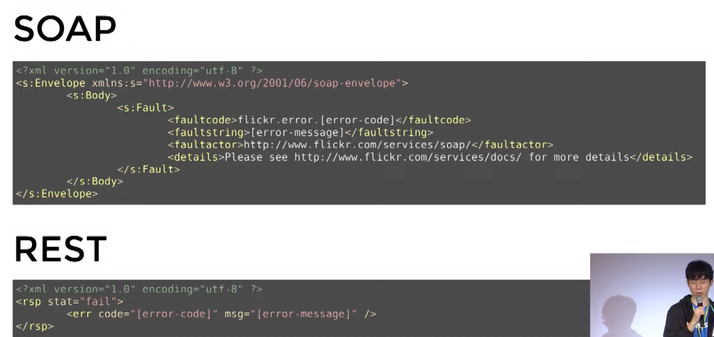

= Deview 2017

== Day1, 2-2. 그런 REST API로 괜찮은가

https://deview.kr/2017/schedule/212

https://tv.naver.com/v/2292653

https://slides.com/eungjun/rest[rest]

https://www.youtube.com/watch?v=RP_f5dMoHFc[Day1, 2-2. 그런 REST API로 괜찮은가 2017.11.20]

REpresentational State Transfer

REST a way of providing interoperability (상호운영성) between ...

WEB (1991)

Q: 어떻게 인터넷에서 정보를 공유할 것인가?
A: 정보들을 하이퍼텍스트로 연결한다.

표현 형식: HTML
식별자: URI
전송 방법: HTTP

HTTP/1.0 (1994-1996)
Roy T. Fielding: "How do I improve HTTP without breaking the Web?"

해결책: HTTP Object Model

REST (1998)

Roy T. Fielding, Microsoft Research에서 발표

"Representatoinal .."

REST (2000)

Roy T. Fielding, 박사 논문으로 발표

"Architectural Styles and the Design...

한편

API

XML-RPC (1998)
by Microsoft -> SOAP

Salesforce API (2000.2)

인터넷에서 공개된 최초의 API라고 보면 됨

Salesforce API (2000.2)
SOAP

flickr API (2004.8)

SOAP과 REST의 느낌적인 비교

...

결국
google trends

* 2006년, AWS가 자사 API의 사용량...

REST의 승리

그런데

CMIS (2008)
* CMS를 윟나 표준
* EMC, IBM, Microsoft등이 함꼐 작업
* REST 바인딩 지원

Roy T. ...
"No REST in CMIS"

Microsoft REST API Guidelines (2016)
* uri는 https://{serviceRoot}/{collection}/{id} 형식이어야한다
* GET, PUT, DEL...
*

"REST APIs must..."

"REST API를 위한 최고의 버저닝 전략은 버저닝을 안 하는 것"

뭐가 문제인 걸까요?

REST API
REST 아키텍쳐 스타일ㅇ르 따르는 API

REST
분산...

아키텍쳐 스타일
제약조건의 집합

REST를 구성하는 스타일
* client-server
* stateless
* cache
* uniform interface
* layered system
* code-on-demand (optional)
** 서버에서 client로 보내서 실행. javascript

Uniform Interface의 제약조건
* identification of resources
* manipulation of resources through representations
* self-descriptive messages
* hypermedia as the engine of application state (HATEOAS)

뒤의 두가지는 대부분 못지키고 있음

메시지는 스스로를 설명해야한다

GET / HTTP/1.1

이 HTTP 요청...

목적지를 추가하면 이제 self-descriptive

Self-descriptive message

----
HTTP/1.1 200 OK

[ { "op": "remove", "path": "/..
----

Content-Type: application/json
이 들어가야 한다.

아직도 부족하다. op가 뭔지, path가 뭔지

Content-Type: application/json-patch+json

명세에 가서

어떻게 해석해야 하는지

HATEOAS

애플리케이션의 상태는 Hyperlink...

애플리케이션 상태의 전이

HATEOAS

----
HTTP/1.1 200 OK
Content-Type: ..
----

----
HTTP/1.1 200 OK
Content-Type: application/json
Link: </articles/1>; rel="previous",
      </articles/3>; rel="next;
{
  "title": "The second article",
  "contents": ...
----

왜 Uniform interface

독립적 진화
* 서버와 클라이언트가 각각 독립적으로 진화한다.
* 서버의 기능이 변경되어도 클라이언트를 업데이트할 필요가 없다.
* REST를 만들게 된 계기: "How do I improve HTTP without breaking the Web."

웹
* 웹 페이지를 변경했다고 웹 브라우저를 업데이트할 필요는 없다.
* 웹 브라우저를 업데이트했다고 웹 페이지를 변경할 필요도 없다.
* HTTP 명세가 변경되어도 웹은 잘 동작한다.
* HTML 명세가 변경되어도 웹은 잘 동작한다.

이럴수도 있지만 동작은 합니다
페이지는 깨져도 동작은 한다.

옛날 폰 브라우저. 갤럭시S3 (4~5년된 폰)

이렇지는 않습니다

모바일앱

어떻게 한걸까요?
* 놀라운...

이 분들이
* W3C Working groups
* IETF Working groups
...

이 정도의 노력을 합니다
* HTML5 첫 초안에서 권고안 나오는데까지 6년
* HTTP/1.1 명세 개정판 작업하는데 7년

하위 호환성을 깨트리면 안되니까

상호운용성(interoperability)에 대한 집착
* Referer 오타지만 안 고침
* charset 잘못 지은 이름이지만 안 고침
* HTTP 상태 코드 416 포기함 (I'm a teapot)
* HTTP/0.9 아직도 지원함 (크롬, 파이어폭스)

잘 못 만들어진 상태코드이지만...

그런 노력이 없다면 웹도...

Netscape 6.0은 지원하지 않습니다 [OK]

REST가 웹의 독립적 진화에 도움을 주었나
* HTTP에 지속적으로 영향을 줌
* Host 헤더 추가
* 길이 제한을 다루는 방법이 명시 (414 URI Too Long 등)
* URI에서 리소스의 정의가 추상적으로 변경됨: "식별하고자 하는 무언가"
* 기타 HTTP와 URI에 많은 영향을 줌
* HTTP/1.1 명세 최신판에서 REST에 대한 언급이 들어감
* Reminder: Roy T. Fielding이 HTTP와 URI 명세의 저자 중 한명입니다

그럼 REST는 성공했는가
* REST는 웹의 독립적 진화를 위해 만들어졌다
* 웹은...

그런데 REST API는?
* REST API는 REST 아키텍쳐 스타일을 따라야한다.
* 오늘날 ...

REST API도 저 제약조건들을 다 지켜야...

그렇다고 합니다
"An API that privides network-based access to resources via a uniform interface of ...

이런 줄 알았는데

SOAP
* 복잡하다
* 규칙 많음
* 어렵다

REST
* 단순하다
* 규칙 적음
* 쉽다(X) -> 어렵다

원격...

아니라고 합니다

"REST emphasizes evolvability to sustain an uncontrollable system. If you think you have control over the system or aren't interested in evolvability, don't waste your time arguing about REST"
시스템 전체를 통제할 수 있다고 생각하거나, 진화에 관심이 없다면, REST에 대해 따지느라 시간을 낭비하지 마라

그럼 이제 어떻게 할까?
1. REST API를 구현하고 REST API라고 부른다.
2. REST API 구현을 포기하고 HTTP API라고 부른다.
3. REST API가 아니지만 REST API라고 부른다. (현재 상태)

"I am getting frustrated by ..."

제발 제약조건을 따르던지 아니면 다른 단어를 써라

1. REST API를 구현하고 REST API라고 부른다.(도전)

일단 왜 API는 REST..

비교
         흔한 웹 페이지   HTTP API
Protocol HTTP         HTTP
커뮤니케이션 사람-기계      기계-기계
Media Type HTML       JSON

                      HTML     JSON
Hyperlink        됨 (a 태그 등) 정의되어있지 않음
Self-descriptive 됨(HTML 명세) 불완전

* 문법 해석은 가능하지만...

비교

HTML

Self-descriptive
1. 응답 메시지의 Content-Type을 보고 media type이 text/html 임을 확인한다.
2. HTTP 명세에 media type은 IANA에 등록되어있다고 하므로, IANA에서 text/html의 설명을 찾는다.
3. IANA에 따르면 text/html이ㅡ 명세는 http://www.w3.org/TR/html 이므로 링크를 찾아가 명세를 해석한다.
4. ...

HATEOAS
a 태그를 이용해 표현된 링클르 통해 다음 상태로 전이될 수 있으므로 HATEOAS를 만족하다.

JSON

Self-descriptive
1. 응답 메시지의 Content-Type을 보고 media type이 application/json 임을 확인한다.
2. HTTP 명세에...

id, title 뭔가?

HATEOAS
다음 상태로 전이할 링크가 없다

FAIL

그런데 Self-descriptive와 HATEOAS가 ...

Self-descriptive
확장 가능한 커뮤니케이션
서버나 클라이언트가 변경되더라도 오고가는 메시지는 언제나 self-descriptive...

HATEOAS
애플리케이션 상태 전이의 late ginding
어디서 어디로 전이가 가능한지 미리 결정되지 않는다. 어떤 상태로 전이가 완료되고 나서야 그 다음 전이될 수 있는 상태가 결정된다.
쉽게 말해서: 링크는 동적으로 변경될 수 있다

그럼 REST API로 고쳐보자

Self-descriptive

방법1: media type
1. 미디어 타입을 하나 정의한다.
2. 미디어 타입 문서를 작성한다. 이 문서에 "id"가 뭐고 "title"이 뭔지 의미를 정의한다.
3. IANA에 미디어 타입을 등록한다. 이 때 만든 문서를 미디어 타입의 명세로 등록한다.
4. 이제 이 ...

JSON

Content-Type: application/vnd.todos-json

Link: <https://example.org/docs/todos>; rel="profile"

방법2. Profile
1. "id"가 뭐고 "title"이 뭔지 의미를 정의한 명세를 작성한다.
2. Link 헤더에 profile relation으로 해당 명세를 링크한다.
3. 이제 메시지를 보는 사람은 명세를 ...

HATEOAS

방법1: data로
data에 다양한 방법으로 하이퍼링크를 표현한다.

SUCCESS

단점: 링키를...

링크를 표현하는 방법을 정의해야한다.

JSON으로 하이퍼링크를 표현하는 방법을 정의한 명세들을 활용한다.
* JSON API
* HAL
* UBER
* Siren
* Collection+json
* ...

방법2: HTTP 헤더로
Link, Location 등의 헤더로 링크를 표현한다.
..

몇 가지 궁금점

Hyperlink는 반드시 uri여야 하는건 아닌가?
아니다.

종류      예

Media type 등록은 필수인가?
* NO

"A REST API should be..."

Media type을 IANA에 등록하기
* 누구나 쉽게 사용할 수 있게 된다
* ...

정리
* 오늘날 대부분의 "REST API"는 사실 REST를 따르지 않고 있다.
* REST의 제약조건 중에서 특히 Self-descriptive와 AHTEOAS를 잘 만족하지 못한다.
* REST는 긴 시간에 걸쳐(수십년) 진화하는 웹 애플리케이션을 위한 것이다.
* REST를 따를 것인지는 API를 설계하는 이들이 스스로 판단하여 결졍해야한다.
* REST를 따르겠다면, Self-descriptive와 HATEOAS를 만족시켜야한다.
** Self-descriptive는 custom media type이나 profile link relation 등올 만족시킬 수 있다.
** HATEOAS는 ...

=== 발표 내용 정리
* https://velog.io/@kjh03160/%EA%B7%B8%EB%9F%B0-REST-API%EB%A1%9C-%EA%B4%9C%EC%B0%AE%EC%9D%80%EA%B0%80[그런 REST API로 괜찮은가? 2021.02.21]
* https://blog.naver.com/gofkdvjvl/221824806443[[NAVER D2 그런 REST API로 괜찮은가\] 정리 2020.02.25]
* https://sookiwi.com/posts/tech/2018/11/11/Is-it-okay-with-such-REST-APIs/[그런 REST API로 괜찮은가 정리 2018.11.11]
* https://steemit.com/rest/@loowin/rest-api[2018.02.05]
* https://roo-26.tistory.com/14[그런 ' REST API ' 로 괜찮은가 2019.08.20]
