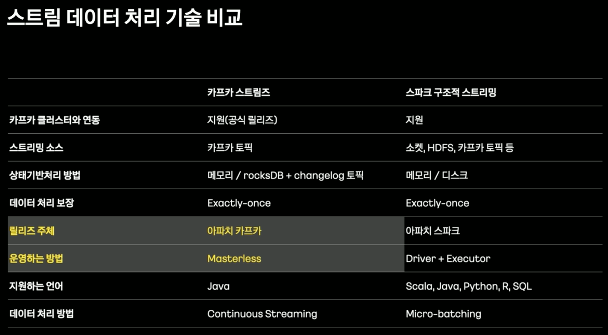
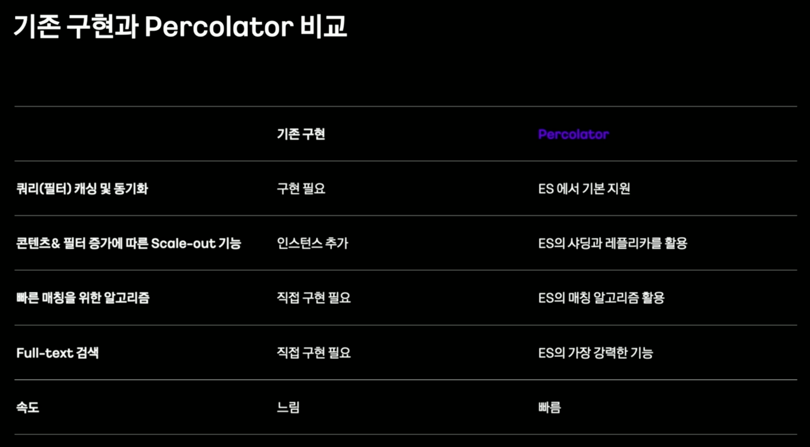
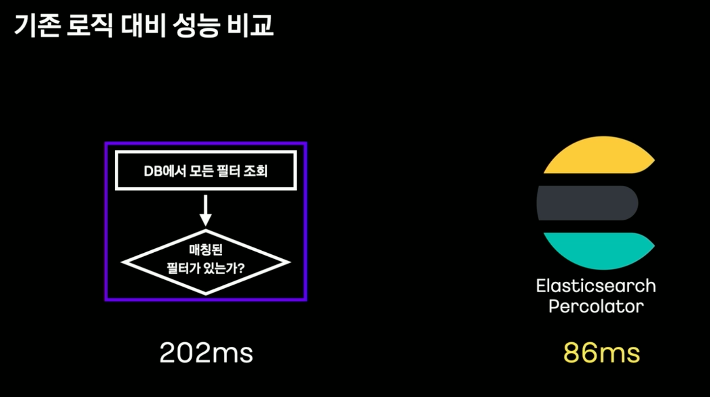
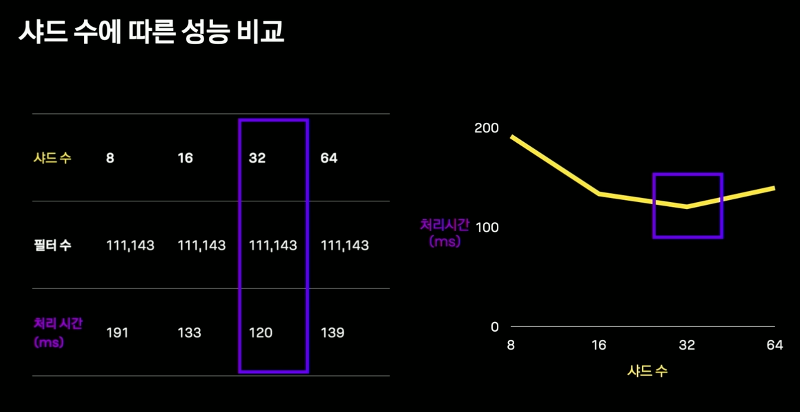
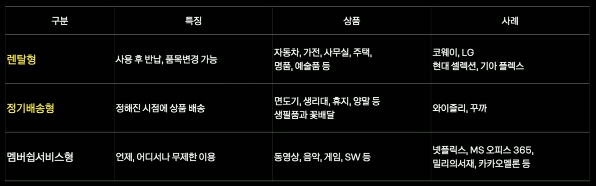
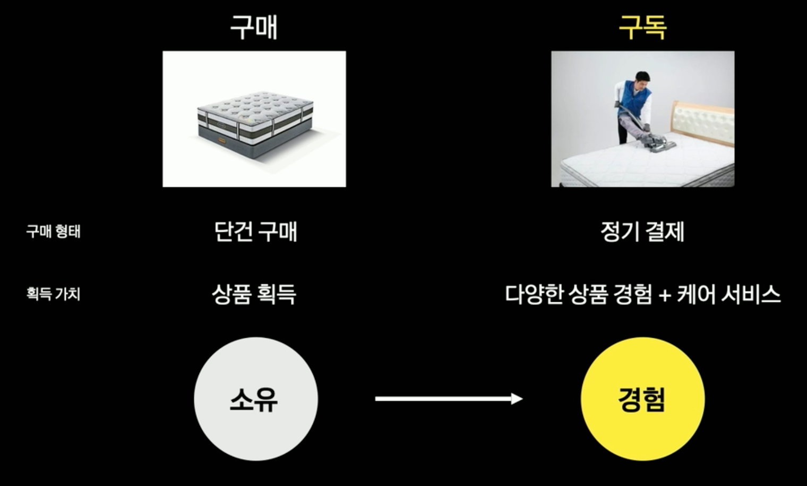
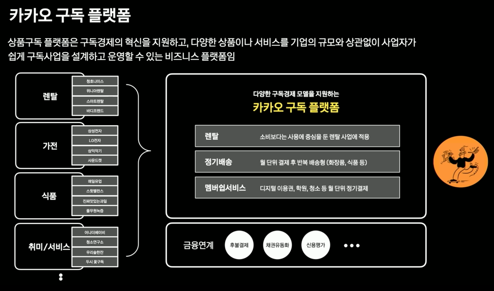

:hardbreaks:
= ifkakao 2021

https://tech.kakao.com/2021/11/17/ifkakao2021/[if(kakao)2021 기술 세션 모아보기? 2021.11.17]

https://if.kakao.com/session

== if(kakao)2021, Developers Recap
https://if.kakao.com/session/129[if(kakao)2021, Developers Recap]

== 스마트 메시지 서비스 개발기
https://if.kakao.com/session/22[스마트 메시지 서비스 개발기]

dane

Golang-based Server

Go: MSA (Micro Service Architecture) 시대의 언어
- 기능별로 서버를 분리: 무겁고 복잡한 프레임워크에 대한 필요성 감소
- 필요한 라이브러리만 조합하여 가벼우면서 빠른 성능 보장
- 효율적인 CI/CD: 빠른 빌드, 쉬운 의존성 관리
- 높은 생산성: 단순한 문법과 낮은 난이도로 인한 빠른 개발속도, 코드 리뷰 용이
- 라이브러리 선택지가 많다는 건 장점이자 단점..
  웹 프레임워크 - echo, gin 사용

Legacy Spring -> Go 전환 효과
- 서버 코드 LOC 60% 감소
- API 서버 기준 pod 메모리 사용량 1/3 수준으로 감소

2. Event-driven Architecture

설계 초안
- API서버와 광고 집행 서버들이 HTTP 통신
- 광고 집행 관련정보 (광고 생성 / 일시정지 / 취소)는 민감정보
- 유실/중복처리의 가능성 존재

Kafka 기반 Event Sourcing Architecture 로 전환
- Event를 Server Pod 장애로부터 안전하게 저장
-> 유실 방지
- Kafka Transaction 사용
-> API서버 처리도중 이슈 발생하더라도 중복 캠페인 처리 방지
- CQRS (Command and Query Responsibility Segregation)
-> API 서버는 main DB 조회만 수행, 광고 스케줄링 서버가 DB 수정
-> API 서버 개발자와 광고 집행 서버 개발자 간 업무 coupling 제거
-> Event handling 모듈 추가가 필요한 경우 유연한 확장 가능
- REST 기반 CRUD 방식에 비해 event 처리 확인에 걸리는 시간 증가
-> Latency에 민감한 API가 아니며 event 트래픽이 높지 않음

3. Delay Queue를 이용한 job scheduling
광고 스케줄링 로직 동작 방식
- 광고가 mini-batch 형태로 진행됨
-> 매 배치마다 갱신된 모델을 사용하기 때문
- 광고 집행 시작 시점과, 실제 job 발생 시점 사이 interval 존재
- 미리 설정된 시간에 맞추어 발송자 결정 서버에 job을 요청

예정된 작업이 남아있는 상태에서 서버 장애갑 ㅏㄹ생한다면?
- Kubernetes가 서버는 새로 띄워준다

문제는 스케줄 되어있던 jbo 정보들
- 메모리에만 저장하는 경우
-> 장애로 서버 종료시 유실
- main DB에 보관한다면?
-> 서버 pod가 여러개...

RabbitMQ 기반 delay queue
- Job 스케줄 정보를 프로세스 메모리 외부에 안전하게 저장
- Delay Queue: Message TTL + Dead Letter Exchanges
Message에 TTL 설정 후 queue에 넣으면,
설정한 TTL이 지난 후 DLX로 이동한다
- DLX를 별도의 queue에 bind
-> 일정 지연 시간 후 메시지가 도달하는 delay queue

cory

kafka streams

카프카 스트림즈를 선택한 이유

카프카 Kafka
상태기반처리 Stateful
운영 Maintenance

Masterless로 유연한 배포

카프카 스트림즈 내부 아키텍처
- 라이브러리로 제공
- 스트림 처리를 위한 DSL 또는 프로세서 API 제공
- 오픈소스 아파치 카프카가 공식적으로 릴리즈
- 카프카 파티션 개수만큼 유연하게 스케일 아웃
- 별도의 클러스터나 스케쥴링 도구 필요 없음
- 상태기반 처리를 위해 로컬에 rocksDB를 사용
- 상태를 기록하기 위해 변경로그(changelog)를 토픽으로 안전하게 저장

카프카 스트림즈 DSL과 프로세서 API

스트림즈 DSL
- Stateful, Stateless 처리를 위한 대부분의 메서드들(map, window, join, aggregation 등)이 제공됨
- 메시지 키, 메시지 값 기반 토폴로지 처리 수행
- KStream, KTable, GlobalKTable 제공

프로세서 API
- 스트림즈DSL에서 제공하지 않는 스트림 처리(scheduler 등)를 레코드 단위로 구현 가능
- 메시지 키, 메시지 값, 헤더, 타임스탬프 사용하여 스트림 데이터 처리
...

스마트 메시지에서 카프카 스트림즈 적용

Aggregation 프로세싱

스트림즈 애플리케이션 테스트 코드

== 대량의 스트림 데이터를 실시간으로 분류하기 : Elasticsearch Percolator를 이용한 콘텐츠 분류
https://if.kakao.com/session/53[대량의 스트림 데이터를 실시간으로 분류하기 : Elasticsearch Percolator를 이용한 콘텐츠 분류]

rick

필터를 이용해 콘텐츠를 분류
- 콘텐츠 정보를 조건으로 설정
- 예) 동물 이미지 필터
제목: 강아지, 멍멍이, 고양이, 냥이 키워드 포함
콘텐츠 ...

뉴스, 브런치, 카카오TV, ... ----(kafka)---> ...

자동차 콘텐츠가 들어오면 여러 필터를 거쳐 컨텐츠 풀로

왜 스트림 데이털르 실시간으로 분류할까?
- 뉴스의 경우 빠른 노출이 중요
- 콘텐츠 수정 OR 삭제 시 재분류 필요

기존에 데이터를 분류하는 방식

기존 분류 방식의 문제점

컨텐츠 수와 필터수가 증가하면서 문제가 발생

분류 필터를 DB에서 매번 조회
- 최신 필터 정보를 위해 매번 조회 필요
- 필터가 많아지면 조회 비용 증가
- 캐싱과 동기화 로직 필요
- 반복문으로 모든 조건을 비교
- 필터 추가시 계산 비용이 크게 증가
비용 = 필터 수 x 콘텐츠 수

콘텐츠와 필터는 계쏙 증가한다
- 필터 정보 캐싱과 동기화 기능 필요
- Scale-out이 용이한 구조로 변경
- 효율적인 매칭 알고리즘으로 검색 속도 향상

Elasticserch Percolator

콘텐츠 필터 매칭 로직을 Percolator...

Percolator란?
여과기

쿼리를 등록해두고 도큐먼트를 담은 퍼컬레이트 요청을 보내 매칭된 쿼리를 반환해주는 Elasticsearch의 기능

Percolator의 동작 구조 - 쿼리 등록

Percolator의 동작 구조 - 캐칭 쿼리 요청

콘텐츠 필터 매칭 로직을 Percolator...

Percolator Index 생성
- 필터 조건으로 사용될 필드 정의
- 쿼리가 저장될 필드 지정

Percolator Query 등록
- 라이언과 어피치 필터 등록
타이틀에 "라이언"또는 "어피치"가 포함
카테고리가 "연예" 또는 "경제"
본문 이미지 수가 2개 이상

Percolator Query 결과 분석
took: 걸린 시간
...

필터 정보 캐싱과 동기화
- Elasticsearch 가 쿼리(필터)를 관리하므로 캐싱 및 동기화를 신경쓰지 않아도 된다
- ...

Scale-out이 쉽게 가능한 구조로 변경 1/2
- Document를 여러 샤드(shard)에 분산 저장
- 샤드 당 스레드(thread) 하나가 할당
- 각 스레드에서 처리하는 Document...

Scale-out이 쉽게 가능한 구조로 변경 2/2
- Replica...

효율적인 매칭 알고리즘으로 검색 속도 향상 1/2
- 수평적 확장과 병행해서 효율적인 매칭 알고리즘...

효율적인 매칭 알고리즘으로 검색 속도 향상 2/2
- filter 조건을 이용해 전체 쿼리 중 검사 대상 쿼리 선별

기존 구현과 Percolator 비교

정리

Recap
- 분류할 데이터나 필터가 많은데 빠르게 분류하고 싶을 때
- 샤딩과 레플리카를 통한 Scale-out이 가능
- Elasticsearch의 효율적인 알고리즘 활용
- 최적의 샤드 수를 위해 실제 데이터와 쿼리로 테스트 필요

또 다른 활용 1/2
- 앱 로그를 이용한 실시간 알람 시스템 개발
데이터: 로그 메시지
필터: 로그 메시지에 특정 문자열이 포함됨

또 다른 활용 2/2
- 특정 조건을 만족하는 중고 제품이 올라오면 알람
데이터: 상품 정보
필터: 제품명, 가격, 지역 등

== 카카오 구독ON 구독으로 비즈니스의 시야를 넓히다

https://if.kakao.com/session/69[카카오 구독ON 구독으로 비즈니스의 시야를 넓히다]

jed

"디지털로 연결돼 있으면 모두 서비스화 해 구독 모델을 적용할 수 있다" Tien Tzuo of Zuora

구독사업 유형

2020년까지 세계 대기업의 50%가 자신의 사업 대부분을 디지털 방식으로 향상된 제품, 서비스, 경험을 만드는 능력에 의존할 것이라고 전망 -> "상품보다 서비스에 초점을 맞춤" - IDG

구매 vs 구독

카카오 구독 플랫폼

카카오 구독 플랫폼 특화 기능

카카오 구독ON

== 필요한 물건이 알아서 배송된다~ 카카오 구독ON 서비스

https://if.kakao.com/session/17[필요한 물건이 알아서 배송된다~ 카카오 구독ON 서비스]

스윗 밸런스랩

== 카카오지갑: 지갑서비스의 현황과 미래

https://if.kakao.com/session/61[카카오지갑: 지갑서비스의 현황과 미래]

== 테스트 코드 한 줄을 작성하기까지의 고난

https://if.kakao.com/session/56[테스트 코드 한 줄을 작성하기까지의 고난]

