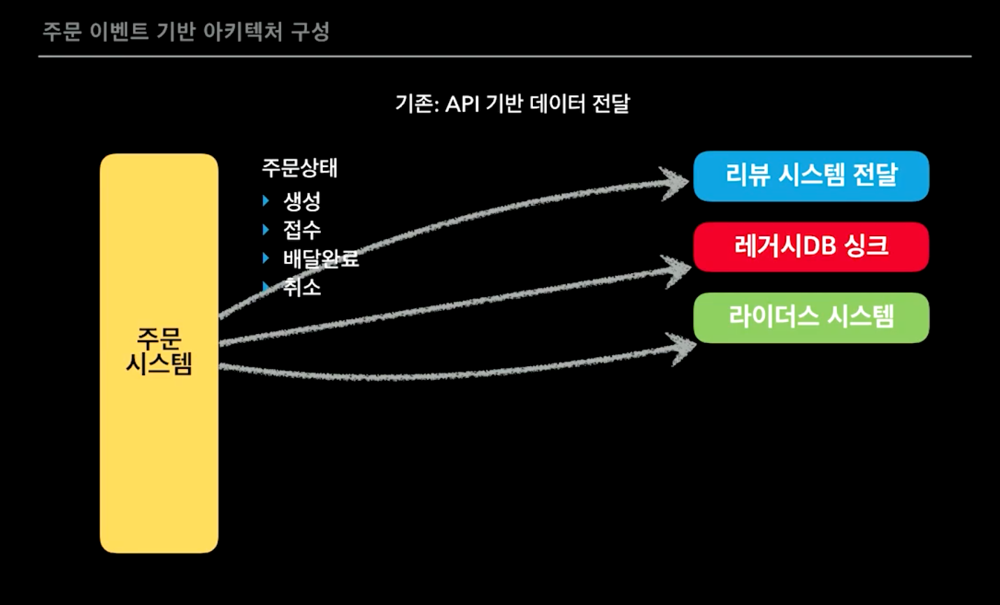
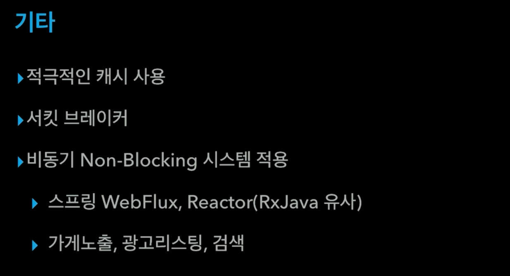

== [우아콘2020] 배달의민족 마이크로서비스 여행기
* https://www.youtube.com/watch?v=BnS6343GTkY

발표자 : 우아한형제들 김영한. 배민서비스개발팀

배민 역사, 마이크로서비스

주문수 년 평균 2.3배 증가

테이블 700개, 프로시져 4000개 정도 있었음. 거대한 모놀리틱 시스템

루비DB 고스펙 사양

리뷰 DB밀리면 전체 시스템 밀리면서 장애

리뷰 장애나도 영향 없어야 되는데

=== 2016

* 자바가 대용량 트래픽 안정적. 개발자 수급.
* 리뷰 장애나면 리뷰만 안되야지. 마이크로서비스

넷플릭스 MSA 가는데 7년. 생존의 문제.

결제가 장애나도 전화 주문 할 수 있음.

마리아DB사용

돈과 관련된 거 클라우드 올릴 수 없어서 IDC사용

주문 중계는 가볍게 NODE JS

나중에는 무거워져서 Java로 바꿈

생각보다 더 많이 들어와서 프론트에서 죽어 버림

다음날 이벤트는 살려야 한다. 한달 짜리 AWS이전 프로젝트를 하루만에.

PG사에서 장애

=== 2017

배민 장애나면, 요기요, 배달통도 죽어버림. 사장님들 준비한거 못팜. 사용자들도 치킨 못먹어서 화남.

마이크로 서비스 해야 되는구나. 생존의 문제.

=== 2018
image::image-2020-12-16-20-38-08-499.png[]

당시 시스템은 가게 하나가 광고 하나만 가능. 아파트 더 생기면 가게를 따로 더 팜.

레거시라서 고치기 힘들었음.

PHP잘하시는 분도 Java로 가야 된다고 함

다이나모 DB는 트래픽 잘 받음. 기능은 적음.

1분~5분 싱크.

프로시저 관리 문제

삐끗하면 돈 문제

리뷰가 죽었다 살아나도 이벤트 다시 받아와서 처리 함

주문팀에서 연동해 주세요 할 필요 없이 SQS 꽂아서 써. 해피

이벤트. 대량의 트래픽이 한 순간에

점심, 저녁, 이벤트에 확 침

전체를 CQRS로

조직도 분리

* Eventually Consistency (최종적 일관성)

가게에서 문제 생기면 가게에서만 이벤트 재발행

image::image-2020-12-16-20-57-09-580.png[]

최소 데이터 보관 원칙

각 시스템 최적화된 DB사용. 폴리글랏 DB

오로라DB는 AWS에서 제공하는 MySQL과 호환되는 DB

SNS장애? 자주 있지는 않음. 전체 IMPORT API 제공, 부분 IMPORT API 제공

