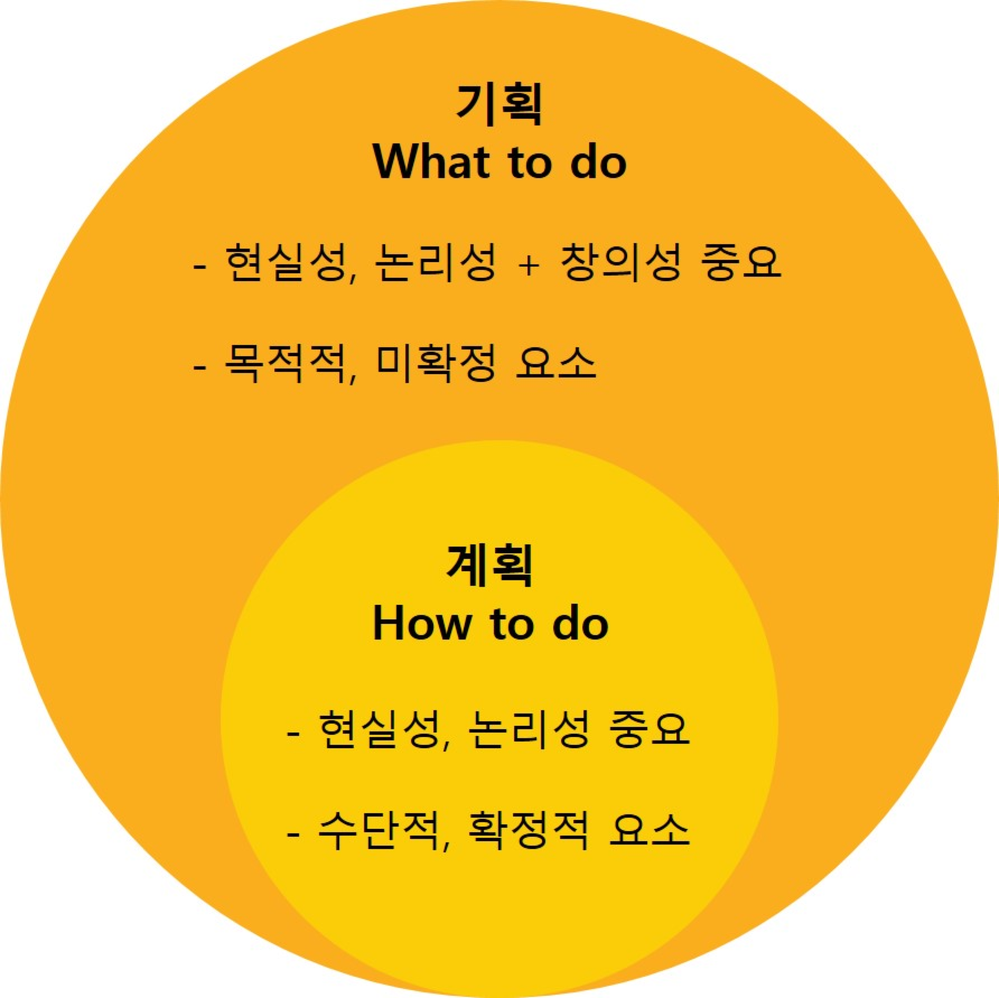

:hardbreaks:
= 기획

사업기획, 서비스기획, 기술기획, 전략기획, 운영기획, 상품기획, 광고기획...

== References
* https://thinkingpower.co.kr/10526/[[기획노하우3\]기획과 계획의 차이 2020.10.08]

* 기획 - What to do
** 현실성, 논리성 + 창의성 중요
** 목적적, 미확정 요소
* 계획 - How to do
** 현실성, 논리성 중요
** 수단적, 확정적 요소
