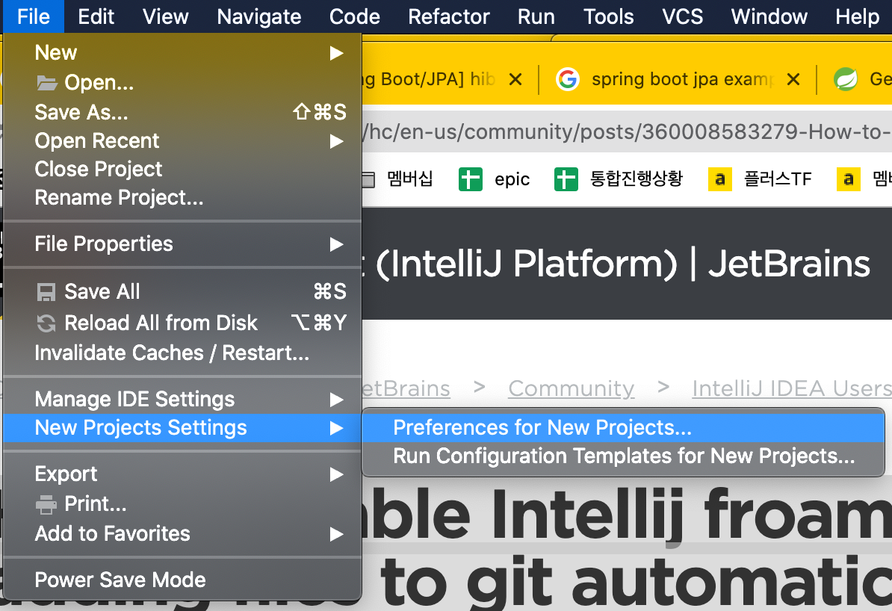
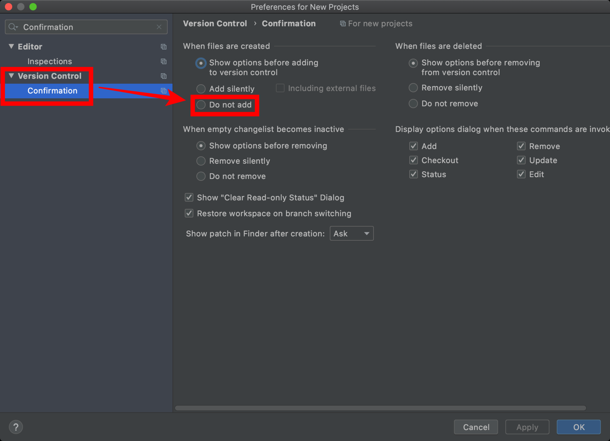

= IntelliJ

== Disable git add confirmation for new file

File -> New Projects Settings -> Preferences for New Projects -> Version Control -> Confirmation -> When files are created

Do not add 로 선택

=== 정리
* https://junho85.pe.kr/1619[IntelliJ - Add File to Git 끄기 2020.07.23]

=== References
https://intellij-support.jetbrains.com/hc/en-us/community/posts/360008583279-How-to-disable-Intellij-froam-adding-files-to-git-automatically[How to disable Intellij from adding files to git automatically]

== 터미널에서 IntelliJ 열기 - command line launcher
* 정리: https://junho85.pe.kr/1448[터미널에서 IntelliJ 실행하기. 커맨드라인에서 spring boot 프로젝트 만들고 연결까지 2019.11.02]

== Extract superclass. 추상 클래스 뽑아 내기

https://www.jetbrains.com/help/idea/extract-superclass.html#17e4f5[Extract superclass]

