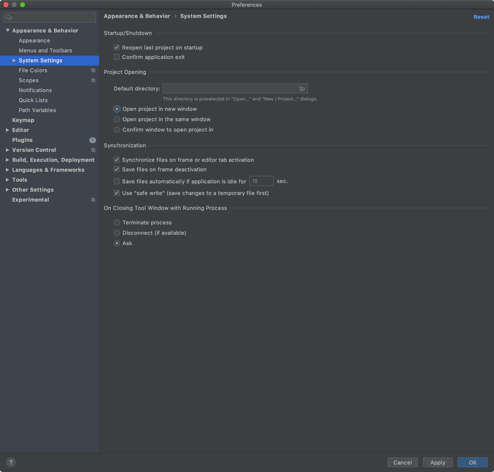

# IntelliJ - 유용한 단축키

## 창 관련
* Zoom - Ctrl + Cmd + =
  * 창 사이즈를 화면 크기에 맞춰 키운다. 다시 누르면 기존 사이즈로 돌아 온다.
  
## 프로젝트 열 때 새 창에서 열기
Preferences -> Appearances & Behavior -> System Settings -> Open project in new window
