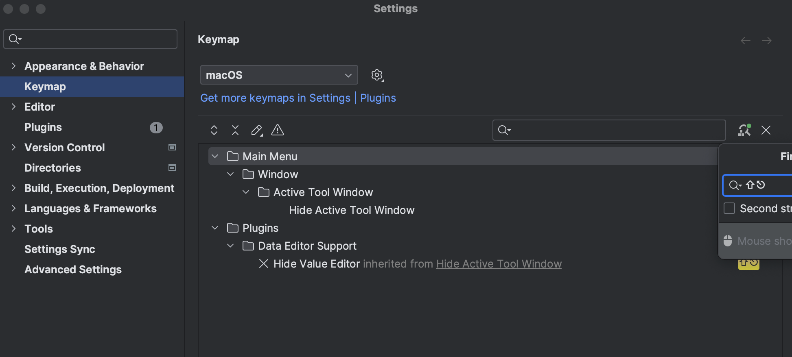

= IntelliJ - 유용한 단축키

== 괄호 반대편으로 이동 ctrl + m

== Structure cmd + 7

== Cmd + F12

== Cmd + Opt + O Symbols 검색

== fold.

== 창 관련

=== Cmd + Shift + F12 Maximize Editor
Editor 영역을 최대크기로 펼침. 다시 누르면 원래대로 돌아옴.
파일 트리나 Gradle, Run 창 등을 숨기고 싶을 때 유용하다.

Shift + ESC Hide Active Tool Window 기능을 이용해서 숨길 수도 있다.

=== Zoom - Ctrl + Cmd + =
* 창 사이즈를 화면 크기에 맞춰 키운다.다시 누르면 기존 사이즈로 돌아 온다.

== 프로젝트 열 때 새 창에서 열기
Preferences -> Appearances & Behavior -> System Settings -> Open project in new window

== 단축키로 맵핑된 액션 찾기 Find Actions by Shortcut

Settings > Keymap > Find Actions by Shortcut

== References
https://medium.com/better-programming/intellij-keyboard-shortcuts-to-swear-by-7638c0efcc76[IntelliJ Keyboard Shortcuts to Swear By 2019.10.15]

https://ifuwanna.tistory.com/241[[IntelliJ\] 필수 단축키 정리 (+ 전체 단축키 표)]