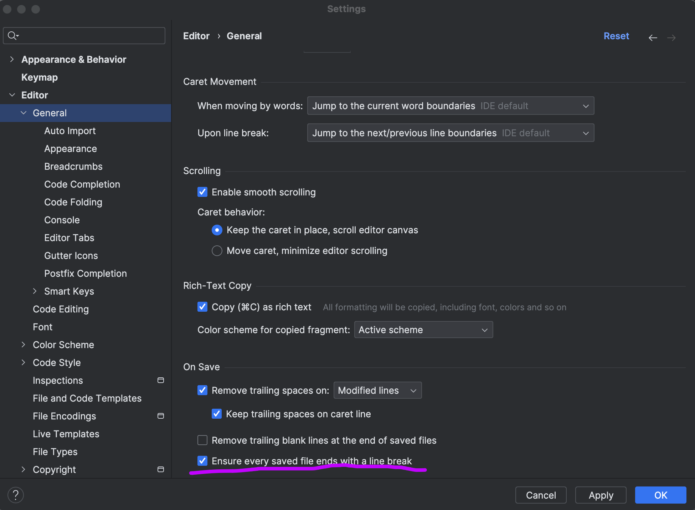

:hardbreaks:
= IntelliJ IDEA에서 ktlint 사용하기

.요약
* plugin 설정
* ktlintApplyToIdea 로 IntelliJ 에 설정
* ktlintCheck 로 코드 검사

== plugin 설정 - org.jlleitschuh.gradle.ktlint

https://plugins.gradle.org/plugin/org.jlleitschuh.gradle.ktlint

== ktlintApplyToIdea

kotlin 스타일 파일을 생성해서 intellij 에 적용

.실행방법
* Run Anything: gradle ktlintApplyToIdea
* cli: ./gradlew ktlintApplyToIdea
* gradle > Tasks > help > ktlintApplyToIdea

하지만 이 설정으로는 파일의 마지막 개행문자(LF)추가가 적용되지 않기 때문에 직접해줘야 한다.

File > Settings > Editor > General > Ensure every saved file ends with a line break 체크

저장할 때 자동으로 파일 마지막에 개행을 추가해준다

== ktlintCheck

.실행방법
* Run Anything: gradle ktlintCheck
* cli: ./gradlew ktlintCheck
* gradle > Tasks > verification > ktlintCheck
** 한 번 수행하고 나면 Run 에 뜨긴 한데 불편

== ktlintFormat

== addKtlintCheckGitPreCommitHook

commit 하기 전에 ktlint 확인해서 실패시 commit 안되게 하는 설정

적용 된 Git hook 을 제거하려면

----
rm .git/hooks/pre-commit
----

== addKtlintFormatGitPreCommitHook

commit 하기 전에 ktlint format 해서 commit 하게 하는 설정

의도치 않은 포멧팅이 되어 버릴 수 있음. 확신이 없다면 ktlintFormat 을 이용해서 수동으로 포멧팅 하다가 확신이 생기면 적용해도 되겠다.

== References

* https://seosh817.tistory.com/154[Kotlin/TDD 프로젝트에 ktlint를 적용하기 2021.10.13]

build.gradle 설정

dependencies org.jlleitschuh.gradle:ktlint-gradle

plugin org.jlleitschuh.gradle.ktlin

----
./gradlew ktlintApplyToIdea
----

----
./gradlew ktlintApplyToIdeaGlobally
----

수동으로 ktlint 스타일 체크
----
./gradlew ktlintCheck
----

스타일 체크 및 스타일 변환
----
./gradle ktlintFormat
----

의도치 않은 수정이 생길 수 있으니 주의

* https://blog.benelog.net/ktlint.html[ktlint로 Kotlin 공식 코딩 컨벤션 맞추기 2019.11.12]