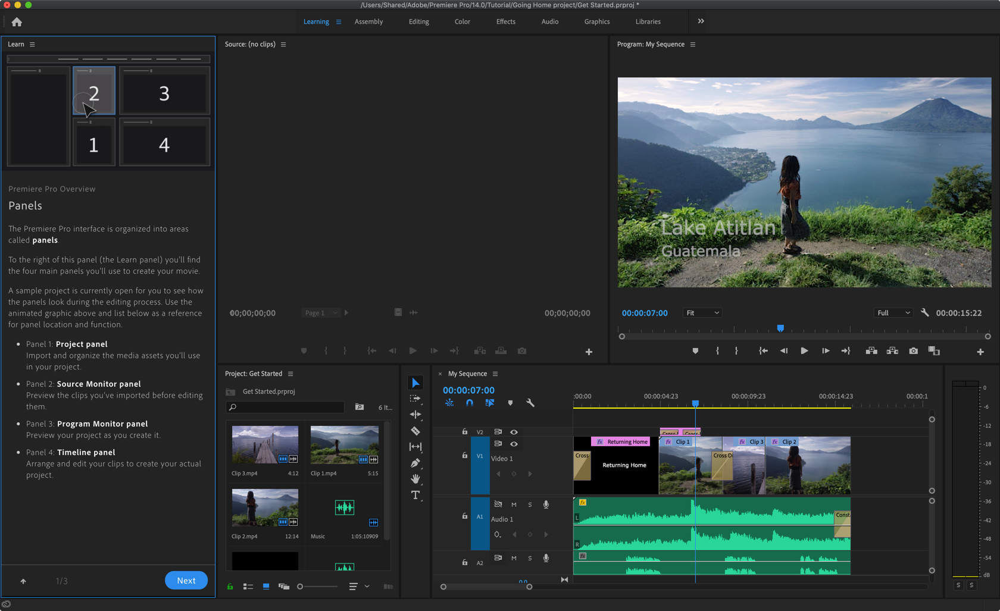

# Adobe Premiere

## 기초
### learning

기본 내장 튜토리얼 좋음

### tutorial
* [Adobe Premiere Pro Learn & Support](https://helpx.adobe.com/support/premiere-pro.html)
  * 웹으로도 튜토리얼 제공하고 있음

## resize image
* 더블클릭 하고 사이즈 조정 하면 됨. 처음 해 보면 더블클릭 해야 되는지 몰라서 해멤.
* 꽉 채우려면?
  * Set to Frame Size, Scale to Frame Size. 그런데 둘 차이는 뭐지

## cut
* Razor Tool (C) 선택 후 마우스 클릭
  * shift 누르고 마우스 클릭 하면 모두 잘림
  * 배경 음악 같은거 안잘리게 하려면 미리 lock 걸어 둔다.
* 단축키
  * 윈도우 ctrl + k, 맥 cmd + k

## 앞(왼쪾),뒤(오른쪽)로 날리기
* q 왼쪽 날리기
* w 오른쪽 날리기

## Ripple Delete
* 프리미어에서는 컷 삭제 하면 중간에 구멍이 생긴다.
  * 파이널컷에서는 특정 컷을 삭제 하면 뒤의 내용들이 앞으로 당겨 진다.
* 프리미어에서는 Ripple Delete 를 해 줘야 뒤의 내용들이 앞으로 당겨 진다.
* 보통 지울 컷을 바로 Ripple Delete 해 주는게 편리하다.
* 단축키: 
  * 윈도우: Alt + Backspace, 맥: Opt + Delete

## 모자이크
* [프리미어프로 CC 모자이크 효과 두 가지 스타일 핵쉽게 만들기! Premiere Pro CC Mosaic effect](https://www.youtube.com/watch?v=SeWDhWDTw0w)
  * 깍두기 모자이크
  * 뿌얘지는 모자이크
  * Effects - Gaussian Blur
  * Effect Controls 효과 컨트롤
  * Blurriness 값 키우면 뿌얘짐
  * Repeat Edge Pixels 체크 - 화면 끝 부분까지 뭉게지는 것 방지
  * Mask 로 모자이크 처리할 영역 지정

## 음악 볼륨 줄이기
* g - gain 에서 직접 입력 해서 세팅하기
* 어디 화면에서 마우스로 하는거 없나?
* 다른 단축키?

## 인디케이터 이동
* 마우스로 타임라인 상단 부분 클릭해서 이동
* 화살표 좌우. 1frame 씩 이동
* shift 화살표 좌우. 5frame 씩 이동
* 화살표 상하. 컷단위 이동
* NumPad 에서 1000 엔터 치면 10초 뒤로 이동함
* 파컷에서는 마우스 스크롤 하면 바로 인디케이터가 이동 되도록 할 수 있는데 프리미어에는 없음. (~프리미어 2019 까지 없는 상태)
  * 프리미어에도 이런 기능 생겼으면 좋겠다.

## 클립 속도 조절하기
* 클립에서 마우스 우클릭. Speed/Duration

## Export
* 내보내기
* Cmd + M
* Export 했는데 일부분만 되었다면? Source Range 가 Custom 으로 되어 있을 수 있음. Entire Sequence 로 바꿔준다.

## 삐~ 소리나는 화면조정 화면 만들기
* 프로젝트 > New Item -> Bars and Tone
* 삐 소리나는 화면조정 화면이 만들어 진다.
* https://www.youtube.com/watch?v=JAfQERAL7Rg

## 유용한 채널
* 비됴클래스: https://www.youtube.com/user/wkwkwk1205
* 조블리: https://www.youtube.com/channel/UCM1CbBpxRg_-FOutzAXjuLg

* [떵컴도 4K 쾌적하게 편집할 수 있는 Proxy 편집 - 프리미어 프로 프록시 2018.05.26](https://www.youtube.com/watch?v=ZmdFM5tB-XA)

## References
* Premiere Pro Tip | How To Resize An Image To Fit The Frame https://www.youtube.com/watch?v=IHmzGRKIuLM
* https://helpx.adobe.com/premiere-pro/using/default-keyboard-shortcuts.html
