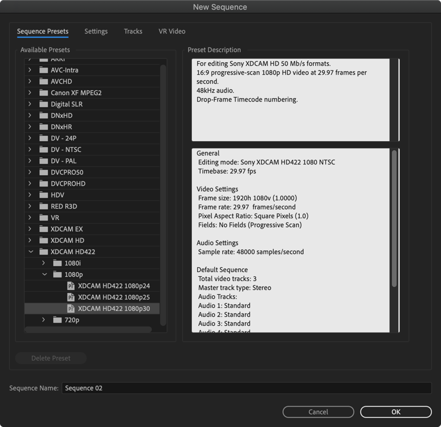

# 프리미어 기초 강좌

## 프로젝트 만들기

## 시퀀스 만들기
영상 기준으로 하려면 영상에서 마우스 우클릭 해서 

New Sequence

XDCAM HD422 -> 1080p -> XDCAM HD422 1080p30

무난한 설정으로 보임.
```
General
 Editing mode: Sony XDCAM HD422 1080 NTSC
 Timebase: 29.97 fps

Video Settings
 Frame size: 1920h 1080v (1.0000)
 Frame rate: 29.97  frames/second
 Pixel Aspect Ratio: Square Pixels (1.0)
 Fields: No Fields (Progressive Scan)

Audio Settings
 Sample rate: 48000 samples/second

Default Sequence
 Total video tracks: 3
 Master track type: Stereo
 Audio Tracks:
 Audio 1: Standard
 Audio 2: Standard
 Audio 3: Standard
 Audio 4: Standard
 Audio 5: Standard
 Audio 6: Standard
 Audio 7: Standard
 Audio 8: Standard
```



## 사운드 편집 1
* M - Mute Track
* 소리만 지우기
* Volume Level
  * 톤의 변화 없이 그냥 크고 작
* Gain
  * Set Gain To: 지정한 값으로 설정
  * Adjust Gain by: 기존 Gain에서 + - 한다
  * Normalize Max Peak to: 선택한 오디오 클립의 최고점을 기준으로 조정. 최고 진폭이 -10dB 일 때 0dB 로 설정하면 +10dB 가 됨
  * Normalize All Peaks to: 모든 오디오 클립의 최고점 조정
  * Peak Amplitude: 최고점과 오디오 클립의 볼륨 차이표시. -6.3dB 이면 6.3dB 올려주면 최고점에 도달함.
* 적당한 볼륨?
  * 오른쪽 막대 바가 0 에 가깝게 조정
  * 작으면 소리가 잘 안들리고
  * 너무 커지면 소리 큰 부분이 깨짐 (클리핑 노이즈)
* 배경 음악 넣기
  * https://www.youtube.com/audiolibrary/music
  * 음악은 보통 크기 때문에 Volume Level 을 적당히 조정해서 줄여줌
* Auto-Match 로 볼륨 조정 - 사운드 평준화
* Ducking - 내가 말할 떄 음악 줄이기


## 사운드 편집 2
* Repair
* SFX
* 효과음
  * Whoosh - 화면 전환
  * Wow
  * 자막 등장 타이밍에 실로폰
* 오디오 트랜지션
  * 
* 오디오 이펙트
  * Chorus
* Audio Track Mixer
  * fx
* multi band compressor
  * 하나로 합치면 편함
  * alt 누르고 드래그 해서 오디오만 선택
  * 복사
  * 오른쪽 마우스 - Nest
  * effect - compressor (압축기)
  * Multiband Compressor
  * Custom Setup - Edit
  * Presets - Pop Master 추천
 * limiter 의 thresh 값을 내리면 볼륨이 올라감
* Normalize
  * Audio Gain - Normalize All Peaks to

## 인트로 영상 만드는 방법

## 애니메이션
* [](https://mixkit.co/videos/coffee-and-cafe/) 에서 커피마시는 영상 다운로드
* 프로젝트 04강
* 

## 모자이크
Tracking