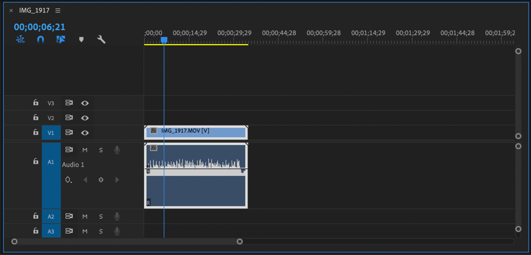
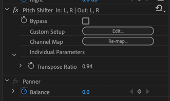
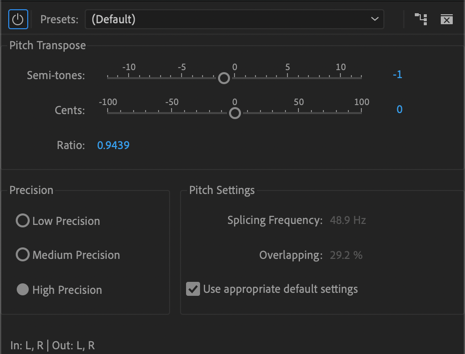

# sound

## 한쪽 채널만 녹음된 스테레오 사운드를 양쪽에 나오도록 만들기

아이폰 + 오디오 인터페이스 (스칼렛 솔로)

## pitch 변경. 음악 key 변경
* effect -> pitch shifter

* Custom Setup - Edit
* Semi-tones 를 조절한다. 1줄이면 1키 낮아지는듯 함.

* [How to Create a High/Low Pitch Voice in Adobe Premiere Pro CC 2019](https://adobemasters.net/how-to-create-a-high-low-pitch-voice-in-adobe-premiere-pro-cc-2019/)