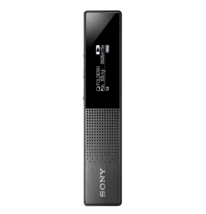

# 녹음기. Recorder
## UX570
* 무게 48g
* 출시: 2019년 11월

## 소니 초슬림 스틱형 IC 레코더. ICD-TX650

* 두께 7.4mm
* 무게 29g
* 비압축 리니어 PCM 녹음
* 베터리?
* 출시 2014년 11월
* 정가 169,000 http://store.sony.co.kr/handler/ViewProduct-Start?productId=25224310
* 용량 16GB

* 
  * 신사임당 유튜버가 쓴다고 하는 녹음기
* 쿠팡: [소니 초슬림 스틱형 IC 레코더. ICD-TX650](https://coupa.ng/bDznvo)
  * 2020.06.03 149,360원
  * 2020.01.15 151,900원
* Qoo10: [★TX650 쿠폰가 $105★ / SONY 소니 리니어 녹음기 레코더 / ICD-TX650 / ICD-SX2000 / 플래시메모리 16GB 음성녹음 MP3 VOR / 정품보장](https://www.qoo10.com/g/514047910?jaehuid=2026416612)
  * 2020.01.30 115,270원
  * 댓글보니 소니코리아정품인증서가 들어있기는 한데 정품등록은 안된다고 함.

