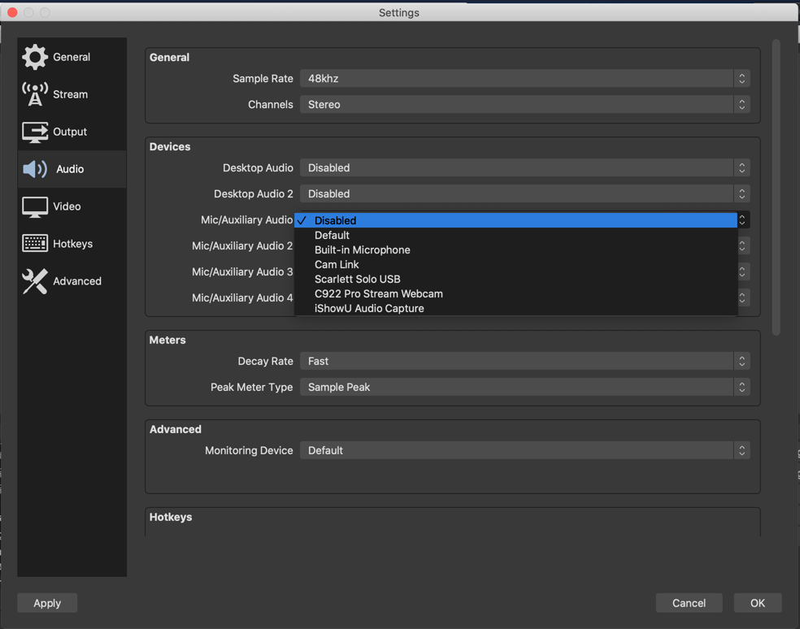

# OSX - Audio Output Capture
어플리케이션에서 나오는 소리를 방송에 넣으려면  iShowU Audio Capture 를 이용하면 됩니다.

하지만 OSX 에서는 아무 Device 도 잡히지 않습니다.

Settings -> Audio 에서 설정 할 수 있지만 적절한 장치를 선택 할 수 없습니다.

이럴때는 iShowU 라는 어플리케이션을 설치해 줍니다. (설치 하고 나면 재부팅 필요)

Audio MIDI Setup 에서 Create Multi-Output Device 를 추가해 줍니다.

Output 에 Built-in Output 과 iShowU Audio Capture 두개를 선택하면 Built-in Output 을 통해 스피커로 소리가 나고 iShowU Audio 에도 소리를 전달하게 됩니다.

Internal Speakers 대신 Multi-Output Device 를 선택해 줍니다.

(아쉬운 부분은 이렇게 하면 기본 볼륨 조정 기능이 비활성화 됩니다)

Settings -> Audio 에서 iShowU Audio Capture 를 선택해 줍니다.

Audio Mixer 에 Mic/Aux 가 추가 되었고 어플리케이션에서 나오는 소리가 OBS 에서 capture 되는 것을 볼 수 있습니다.

## References
* [Install iShowU Audio Capture - Mojave/Catalina](https://support.shinywhitebox.com/hc/en-us/articles/360030800592)
* [[OS X]Capture audio with iShowU Audio Capture 2017.03.21](https://obsproject.com/forum/resources/os-x-capture-audio-with-ishowu-audio-capture.505/)