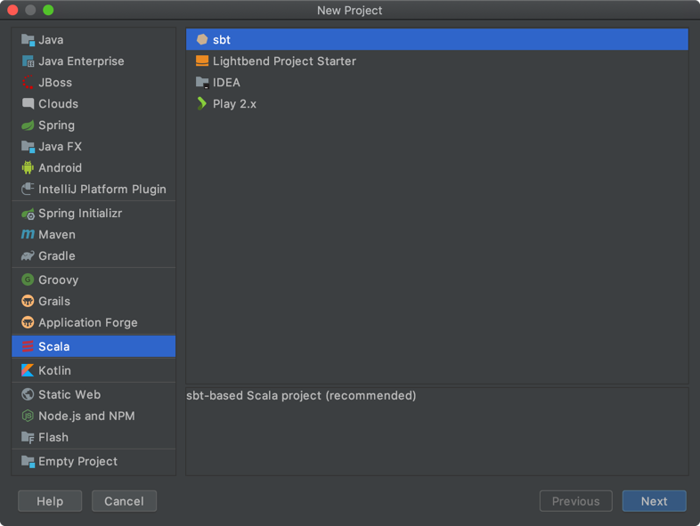
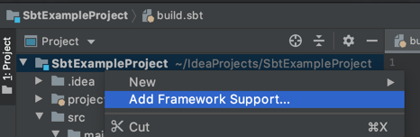

# scala

## hello world
* [BUILDING A SCALA PROJECT WITH INTELLIJ AND SBT](https://docs.scala-lang.org/getting-started/intellij-track/building-a-scala-project-with-intellij-and-sbt.html)

intellij 에 scala 플러그인을 먼저 설치 한다.

New Project 에 Scala 가 추가 되었고 sbt 를 선택할 수 있게 되었다.

Name: SbtExampleProject

src/main/scala 에 example package 생성

example 에 Main.scala 생성

만약 New -> Scala Class 가 나타나지 않는다면 scala 를 Framework 로 추가해 주어야 한다. ([Unable to create Scala class on IntelliJ](https://stackoverflow.com/questions/38006735/unable-to-create-scala-class-on-intellij))

