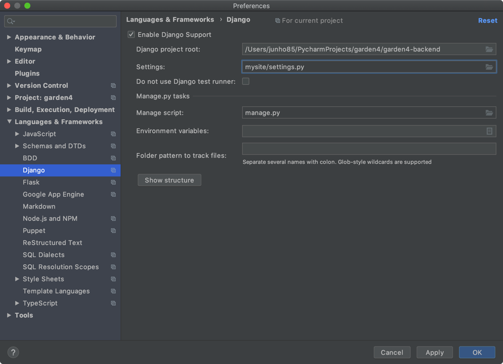

# setup django

## Python3
* slack, mongodb 쓰기가 편합니다.

## Django
```
ssh labs.junho85.pe.kr
cd web
cd garden4
```

### git clone
```
git clone git@github.com:junho85/garden4.git
cd garden4/garden4-backend
```

### virtualenv 환경 세팅
virtualenv 가 없다면 먼저 설치 해 줍니다. (있다면 패스)
```
pip3 install virtualenv
```

virtualenv 로 python3 환경을 세팅합니다.
```
python3 -m virtualenv venv
source venv/bin/activate
```

### moules installation
필요한 모듈들을 설치해줍니다. requirements 에 필요한 모듈들이 기입되어 있습니다.
```
pip install -r requirements.txt
```

pip 로 하나하나 직접 설치 해 줄수도 있습니다.
```
pip install slackclient
pip install Django
pip install pymongo
```


### config.ini
attendance/config.ini 는 직접 생성
```
; config.ini
[DEFAULT]
SLACK_API_TOKEN = xoxp-...
CHANNEL_ID = ...

START_DATE = 2019-10-10 # 시작일
GARDENING_DAYS = 100 # 진행일수

[MYSQL]
HOST = localhost
USER = garden_admin
PASSWORD = ...
DB = garden

[MONGO]
DATABASE = garden
HOST = localhost
PORT = 27017

[GITHUB]
USERS = junho85,...
```

### users.yaml
github 계정이 junho85 일 떄 slack 계정을 기입 해 주어야 함.

e.g.
```
junho85:
  slack: junho85
```

### django 구동
django 구동
```
python manage.py runserver
```

기본 8000 인데 ufw 방화벽 오픈 하고 싶은 경우
```
sudo ufw allow 8000
```

#### PyCharm 에서 세팅 하는 방법
* Preferences -> Languages & Frameworks -> Django 에서 Enable Django Support



## 세팅후 구동
```
cd /home/junho85/web/garden4/garden4-backend
source venv/bin/activate
python manage.py runserver
```
