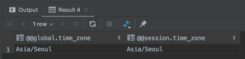
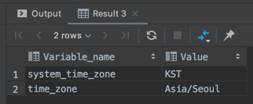

# timezone

## timezone 확인 하는 방법
```
select @@global.time_zone, @@session.time_zone;
```


```
show global variables like '%time_zone%';
```


## timezone 설정 하는 방법
timezone 이 제대로 설정 되어 있지 않으면 DataGrip 에서 "Server returns invalid timezone"오류가 나면서 접속이 안될 수 있습니다. Advanced탭에서 serverTimezone을 직접 설정해 줄 수도 있겠지만 사용자 마다 설정을 해 줘야 되니 번거롭습니다.

SYSTEM 으로 나오는 경우 DataGrip 에서 "Server returns invalid timezone"오류가 발생하는거 같네요.
```
mysql> select @@global.time_zone, @@session.time_zone;
+--------------------+---------------------+
| @@global.time_zone | @@session.time_zone |
+--------------------+---------------------+
| SYSTEM             | SYSTEM              |
+--------------------+---------------------+
1 row in set (0.00 sec)
```

timezone을 적절히 설정해 줍니다.

```
SET GLOBAL time_zone='Asia/Seoul';
SET time_zone='Asia/Seoul';
```

### my.cnf 설정 수정하기
```
[mysqld]
default-time-zone='Asia/Seoul'
```

```
[mysqld]
default-time-zone='+09:00'
```

## Unknown or incorrect time zone 오류가 발생하는 경우
Unknown or incorrect time zone 이라고 오류가 나는 경우가 있습니다.
```
mysql> SET GLOBAL time_zone='Asia/Seoul';
ERROR 1298 (HY000): Unknown or incorrect time zone: 'Asia/Seoul'
```
해결 방법은 여러가지가 있는 거 같긴 한데요.

가장 무난한 방법은 Asia/Seoul 이라 할 필요 없이 그냥 숫자를 직접 넣는 것입니다.
```
SET GLOBAL time_zone='+09:00';
SET time_zone='+09:00';
```

꼭 Asia/Seoul 을 쓰고 싶다면
```
mysql_tzinfo_to_sql /usr/share/zoneinfo/ | mysql -uroot mysql -p
```
로 추가하고 나서
```
SET GLOBAL time_zone='Asia/Seoul';
SET time_zone='Asia/Seoul';
```
하면 됩니다.

```
$ mysql_tzinfo_to_sql
Usage:
 mysql_tzinfo_to_sql timezonedir
 mysql_tzinfo_to_sql timezonefile timezonename
 mysql_tzinfo_to_sql --leap timezonefile
$ mysql_tzinfo_to_sql /usr/share/zoneinfo/ | mysql -uroot mysql -p
Enter password:
Warning: Unable to load '/usr/share/zoneinfo//iso3166.tab' as time zone. Skipping it.
Warning: Unable to load '/usr/share/zoneinfo//leapseconds' as time zone. Skipping it.
Warning: Unable to load '/usr/share/zoneinfo//tzdata.zi' as time zone. Skipping it.
Warning: Unable to load '/usr/share/zoneinfo//zone.tab' as time zone. Skipping it.
Warning: Unable to load '/usr/share/zoneinfo//zone1970.tab' as time zone. Skipping it.
$ mysql -uroot -p
Enter password:
Welcome to the MySQL monitor.  Commands end with ; or \g.
Your MySQL connection id is 77
Server version: 5.7.29-log MySQL Community Server (GPL)

Copyright (c) 2000, 2020, Oracle and/or its affiliates. All rights reserved.

Oracle is a registered trademark of Oracle Corporation and/or its
affiliates. Other names may be trademarks of their respective
owners.

Type 'help;' or '\h' for help. Type '\c' to clear the current input statement.

mysql> SET GLOBAL time_zone='Asia/Seoul';
Query OK, 0 rows affected (0.01 sec)

mysql> SET time_zone='Asia/Seoul';
Query OK, 0 rows affected (0.00 sec)

mysql> select @@global.time_zone, @@session.time_zone;
+--------------------+---------------------+
| @@global.time_zone | @@session.time_zone |
+--------------------+---------------------+
| Asia/Seoul         | Asia/Seoul          |
+--------------------+---------------------+
1 row in set (0.00 sec)
```

이렇게 해도 안된다는 경우가 있는거 같은데요. 
```
cd /usr/share/zoneinfo
```
에서 timezone 을 확인해서 timezone 파일을 강제로 덮어 쓰는 방법도 있다고 합니다. 하지만 이런거 까지 건드려야 하나 싶습니다.
```
cp /usr/share/zoneinfo/Asia/Seoul /etc/localtime
```

## 정리
* [Jetbrains DataGrip - Server returns invalid timezone. Go to 'Advanced' tab and set 'serverTimezone' property manually. 문제 해결 2020.03.24](https://junho85.pe.kr/1483)
